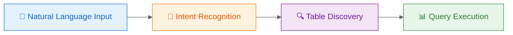
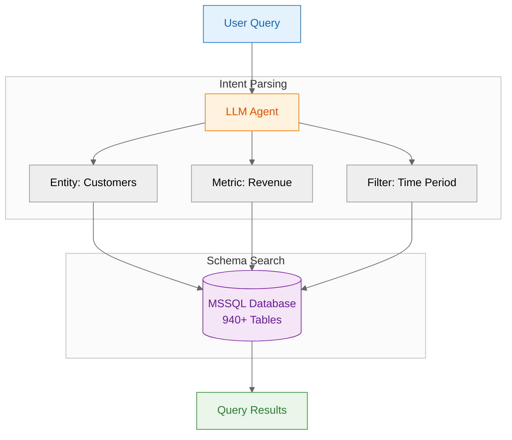
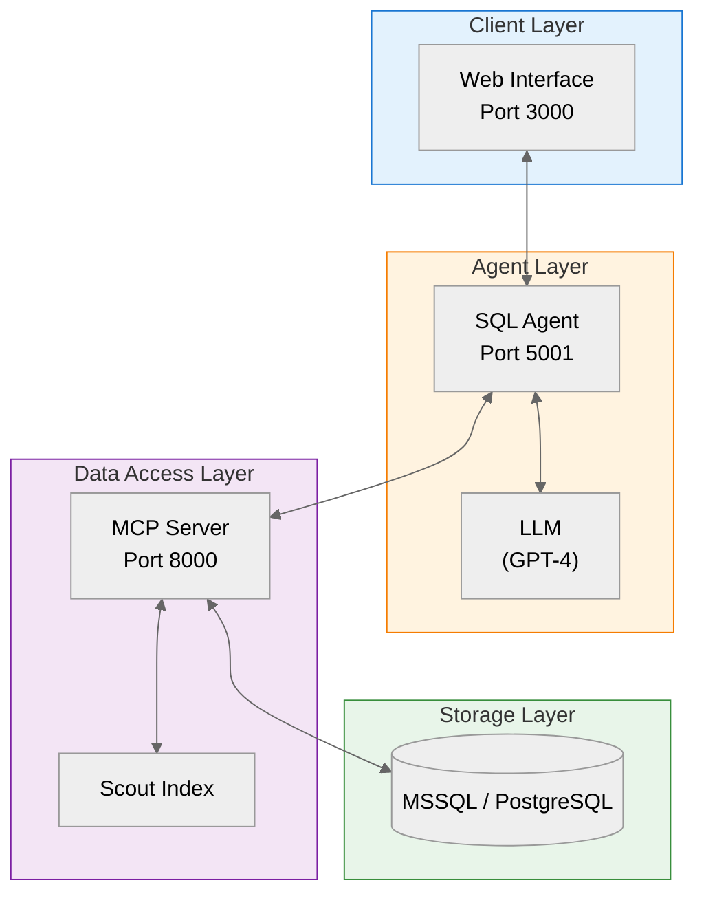

# ERP Natural Language Assistant

<p align="center">
  <strong>Natural language to SQL interface for MSSQL databases.</strong>
</p>

<p align="center">
  
</p>

---

## Problem Statement

Enterprise databases contain valuable business insights, but accessing them requires:
- Technical SQL knowledge
- Understanding of complex database schemas
- IT department involvement for ad-hoc queries

**Result:** Business users face delays for simple data retrieval tasks.

---

## Solution

An AI-powered assistant that translates natural language questions into SQL queries and retrieves data from MSSQL databases.



---

## How It Works

### 1. Natural Language Input

The system accepts queries in plain language (German and English):

> *"Show me the top 10 customers by revenue this year"*
>
> *"Which products had the highest sales growth last quarter?"*
>
> *"What's the average order value by region?"*

### 2. Intelligent Table Discovery

The system automatically:
- Identifies relevant tables from the database schema
- Resolves relationships between entities
- Generates appropriate SQL queries



### 3. Result Presentation

Responses include:
- Formatted answers to the query
- Data tables where applicable
- Support for follow-up questions in conversational context

---

## Architecture



### Components

| Component | Purpose |
|-----------|---------|
| **Web Interface** | Chat-based UI for query input and result display |
| **SQL Agent** | LangGraph-based ReAct agent for query decomposition |
| **MCP Server** | Database abstraction layer with tool endpoints |
| **Scout Index** | Pre-computed table metadata for semantic search |

---

## Features

| Feature | Description |
|---------|-------------|
| **Natural Language Processing** | Supports German and English queries |
| **Semantic Table Discovery** | Finds relevant tables among 900+ candidates |
| **Real-time Streaming** | Server-Sent Events for progressive response display |
| **Conversational Context** | Maintains session state for follow-up queries |
| **Read-only Access** | No data modification capabilities |

---

## Use Cases

**Sales Analytics**
- Revenue by customer, product, or region
- Sales trends and growth analysis
- Performance comparisons

**Inventory Management**
- Stock levels and availability
- Product performance metrics

**Operations**
- Order fulfillment statistics
- Supplier analysis
- Cost breakdowns

---

## Getting Started

### Prerequisites

- Python 3.10+
- MSSQL or PostgreSQL database (read-only access)
- OpenAI API key ([platform.openai.com](https://platform.openai.com/api-keys))

### Installation

```bash
# Clone repository
git clone https://github.com/julianus-kath/erp-assistant.git
cd erp-assistant

# Create virtual environment
python -m venv venv
source venv/bin/activate  # Windows: venv\Scripts\activate

# Install dependencies
pip install -r requirements.txt
```

### Configuration

```bash
cp .env.example .env
```

Required environment variables:
```
OPENAI_API_KEY=sk-...
MCP_SERVER_URL=http://database-server:8000
```

### Running

```bash
./start_scripts/start_all_services.sh
```

### Endpoints

| Service | URL | Description |
|---------|-----|-------------|
| Web Interface | http://localhost:3000 | Chat UI |
| Agent API | http://localhost:5001 | Query endpoints |
| Health Check | http://localhost:5001/health | Service status |

---

## Project Structure

```
├── simple_sql_agent/       # LangGraph agent implementation
│   ├── agent.py            # ReAct agent logic
│   ├── service.py          # FastAPI service
│   └── prompts/            # System prompts
├── chatbot_ui/             # Web interface
├── mcp_server/             # Database access layer
│   ├── scout/              # Semantic search
│   └── catalog/            # Schema caching
├── eval/                   # Evaluation framework
└── adrs/                   # Architecture Decision Records
```

---

## About

Master's thesis project exploring LLM-based natural language to SQL translation.

**Author:** Julianus Kath

**Stack:** Python, LangGraph, FastAPI, GPT-4, MSSQL

---

<p align="center">
  <em>Natural language to SQL for MSSQL databases.</em>
</p>
