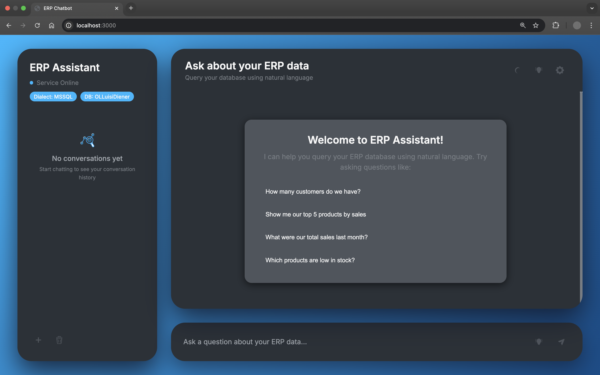
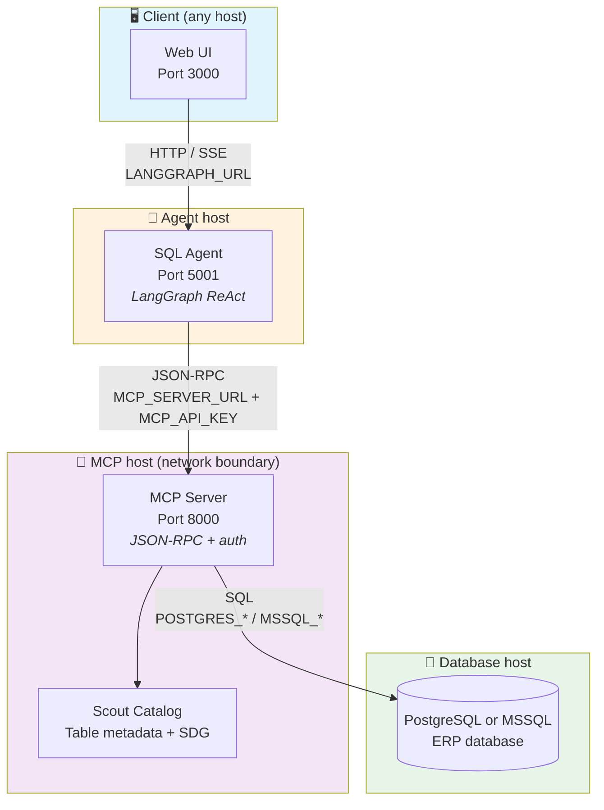
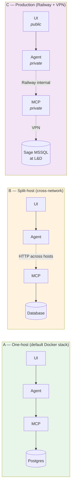
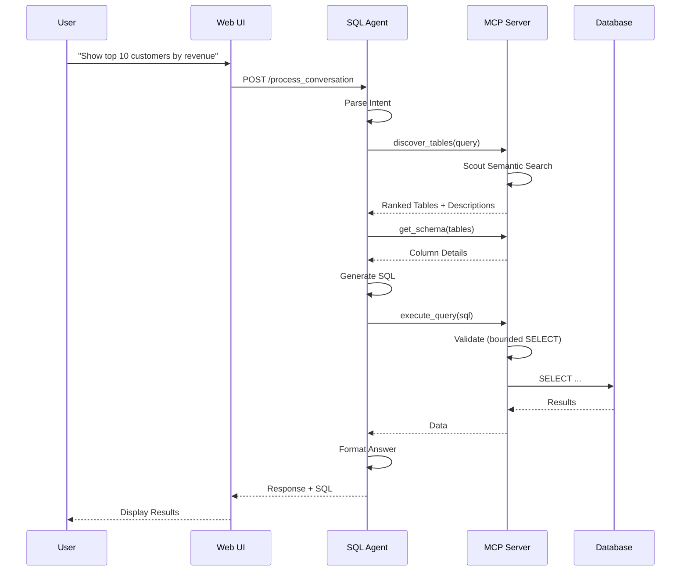

<h1 align="center">ERP Natural Language Query Assistant</h1>

<p align="center">
  <strong>Proactive Context Learning for LLM-Based ERP Database Querying in SMEs</strong>
</p>

<p align="center">
  
  
  
  
  
  
</p>

<p align="center">
  <a href="#about-this-release">About</a> •
  <a href="#quick-start">Quick Start</a> •
  <a href="#architecture">Architecture</a> •
  <a href="#running-the-system">Running</a> •
  <a href="#api-reference">API</a> •
  <a href="#thesis-context">Thesis</a>
</p>

---

## About This Release

This repository accompanies the master's thesis *"Proactive Context Learning for LLM-Based ERP Database Querying in SMEs"*.

| | |
|---|---|
| **Author** | Julianus Elias Flavio Kath |
| **Email** | [julianus.kath@student.unisg.ch](mailto:julianus.kath@student.unisg.ch) |
| **Matriculation** | 23-607-203 |
| **Programme** | MSc Business Innovation, University of St. Gallen |
| **Supervisor** | Prof. Dr. Simon Mayer |
| **Year** | 2026 |

**Production target.** The thesis's primary case study is a Sage-family **MSSQL** ERP at Luisi & Diener — schema-opaque German table names, 900+ tables, human-in-the-loop querying. That deployment runs against a VPN-tunnelled Windows MCP server; see [Running on MSSQL](#running-on-mssql-production-path).

**This release ships preconfigured for Northwind (PostgreSQL)** — the controlled benchmark used in the thesis — so a reviewer can clone and run without any database setup. A live instance of this exact configuration is available at **[thesis.julianuskath.com](https://thesis.julianuskath.com)** — for the access password, please contact [julianus.kath@student.unisg.ch](mailto:julianus.kath@student.unisg.ch).

---

## Quick Start

Clone, add an OpenAI key, run one script. The stack bundles a Postgres container pre-seeded with Northwind, so no external database setup is required.

**Prerequisites:** [Docker Desktop](https://docs.docker.com/get-docker/) and an OpenAI API key.

```bash
git clone https://github.com/<REPO>/<NAME>.git
cd <NAME>
cp .env.example .env
$EDITOR .env          # paste your OPENAI_API_KEY
./run.sh
```

First boot takes ~2 minutes (image builds + Northwind seeding). When ready:

- Web UI → http://localhost:3000
- SQL Agent docs → http://localhost:5001/docs
- MCP health → http://localhost:8000/health

Stop the stack with `docker compose down`. See [.env.example](.env.example) for port overrides, SDG toggle, and MSSQL override.

---

<!-- Interface Screenshot -->
<p align="center">
  
</p>

---

## Features

- **Natural Language Queries** — Plain English or German
- **Scout Mode** — Proactive schema catalog with semantic table ranking
- **Dialect-aware SQL Generation** — PostgreSQL and MSSQL
- **Interactive Clarifications** — Asks follow-up questions when queries are ambiguous
- **Real-time Streaming** — See results and agent reasoning as they're generated
- **Secure Architecture** — API keys managed server-side, no client exposure

---

## Architecture

### System Overview

Four services. Every link between them is an HTTP boundary that can be a network hop on a different host — proven by the production deployment, where the MCP server lives behind a VPN on a different machine than the SQL Agent.



Three URLs configure the topology end-to-end: `LANGGRAPH_URL` (UI → Agent), `MCP_SERVER_URL` (Agent → MCP), and the `POSTGRES_*` / `MSSQL_*` block (MCP → DB). No service knows about any other except via these env vars; collapse them all to localhost for a single-host deployment, or split them across hosts for a VPN-tunnelled production.

### Deployment topologies

The same image set supports three configurations. All three are tested.



- **A** — `./run.sh` boots the whole stack on one machine. Bundled Postgres + Northwind, ~2 min cold start. The default for examiners.
- **B** — Set `MCP_SERVER_URL=http://<other-host>:8000` on the Agent. The MCP server's `MCP_API_KEY` authenticates inbound traffic; nothing else needs to change. Use this when the database is on a separate machine, behind a firewall, or behind a VPN.
- **C** — The four services run as separate Railway services with private internal DNS; only the Web UI is publicly exposed at `thesis.julianuskath.com`. The MCP service connects through a VPN to the Sage MSSQL ERP at Luisi & Diener. See [`deploy/railway/README.md`](deploy/railway/README.md) for the runbook.

For local variations of B (custom Postgres, port overrides, remote MCP), see [`docker-compose.override.yml.example`](docker-compose.override.yml.example).

### Query Processing Flow



### Scout Mode

The agent calls five MCP tools. Three are direct catalog reads (`list_tables`, `get_schema`, `get_column_index`), one runs the generated SQL (`execute_query`), and one is the proactive entry point (`discover_tables`) that drives Scout's semantic ranking before the agent commits to a table set. Scout's catalog is populated at MCP startup and refreshed on a TTL; the agent never waits on a fresh build during a query.

```mermaid
flowchart LR
    subgraph Tools["🔧 MCP tools (called by the agent)"]
        T1[discover_tables<br/><i>proactive ranking</i>]
        T2[list_tables]
        T3[get_schema]
        T4[get_column_index]
        T5[execute_query]
    end

    subgraph Scout["🔍 Scout ranker"]
        S1[Semantic search]
        S2[CamelCase / German<br/>compound parser]
        S3[Fuzzy match]
        S4[SDG description<br/>token coverage]
    end

    subgraph Cache["📦 Catalog cache"]
        C1[Table metadata]
        C2[Column types]
        C3[Row counts]
        C4[FK graph]
    end

    T1 --> S1
    S1 --> S2
    S1 --> S3
    S1 --> S4
    S1 --> C1
    T2 --> C1
    T3 --> C2
    T3 --> C3
    T3 --> C4
    T4 --> C2
    T5 -.>|bounded SELECT| C1

    style Tools fill:#fff3e0
    style Scout fill:#e8f5e9
    style Cache fill:#f3e5f5
```

---

## Running the System

The stack runs three application services plus a database. There are three supported ways to bring them up.

### 1. Docker (default, Northwind demo)

See [Quick Start](#quick-start) above. This is what `thesis.julianuskath.com` runs.

### 2. Run services individually (Docker)

```bash
docker compose up postgres                     # DB only
docker compose up postgres mcp_server          # DB + catalog server
docker compose up --build                      # Full stack
docker compose logs -f mcp_server              # Tail one service
```

### 3. Native dev (Mac, non-Docker)

For active development on Mac with a local venv:

```bash
./start_scripts/start_all_services_mac.sh
```

Starts SQL Agent (5001), Web UI (3000), and optionally a local MCP server on 8000. See [start_scripts/](start_scripts/) for details.

### Connecting your own Postgres (or splitting MCP onto a remote host)

The default stack bundles a Postgres container seeded with Northwind so a reviewer can run the system without any external setup. Two common variations are pre-written in [`docker-compose.override.yml.example`](docker-compose.override.yml.example) — copy it to `docker-compose.override.yml` (git-ignored), uncomment the scenario you want, edit the values:

- **Scenario A** — point `mcp_server` at your own existing Postgres on the network.
- **Scenario B** — change ports if `3000`/`5001`/`8000`/`55432` clash with something on your machine. (Pure env, no override needed: set `WEB_UI_PORT`, `SQL_AGENT_PORT`, `MCP_PORT`, `POSTGRES_PORT` in `.env`.)
- **Scenario C** — run the MCP server on a **different host** entirely (e.g. behind a VPN, on a Windows machine, or on Railway), and have the local stack only run the agent + UI. This is exactly the production deployment for the Sage ERP — see [Running on MSSQL](#running-on-mssql-production-path).

The `mcp_server` container binds to `0.0.0.0` and authenticates inbound requests with `MCP_API_KEY`, so it can serve traffic from any host. The `sql_agent` reaches it via `MCP_SERVER_URL` and the `web_ui` reaches the agent via `LANGGRAPH_URL` — every URL is env-driven, no hard-coded hosts.

### Northwind seed source

`data/northwind.sql` is the seed dump used to populate the bundled Postgres container. It comes from [pthom/northwind_psql](https://github.com/pthom/northwind_psql), the standard PostgreSQL port of Microsoft's Northwind sample database (14 tables: customers, orders, products, employees, suppliers, etc.). To rebuild or inspect the seed independently, clone that repo and follow its instructions; the resulting `northwind.sql` is drop-in compatible.

### Running on MSSQL (production path)

The thesis's primary case study is a Sage-family MSSQL ERP reachable only through a VPN. To run the system against a real MSSQL instance:

1. Install **ODBC Driver 17 for SQL Server** on the MCP-server host (or use the Railway Dockerfile at [deploy/railway/Dockerfile.mcp-server](deploy/railway/Dockerfile.mcp-server), which bundles it).
2. Set the MCP server's env:

   ```bash
   DB_DIALECT=mssql
   MSSQL_SERVER=<your-sql-host>
   MSSQL_PORT=1433
   MSSQL_DATABASE=<your-database>
   MSSQL_USER=<your-username>
   MSSQL_PASSWORD=<your-password>
   MSSQL_DRIVER="ODBC Driver 17 for SQL Server"
   ```

3. Start the MCP server on the Windows host via [vpn_config/start_mcp_server_windows.bat](vpn_config/start_mcp_server_windows.bat). The Mac side runs the agent + UI and points `MCP_SERVER_URL` at the Windows host.

Full Windows/VPN setup is documented in [vpn_config/README.md](vpn_config/README.md). The Railway production deployment is in [deploy/railway/](deploy/railway/).

### Deployment (Railway, Northwind Demo)

For production-style deployment with Northwind/Postgres on Railway, use the runbook:

- [deploy/railway/README.md](deploy/railway/README.md)

Railway Dockerfiles:

- `deploy/railway/Dockerfile.web-ui`
- `deploy/railway/Dockerfile.sql-agent`
- `deploy/railway/Dockerfile.mcp-server`

---

## API Reference

Each service exposes interactive OpenAPI docs via FastAPI:

| Service | Port | Interactive docs | Health |
|---|---|---|---|
| MCP Server | 8000 | `/docs` | `/health` |
| SQL Agent | 5001 | `/docs` | `/health` |
| Web UI | 3000 | — | `/health` |

### Key endpoints

**SQL Agent** (`:5001`):

```http
POST /query                     # Single-query synchronous
POST /process_query             # Query processing endpoint
POST /process_conversation      # Multi-turn chat
POST /stream                    # Server-Sent Events stream of agent reasoning
GET  /health                    # Service status + MCP connectivity
```

Example request:

```http
POST /query
Content-Type: application/json

{ "question": "Who are our top 5 customers by revenue?" }
```

Example response:

```json
{
  "answer": "Based on the sales data, your top 5 customers are ...",
  "sql_query": "SELECT c.company_name, SUM(od.quantity * od.unit_price) AS revenue ...",
  "success": true,
  "latency_ms": 2500
}
```

**MCP Server** (`:8000`):

```http
GET  /health                    # Scout catalog health, DB connectivity, table count
POST /mcp                       # JSON-RPC endpoint for all tool calls
```

**Web UI** (`:3000`):

```http
GET  /                          # Chat UI
POST /process_conversation      # Proxied to SQL Agent
POST /stream_conversation       # Proxied stream
GET  /backend_health            # Proxied health check of SQL Agent
```

---

## Project Structure

```
.
├── run.sh                     # One-command launcher (Docker)
├── docker-compose.yml         # Postgres + 3 app services
├── .env.example               # Minimal config (only OPENAI_API_KEY required)
├── simple_sql_agent/          # LangGraph ReAct agent (port 5001)
├── chatbot_ui/                # FastAPI web interface (port 3000)
├── mcp_server/                # MCP database server (port 8000)
│   ├── scout/                 # Proactive schema catalog + semantic search
│   └── catalog/               # Dialect-specific catalog builders
├── eval/                      # Evaluation framework (scripts, datasets, runs)
├── evaluation/                # Curated thesis-cited results (H1, H2a, H2b, H3)
├── tests/                     # Unit + integration tests
├── adrs/                      # 34 Architecture Decision Records
├── data/
│   ├── northwind.sql          # Seed dump for the demo container
│   └── concepts.json          # Domain knowledge
├── deploy/railway/            # Production Dockerfiles (reused by docker-compose)
├── start_scripts/             # Native (non-Docker) startup scripts
└── vpn_config/                # Windows/VPN production setup
```

---

## Thesis Context

**Core contribution.** Scout Mode — a schema-aware context acquisition layer that indexes database tables and columns, then provides ranked metadata to an LLM-based SQL agent. The thesis evaluates whether injecting LLM-generated semantic descriptions (SDG) into Scout's ranker improves table selection under schema opacity — the regime that characterizes real production ERPs.

**Evaluation datasets.**
- **Northwind (PostgreSQL, 14 tables)** — controlled benchmark with transparent schema naming
- **Sage/Luisi & Diener (MSSQL, ~943 tables)** — production evaluation with opaque German table names

**Curated evaluation results** organised by hypothesis are in [`evaluation/`](evaluation/). The full reproducibility framework — datasets, scripts, all run timestamps — is in [`eval/`](eval/).

| Hypothesis | Subdirectory | Thesis section |
|---|---|---|
| H1 — Catalog completeness | [`evaluation/H1/`](evaluation/H1/) | §5.1 |
| H2a — Controlled SDG ablation | [`evaluation/H2a/`](evaluation/H2a/) | §5.2 |
| H2b — Production transfer | [`evaluation/H2b/`](evaluation/H2b/) | §5.3 |
| H3 — User study | [`evaluation/H3/`](evaluation/H3/) | §5.4 |

### Key Architecture Decisions

| ADR | Title |
|---|---|
| [0014](adrs/0014-scout-mode-semantic-caching.md) | Scout Mode: Semantic Caching |
| [0015](adrs/0015-semantic-table-ranking.md) | Semantic Table Ranking |
| [0020](adrs/0020-mcp-discovery-tools-semantic-catalog-enrichment.md) | MCP Discovery Tools & Catalog Enrichment |
| [0030](adrs/0030-simple-sql-agent-architecture.md) | Simple SQL Agent Architecture |
| [0032](adrs/0032-generic-table-search-ranking-fixes.md) | Table Search Ranking Fixes |
| [0034](adrs/0034-agent-quality-debugging-and-fixes.md) | Agent Quality Debugging |

Full index: [adrs/adr-index.yaml](adrs/adr-index.yaml)

### Key Concepts

- **Scout Mode** — pre-computed table metadata indexed for semantic search
- **SDG (Semantic Description Generation)** — LLM-generated table/column descriptions injected into Scout's ranker; the primary H2a ablation axis
- **ReAct Agent** — reasoning-and-acting pattern for query decomposition via LangGraph
- **MCP Protocol** — JSON-RPC tool calls from the agent to the database server

---

## Running Benchmarks

```bash
# H2a full-pipeline ablation (Northwind)
python -m eval.run_h2a_full_pipeline \
  --dataset eval/datasets/northwind_extended_difficulty_v1.jsonl \
  --contracts eval/datasets/northwind_extended_difficulty_v1.contracts.json \
  --mode scout_structural

# H1 retrieval-only ablation (bypasses the LLM — tests Scout in isolation)
python -m eval.run_retrieval_only_ablation --help
```

See [eval/SDG_EVALUATION_RUNBOOK.md](eval/SDG_EVALUATION_RUNBOOK.md) for the full evaluation procedure.

### Tests

```bash
pytest -m "not integration"    # Unit tests only
pytest                         # Full suite (requires the Postgres container up)
```

---

## License

MIT — see [LICENSE](LICENSE).

---

<p align="center">
  Master's thesis, University of St. Gallen, 2026 — built with <a href="https://www.langchain.com/langgraph">LangGraph</a>, <a href="https://modelcontextprotocol.io/">MCP</a>, and <a href="https://openai.com">OpenAI</a>
</p>
