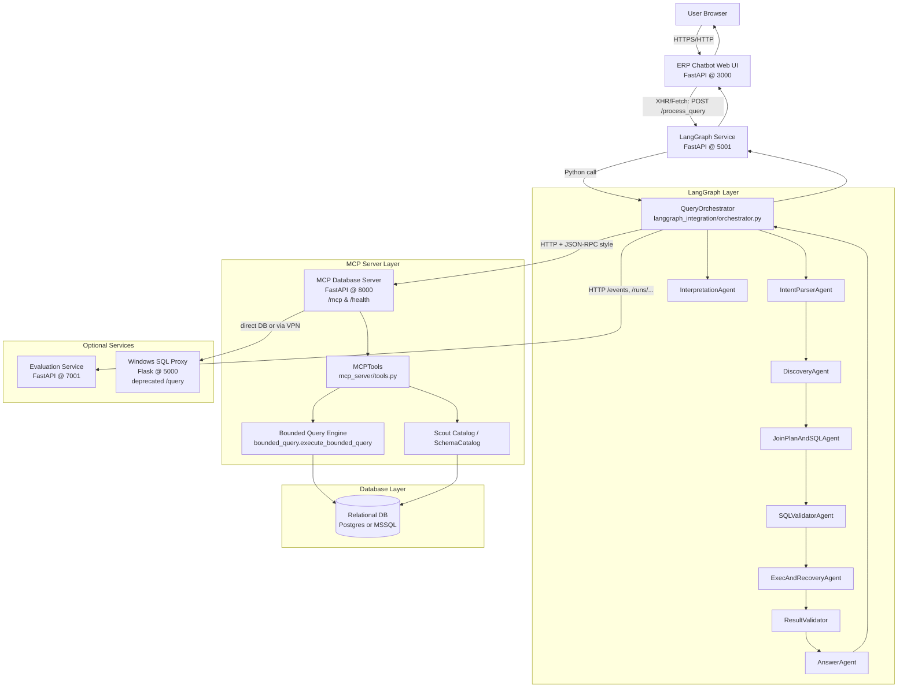
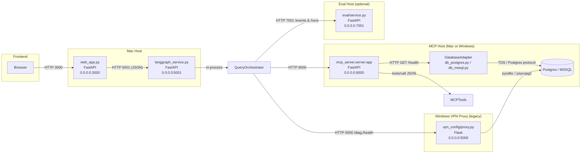

# ERP Multi‑Agent Assistant – System README

> This README describes how the system actually works today, based on the code in this repository and ADR‑0024 (`adrs/0024-Comprehensive-ERP-Assistant-Architecture.md`). Where behavior cannot be confirmed from code, it is marked as `UNKNOWN (needs verification)`.

---

## 1. Project Overview (implementation‑truth)

- **Purpose**
  - End‑to‑end ERP assistant that answers natural‑language questions against an ERP database using a LangGraph multi‑agent workflow and an MCP database server.
  - Primary flow: **Web UI → LangGraph Service → LangGraph Orchestrator → MCP Server → Database**.

- **Core runtime services**
  - **LangGraph Service (multi‑agent API)**
    - Path: `chatbot_ui/langgraph_service.py`
    - Framework: FastAPI + Uvicorn
    - Default port: **5001**
    - Responsibilities:
      - Initialize a global `QueryOrchestrator` (LangGraph graph) via `create_query_orchestrator()` in `langgraph_integration/orchestrator.py`.
      - Expose HTTP endpoints:
        - `POST /process_query` – single‑turn queries.
        - `POST /process_conversation` – multi‑turn conversations (passes full message history).
        - `GET /health`, `/debug/config`, `/debug/logs`, `/debug/logs/stream`, `/`.
      - Enforce API key (`API_KEY` env var) on query endpoints.
      - Normalize `exec_result` and `error_info` into typed envelopes before returning.
  - **ERP Chatbot Web UI**
    - Path: `chatbot_ui/web_app.py` (+ static assets in `chatbot_ui/index.html`, `script.js`, `styles.css`)
    - Framework: FastAPI (serves static HTML/CSS/JS)
    - Default port: **3000**
    - Responsibilities:
      - Serve modern chat UI that talks to the LangGraph Service (default `http://localhost:5001`).
      - Provide `GET /health` and `GET /config` to let the frontend discover current LangGraph URL and API key status.
  - **MCP Database Server**
    - Path: `mcp_server/server.py`
    - Framework: FastAPI + Uvicorn
    - Default port: **MCP_PORT** env or **8000**
    - Responsibilities:
      - Initialize `DatabaseAdapter` (`mcp_server/database_adapter.py`) for Postgres or MSSQL.
      - Run Scout catalog / SchemaCatalog at startup (via `ScoutRunner` / `SchemaCatalog`).
      - Expose:
        - `GET /health` – rich health + catalog status (via `mcp_server/health.py`).
        - `POST /mcp` – MCP **JSON‑RPC‑ish** tool dispatch endpoint (see “Spec vs Implementation”).
      - Dispatch tool calls to `MCPTools` (`mcp_server/tools.py`) for discovery, schema, and bounded query execution.
  - **Evaluation & Tracking Service (optional)**
    - Path: `eval/service.py`
    - Framework: FastAPI
    - Default port: **7001**
    - Responsibilities:
      - Receive evaluation run manifests, per‑query artifacts, and trace events.
      - Persist to local filesystem under `eval/runs/`.
      - Used by `eval/eval_client.py` when `EVAL_ENABLED` and `EVAL_TRACKING_URL` are set.
  - **Windows SQL Proxy (legacy / deprecated for query execution)**
    - Path: `vpn_config/proxy.py` (Flask)
    - Default port: **PROXY_PORT** env or **5000**
    - Responsibilities:
      - Provides `/health` and `/diag` for diagnostics.
      - `POST /query` endpoint is **explicitly deprecated** and now returns HTTP 410 with a migration guide pointing to MCP `/mcp` and tools like `query_bounded`.

  - **Agent and graph layer**
    - Implemented under `langgraph_integration/`:
      - Orchestrator: `langgraph_integration/orchestrator.py` (class `QueryOrchestrator`).
        - Supports two orchestration modes:
          - `pipeline` – fixed multi‑agent graph (Phase 9/10 pipeline, current default).
          - `react_supervisor` – ReAct‑style supervisor that calls the same agents via capability tools.
        - Mode is selected via the `orchestration_mode` argument, `metadata["orchestration_mode"]` on `process_query`, or the `ORCHESTRATION_MODE` environment variable.
    - State contracts: `langgraph_integration/contracts/state.py`.
    - Agents:
      - `agents/intent_parser/agent.py` – `IntentParserAgent` (LangGraph subgraph).
      - `agents/discovery/agent.py` – `DiscoveryAgent`.
      - `agents/join_sql/agent.py` – `JoinPlanAndSQLAgent`.
      - `agents/sql_validator/agent.py` – `SQLValidatorAgent`.
      - `agents/exec_recovery/agent.py` – `ExecAndRecoveryAgent`.
      - `agents/answer/agent.py` – `AnswerAgent`.
      - `agents/interpretation/agent.py` – `InterpretationAgent`.
      - `agents/result_validator/agent.py` – result validation node (Phase 10a).
    - Prompts: `langgraph_integration/prompts/*.py` (answer formatting, discovery, join/SQL, repair).

- **Data sources and generators**
  - **Relational DB** (Postgres or MSSQL)
    - Accessed exclusively via MCP server when running the production path.
    - `mcp_server/database_adapter.py` orchestrates connectors:
      - `db_postgres.py` for Postgres (`DB_DIALECT=postgres`).
      - `db_mssql.py` for SQL Server (`DB_DIALECT=mssql`).
      - `db_proxy.py` exists for proxy mode but is not used in the main path in ADR‑0024.
  - **Synthetic Data Service** (no HTTP server)
    - Path: `synthetic_data_service/main.py`, `synthetic_data_service/setup_postgres.py`.
    - CLI to generate synthetic ERP data into Postgres; configuration via `synthetic_data_service/config.py`.
  - **MongoDB Document Store**
    - Package: `mongodb_document_store/`
    - Configuration: `mongodb_document_store/config.py`.
    - Provides async document store for reviews, tickets, campaigns, etc.
    - Integration into the main LangGraph+MCP path is `UNKNOWN (needs verification)`; there is no direct reference from `QueryOrchestrator` or `MCPTools`.

- **Supporting scripts**
  - `start_system.py` – cross‑platform launcher for Mac (LangGraph + Web UI) and Windows (MCP server).
  - `start_all_services.sh` / `start_all_services_mac.sh` – convenience startup scripts (Mac).
  - `vpn_config/start_mcp_server_windows.*` – Windows scripts to run `mcp_server.server:app` via Uvicorn.
  - Docker artifacts under `docker/` (see Runtime Topology); these are partially legacy and not wired into ADR‑0024 orchestration.

---

## 2. System Diagram (Mermaid)

### 2.1 High‑level System Diagram



### 2.2 Low‑level Ports & Protocols



---

## 3. Component Index

| Component                         | Path                                      | Port                      | How to run (local)                                                                                          | Talks to                                                                                     | Key env vars |
| --------------------------------- | ----------------------------------------- | ------------------------- | ----------------------------------------------------------------------------------------------------------- | -------------------------------------------------------------------------------------------- | ------------ |
| LangGraph Service (API)          | `chatbot_ui/langgraph_service.py`         | `5001`                    | `python -m uvicorn chatbot_ui.langgraph_service:app --host 0.0.0.0 --port 5001`                            | MCP Server (`MCP_SERVER_URL`), OpenAI API, Evaluation Service (via `eval_client.py`)        | `API_KEY`, `MCP_SERVER_URL`, `MCP_API_KEY`, `OPENAI_API_KEY`, `LANGGRAPH_LLM_MODEL`, `LANGGRAPH_LLM_TEMP` |
| ERP Chatbot Web UI               | `chatbot_ui/web_app.py`                   | `3000`                    | `python -m uvicorn chatbot_ui.web_app:app --host 0.0.0.0 --port 3000`                                      | LangGraph Service (`LANGGRAPH_URL`), MCP Server (indirect)                                  | `LANGGRAPH_URL`, `API_KEY` |
| MCP Database Server              | `mcp_server/server.py`                    | `${MCP_PORT}` or `8000`   | `python -m uvicorn mcp_server.server:app --host 0.0.0.0 --port 8000`                                       | Relational DB via `DatabaseAdapter`; Scout catalog files under `mcp_server/data/catalog`    | `MCP_PORT`, `MCP_API_KEY`, `DB_DIALECT`, `POSTGRES_*`, `MSSQL_*`, `MAX_QUERY_RESULTS`, `QUERY_TIMEOUT` |
| Evaluation Service (optional)    | `eval/service.py`                         | `7001`                    | `python -m eval.service` or `python eval/service.py`                                                       | Receives events from `eval/eval_client.py`                                                   | `EVAL_TRACKING_URL`, `EVAL_ENABLED` |
| Simple LangGraph API (legacy)    | `langgraph_integration/api.py`            | `8000` (in `__main__`)    | `python langgraph_integration/api.py`                                                                      | Directly calls `QueryOrchestrator` (no Web UI)                                              | `MCP_SERVER_URL`, `MCP_API_KEY`, `OPENAI_API_KEY` |
| Windows SQL Proxy (legacy)       | `vpn_config/proxy.py`                     | `${PROXY_PORT}` or `5000` | `python vpn_config/proxy.py` (Windows)                                                                     | Direct DB (pyodbc / psycopg2); **/query is deprecated**; still used for `/health` & `/diag` | `PROXY_BIND_HOST`, `PROXY_PORT`, `PROXY_API_KEY`, `PROXY_MAX_REQUEST_SIZE`, `PROXY_RATE_LIMIT_PER_MINUTE` |
| Synthetic Data CLI               | `synthetic_data_service/main.py`          | `-`                       | `python synthetic_data_service/main.py --customers 5000 ...`                                               | Target Postgres DB configured via env                                                       | `DB_TYPE`, `DB_HOST`, `DB_PORT`, `DB_NAME`, `DB_USER`, `DB_PASSWORD` |
| MongoDB Document Store           | `mongodb_document_store/`                 | `-`                       | `python mongodb_document_store/setup_database.py` (for initialization)                                     | MongoDB at `MONGODB_URL`                                                                    | `MONGODB_URL`, `MONGODB_DATABASE` |
| Multi‑platform launcher          | `start_system.py`                         | `-`                       | `python start_system.py mac --all` (Mac) / `python start_system.py windows` (Windows MCP server)           | Calls `start_all_services_mac.sh` or `vpn_config/start_mcp_server_windows.*`                | `.env` (various), `DB_MODE` |
| Mac startup script               | `start_all_services.sh` / `_mac.sh`       | `3000`, `5001`, `8000`    | `bash start_all_services.sh` (Note: hard‑coded `PROJECT_ROOT` path must be adjusted for your machine)      | Starts MCP Server, LangGraph Service, Web UI                                                 | `.env`, `DB_MODE`, `PROXY_*`, `MCP_*`, `OPENAI_API_KEY` |
| Docker (n8n + legacy UI)         | `docker/docker-compose.yml`               | `5678`, `8080`            | `docker compose -f docker/docker-compose.yml up`                                                            | n8n workflow engine + Nginx static UI (uses older paths; integration with new LangGraph is `UNKNOWN`) | `OPENAI_API_KEY` (for n8n), container‑local config |

---

## 4. Runtime Topology

### 4.1 Local development (Mac)

- **Recommended orchestration**
  - Use `start_system.py`:
    - `python start_system.py check` – run environment checks.
    - `python start_system.py mac --all` – starts:
      - MCP Server (if configured in scripts / `.env`).
      - LangGraph Service (5001) via `uvicorn`.
      - Web UI (3000).
  - Alternative: `bash start_all_services.sh`
    - Cleans ports 3000, 5001, 8000.
    - Optionally creates `.env` with template DB + MCP settings.
    - Starts:
      - MCP Server (if `mcp_server/tools.py` present).
      - `uvicorn langgraph_service:app --port 5001`.
      - `uvicorn web_app:app --port 3000`.
    - Logs go to `logs/` under the `PROJECT_ROOT` hard‑coded in the script (must be updated for your machine).

- **Service dependencies**
  - Web UI:
    - Uses `GET /config` from `web_app.py` to learn `LANGGRAPH_URL` and `api_key_set`.
    - Defaults: `LANGGRAPH_URL=http://localhost:5001`.
  - LangGraph Service:
    - Assumes MCP Server reachable at `MCP_SERVER_URL` (default `http://localhost:8000`) via `langgraph_integration/mcp_client.py`.
    - Requires `OPENAI_API_KEY` for `IntentParserAgent` and other LLM calls.
  - MCP Server:
    - Needs DB connectivity:
      - `DB_DIALECT=postgres` → Postgres config via `POSTGRES_*`.
      - `DB_DIALECT=mssql` → MSSQL config via `MSSQL_*` (often used when running on Windows with VPN).
    - Builds Scout catalog (or SchemaCatalog) on startup (see `mcp_server/server.py` + `health.py`).

### 4.2 Windows proxy / VPN mode

- **MCP on Windows**
  - `vpn_config/start_mcp_server_windows.bat` / `.ps1`:
    - Ensures `uvicorn` and `fastapi` installed.
    - Runs `uvicorn mcp_server.server:app` on **MCP_PORT** (default 8000).
    - Logs to Windows console; health available at `http://<windows-ip>:8000/health`.
  - The Mac side then:
    - Sets `MCP_SERVER_URL=http://<windows-ip>:8000` in `.env`.
    - Runs Web UI + LangGraph Service locally.

- **SQL Proxy (legacy path)**
  - `vpn_config/proxy.py`:
    - Runs a read‑only SQL‑over‑HTTP proxy on `PROXY_PORT` (default 5000) with:
      - `GET /health`
      - `GET /diag`
      - `POST /query` (returns 410 Gone, with migration instructions to MCP `/mcp`).
    - Controlled by env:
      - `PROXY_BIND_HOST`, `PROXY_PORT`, `PROXY_API_KEY`, TLS certificate paths.
  - **DB_MODE**
    - Several scripts (`start_all_services.sh`, `scripts/ping_mcp.py`, tests) read `DB_MODE`:
      - `DB_MODE=local` – direct DB via MCP DatabaseAdapter.
      - `DB_MODE=proxy` – legacy path through HTTP proxy (`db_proxy.py`); current production path is MCP‑only per ADR‑0012.
    - In the current ADR‑0024 implementation, all database access in the main assistant path goes through MCP; `db_proxy.py` and `/query` endpoint are effectively deprecated and should be treated as such.

### 4.3 Docker mode

- **docker/docker-compose.yml**
  - Defines:
    - `n8n` service on `5678`:
      - Mounts project repo into container.
      - Passes `OPENAI_API_KEY`.
      - Intended to orchestrate workflows that can call Python scripts from this repo.
    - `chatbot-ui` service on `8080`:
      - Nginx serving static content from `./chatbot-interface` (legacy directory).
  - Integration between this compose file and the current LangGraph + MCP stack is **`UNKNOWN (needs verification)`**; it predates the multi‑agent LangGraph architecture seen in `langgraph_integration/`.

- **Dockerfiles**
  - `docker/Dockerfile`, `Dockerfile.api`, `Dockerfile.frontend`, `Dockerfile.mcp`, `Dockerfile.mongo`:
    - Some still reference `crawling_agent` modules that are not part of the ADR‑0024 flow.
    - Use these as reference only; building a fully working container stack for the current architecture will require additional wiring (`UNKNOWN (needs verification)`).

---

## 5. API Reference (Complete)

### 5.1 LangGraph Service – `chatbot_ui/langgraph_service.py` (port 5001)

#### 5.1.1 `GET /health`

- **Description**: Simple readiness check for the LangGraph Service.
- **Request**: no body.
- **Response JSON**:
  - `status`: `"healthy"`.
  - `service`: `"Multi-Agent Orchestrator (Phase 9.1)"`.
  - `orchestrator_ready`: `true` if global orchestrator initialized.
  - `agents`: list of agent names (`["IntentParserAgent", "DiscoveryAgent", "JoinPlanAndSQLAgent", "ExecAndRecoveryAgent", "AnswerAgent"]`).
- **Auth**: none.
- **Typical errors**: none (if orchestrator failed to initialize, `orchestrator_ready` may be `false`).

```bash
curl http://localhost:5001/health
```

#### 5.1.2 `GET /debug/config`

- **Description**: Exposes orchestrator control‑flow defaults for debugging.
- **Request**: no body.
- **Response JSON**:
  - `status`: `"ok"` or error.
  - `version`: `"cf_fix2"` (control‑flow fix version).
  - `defaults`:
    - `max_total_plans`: `4`
    - `max_exec_attempts`: `4`
    - `max_llm_calls`: `20`
    - `max_graph_cycles`: `10`
- **Auth**: none.
- **Errors**:
  - `503` if `orchestrator` is `None`.

#### 5.1.3 `POST /process_query`

- **Description**: Main single‑turn query endpoint; runs the full multi‑agent pipeline.
- **Request model**: `QueryRequest`
  - JSON body:
    - `user_input` (string, required) – natural language query.
    - `api_key` (string, optional) – must match `API_KEY` env.
  - Header `X-API-Key` is accepted as a parameter but **unused** in current implementation; all auth uses `request.api_key` from the body.
- **Auth**:
  - `API_KEY` env (default `"supersecretapikey"`).
  - If `request.api_key != API_KEY`, returns HTTP `401`.
- **Response model**: `QueryResponse`
  - Fields:
    - `final_response` (string, required) – natural language answer from `AnswerAgent`.
    - `exec_result` (object, optional) – normalized `ResponseEnvelope`:
      - `ok` (bool)
      - `data` (list of row dicts)
      - `row_count` (int)
      - `execution_time_ms` (int or null)
      - `truncated` (bool)
      - `warnings` (list of strings)
      - `error` (string or null)
      - `error_info` (object or null; normalized via `ErrorInfo` model).
      - Optional: `columns`, `metadata`, `redacted_columns`, `limit`, `applied_limit`.
    - `sql_query` (string or null) – generated SQL.
    - `sources` (list) – typically candidate table names or view names.
    - `error_info` (object or null) – normalized `ErrorInfo` (type, message, optional details).
    - `discovery_log` (object or null) – discovery diagnostics from orchestrator.
    - `status` (string, default `"success"`).
- **Typical errors**:
  - `400` – `user_input` empty or missing.
  - `401` – invalid `api_key`.
  - `503` – orchestrator not initialized.
  - `500` – internal error; detail string is `"Error processing query: ..."`.

```bash
curl -X POST http://localhost:5001/process_query \
  -H "Content-Type: application/json" \
  -d '{
    "user_input": "How many customers do we have?",
    "api_key": "YOUR_API_KEY"
  }'
```

#### 5.1.4 `POST /process_conversation`

- **Description**: Multi‑turn conversation endpoint; uses full message history and an optional `conversation_id`.
- **Request model**: `ConversationRequest`
  - JSON body:
    - `messages` (list, required) – sequence of chat messages; each entry is expected to be a dict with at least `role` and `content`. Only `role == "user"` entries are used to find the last user message.
    - `conversation_id` (string, optional).
    - `api_key` (string, optional) – must match `API_KEY`.
- **Auth**:
  - Same as `/process_query` – `api_key` in body only.
- **Response model**: `ConversationResponse`
  - Fields:
    - `final_response` (string or null) – final assistant message.
    - `operation` (string or null) – `"clarify"` if `result["clarify"]` truthy else `"query"`.
    - `clarification` / `question` (string or null) – clarification question if `clarify == true`.
    - `clarify` (bool) – whether the system is asking a clarification.
    - `response` (string or null) – alias of `final_response`.
    - `messages` (list) – original messages plus appended assistant message (JSON‑encoded via `jsonable_encoder`).
    - `status` (string, default `"success"`).
- **Typical errors**:
  - `400` – missing or empty `messages`, or no user message in the sequence.
  - `401` – invalid `api_key`.
  - `503` – orchestrator not initialized.
  - `500` – internal error.

```bash
curl -X POST http://localhost:5001/process_conversation \
  -H "Content-Type: application/json" \
  -d '{
    "messages": [
      {"role": "user", "content": "How many customers did we have last year?"},
      {"role": "assistant", "content": "Answer from previous turn"},
      {"role": "user", "content": "And how many this year?"}
    ],
    "conversation_id": "conv-123",
    "api_key": "YOUR_API_KEY"
  }'
```

#### 5.1.5 Debug log endpoints

- `GET /debug/logs`
  - Returns `DebugLogsResponse`:
    - `logs`: list of log entries (`DebugLogEntry`) with `timestamp`, `type`, `message`, `session_id`.
    - `status`: `"success"` or `"error"`.
  - Side effect: clears internal debug log buffer.
- `GET /debug/logs/stream`
  - Same as above, but **does not** clear the buffer.

#### 5.1.6 `GET /`

- **Description**: Service capability descriptor for LangGraph Service.
- **Response JSON**:
  - `service`: `"LangGraph Service"`.
  - `version`: `"1.0.0"`.
  - `description`: free‑text.
  - `endpoints`: mapping detailing key endpoints and paths.

---

### 5.2 ERP Chatbot Web UI – `chatbot_ui/web_app.py` (port 3000)

#### 5.2.1 `GET /`

- Serves `chatbot_ui/index.html`.
- Errors:
  - `404` – if `index.html` is missing.

#### 5.2.2 `GET /styles.css`

- Serves `chatbot_ui/styles.css`.
- Errors:
  - `404` – if CSS file is missing.

#### 5.2.3 `GET /script.js`

- Serves `chatbot_ui/script.js`.
- The JS code defaults to `http://localhost:5001` for LangGraph Service, but allows overriding via UI input.

#### 5.2.4 `GET /health`

- Response:
  - `{"status": "healthy", "service": "ERP Chatbot Web UI", "version": "2.0.0"}`.

#### 5.2.5 `GET /config`

- Response:
  - `langgraph_url`: `LANGGRAPH_URL` env or `"http://localhost:5001"`.
  - `api_key_set`: boolean – whether `API_KEY` env is set.
  - `version`: `"2.0.0"`.

```bash
curl http://localhost:3000/config
```

---

### 5.3 MCP Database Server – `mcp_server/server.py` (port 8000)

#### 5.3.1 `GET /health`

- **Description**: Rich health and catalog status endpoint.
- **Implementation**: `mcp_server/health.py:get_health_status(db_manager)`.
- **Response JSON** (shape):
  - `status`: `"healthy"`, `"scout_not_initialized"`, `"building_catalog"`, `"catalog_unavailable"`, or `"error"`.
  - `timestamp`: ISO 8601 string.
  - `version`: `"1.0"`.
  - `components`:
    - `database`:
      - `status`: `"healthy"` or `"unhealthy"`.
      - `connectivity`: bool.
      - `dialect`: `"postgres"`, `"mssql"`, or `"unknown"`.
    - `scout_catalog`:
      - `status`: `"healthy"`, `"building"`, `"not_initialized"`, `"catalog_unavailable"`.
      - `catalog_exists`: bool.
      - `catalog_valid`: bool.
      - `catalog_age_hours`, `catalog_ttl_hours` (numbers or null).
      - `build_in_progress`, `build_count`, `last_build_duration`, `last_build_time`.
      - `compressed_size_mb`, `compression_ratio` (numbers or null).
      - `backend`: `"ScoutRunner"` or `"SchemaCatalog"`.
  - On error: `status="error"` and `error` message.

```bash
curl http://localhost:8000/health
```

#### 5.3.2 `POST /mcp` – MCP tool dispatch

- **Description**: The single HTTP entrypoint for MCP tools (JSON‑RPC‑style).
- **Auth**: `verify_api_key`:
  - Accepts either:
    - Header: `X-API-Key: <MCP_API_KEY>`, or
    - Header: `Authorization: Bearer <MCP_API_KEY>`.
  - `MCP_API_KEY` env default: `"supersecretapikey"`.
  - On failure: HTTP `401` with `{"detail": "Invalid API key"}`.
- **Request body**: `JSONRPCRequest` (server‑side model)
  - Required fields:
    - `jsonrpc`: `"2.0"` (default if omitted in Pydantic model).
    - `method`: must be `"tools/call"` for this implementation.
    - `params`:
      - `name`: tool name (e.g. `"query_bounded"`, `"search_tables"`).
      - `arguments`: arbitrary dict matching tool `inputSchema`.
    - `id`: optional string or int.
- **Behavior**:
  - Only `method == "tools/call"` is supported:
    - Extracts `tool_name` and `tool_args`.
    - Dispatches to `MCPTools._<tool>` for recognized tools:
      - `"search_tables"`, `"list_tables"`, `"describe_table"`, `"query"`, `"query_bounded"`, `"run_query"`, `"list_relations"`, `"list_views"`, `"search_views"`, `"describe_view"`, `"scout_catalog_diagnostics"`, `"scout_catalog_get"`, `"scout_catalog_refresh"`, `"get_column_index"`, `"get_view_dependencies"`, `"get_fk_cardinality"`, `"get_domain_clusters"`, etc.
    - Unrecognized tool: raises HTTP 404 → response `{"detail": "Unknown tool: <name>"}`.
  - On success:
    - Returns `JSONResponse(content={"result": result.content})`, where `result` is `MCPToolResult`.
    - `result.content` is a list of dicts – typically:
      - `{"type": "json", "json": <envelope>}` or
      - `{"type": "text", "text": "<human‑readable + embedded JSON>"}`.
- **Error handling**:
  - HTTP exceptions from FastAPI are propagated (e.g., 404).
  - All other exceptions → HTTP 500 with `{"detail": "<stringified error>"}`.

**Example: bounded query call**

```bash
curl -X POST http://localhost:8000/mcp \
  -H "Authorization: Bearer ${MCP_API_KEY:-supersecretapikey}" \
  -H "Content-Type: application/json" \
  -d '{
    "jsonrpc": "2.0",
    "id": "q1",
    "method": "tools/call",
    "params": {
      "name": "query_bounded",
      "arguments": {
        "sql": "SELECT TOP 10 * FROM dbo.KHKAdressen",
        "limit": 10,
        "enable_redaction": true
      }
    }
  }'
```

**Typical response payload shape (outer HTTP body)**:

```json
{
  "result": [
    {
      "type": "json",
      "json": {
        "ok": true,
        "data": [ { "CustomerId": 1, "...": "..." }, ... ],
        "row_count": 10,
        "execution_time_ms": 123,
        "truncated": false,
        "warnings": [],
        "error": null,
        "error_info": null,
        "columns": ["CustomerId", "..."],
        "metadata": {
          "original_limit": 10,
          "applied_limit": null,
          "dialect": "mssql"
        }
      }
    }
  ]
}
```

> Note: although `mcp_server/models.JSONRPCResponse` defines a full JSON‑RPC envelope (`jsonrpc`, `result`, `error`, `id`), the actual `/mcp` route currently returns a **simplified** `{ "result": ... }` object. The client (`langgraph_integration/mcp_client.py`) is coded to handle this.

---

### 5.4 Evaluation Service – `eval/service.py` (port 7001)

#### 5.4.1 `GET /health`

- Response: `{"status": "ok", "service": "evaluation"}`.

#### 5.4.2 `POST /runs`

- **Body model**: `RunManifest`
  - Fields:
    - `run_id` (string)
    - `run_name` (string)
    - `timestamp` (string)
    - `git_commit` (string or null)
    - `dataset_path` (string)
    - `mcp_server_url` (string)
    - `model` (string)
    - `prompt_versions` (dict or null)
    - `environment` (dict or null)
    - `total_queries`, `completed_queries`, `failed_queries` (ints; default 0).
- **Behavior**:
  - Creates directory `eval/runs/<run_id>/`.
  - Writes `run_manifest.json`.
  - Returns `{"ok": true, "run_id": ..., "run_dir": "...", "timestamp": ...}`.

#### 5.4.3 `POST /runs/{run_id}/queries/{query_id}`

- **Body model**: `QueryArtifact`
  - Fields include `question`, `status`, `final_answer_text`, `sql_generated` (list), `sql_executed` (list), `tables_used` (list), `result_preview` (rows), `row_count`, `latency_ms_total`, `latency_ms_by_stage`, `retries`, `error`, `trace_events`.
- **Behavior**:
  - Writes `<run_dir>/<query_id>.json`.
  - Returns `"artifact_path"` in response.

#### 5.4.4 `POST /events`

- **Body model**: `TraceEvent`
  - Fields: `run_id`, `query_id`, `event_type`, `timestamp`, optional `stage`, `data`, `error`.
- **Behavior**:
  - Appends JSONL line to `<run_dir>/trace_events.jsonl`.

#### 5.4.5 `GET /runs/{run_id}`

- **Response**:
  - `run_id`
  - `manifest` – parsed `run_manifest.json`.
  - `artifacts` – mapping `query_id -> artifact dict` for files matching `Q*.json`.
  - `run_dir` – absolute or relative path string.

#### 5.4.6 `GET /runs`

- Lists all runs with manifests.
- Response: `{"runs": [ { "run_id": ..., "run_name": ..., "timestamp": ..., "total_queries": ..., "completed_queries": ...}, ... ]}`.

---

### 5.5 Windows SQL Proxy – `vpn_config/proxy.py` (port 5000)

#### 5.5.1 `GET /health`

- Response:
  - `{"status": "ok", "connections": [<connection_names>]}`
  - Connection names come from `vpn_config/connections.yaml`.

#### 5.5.2 `GET /diag`

- Response JSON (diagnostic only):
  - `version`: `{ "proxy": PROXY_VERSION, "python": PYTHON_VERSION }`
  - `connections`: list of `{ "name": ..., "type": "mssql" | "postgres" }`.
  - `drivers`: information about available ODBC / Postgres drivers.

#### 5.5.3 `POST /query` (deprecated)

- Behavior:
  - Always returns HTTP 410 with JSON:
    - `ok`: `false`
    - `error`: `"This endpoint is permanently deprecated. Please use MCP JSON-RPC instead."`
    - `code`: `"ENDPOINT_DEPRECATED"`
    - `status`: `410`
    - `migration_guide`: includes example MCP `/mcp` request and pointers to docs.
  - This endpoint no longer executes SQL; all production queries go through MCP `/mcp`.

---

## 6. MCP Protocol Reference

### 6.1 Server endpoints

- HTTP base URL: `MCP_SERVER_URL` env, default `"http://localhost:8000"` (used by `langgraph_integration/mcp_client.py`).
- Endpoints:
  - `GET /health` – see §5.3.1.
  - `POST /mcp` – tool dispatch endpoint; **JSON body only** (no multipart, no query parameters).

### 6.2 Client call pattern (LangGraph MCP client)

- Implementation: `langgraph_integration/mcp_client.py`, class `MCPDatabaseTool`.
- Configuration:
  - `MCP_URL` – from `MCP_SERVER_URL` with fallback `http://localhost:8000`.
  - `API_KEY` – from `MCP_API_KEY` or `API_KEY` env (default `"supersecretapikey"`).
- HTTP details:
  - `POST {MCP_URL}/mcp`
  - Headers:
    - `Authorization: Bearer <API_KEY>`
    - `Content-Type: application/json`
  - Body:

```json
{
  "jsonrpc": "2.0",
  "method": "tools/call",
  "params": {
    "name": "<tool_name>",
    "arguments": { /* tool-specific */ }
  },
  "id": 1
}
```

- Response handling:
  - Ensures status is 2xx and `Content-Type` contains `application/json`.
  - Accepts:
    - A dict containing `result` or `content` (preferred).
    - A list (treated as content list directly).
  - Interprets JSON‑RPC errors if `data["error"]` is present.
  - Normalizes to `content: List[Dict[str, Any]]` where each item is:
    - `{"type": "json", "json": {...}}` or
    - `{"type": "text", "text": "..."}`.
  - Higher‑level helpers (`list_tables`, `search_tables`, `describe_table`, `query`, `query_bounded`, `get_column_index`, `get_schema_index`, etc.) extract embedded JSON by:
    - Prefer `type="json"`.
    - Otherwise parse JSON text following markers like `"📊 Full response (JSON):"`.

### 6.3 Response envelopes

- `mcp_server/tools.py::_envelope_from_payload` defines normalized envelope shape used by query tools:
  - `ok` (bool) – success flag.
  - `data` (list) – rows (each row is a dict).
  - `row_count` (int) – row count (falls back to `len(data)`).
  - `execution_time_ms` (int or null).
  - `truncated` (bool) – indicates whether row cap applied.
  - `warnings` (list of strings) – includes `"RESULT_TRUNCATED"` and/or `"RESULT_REDACTED"` when applicable.
  - `error` (string or null).
  - `error_info` (object or null) – `{"type": code, "message": message}` when `ok` is false.
  - Optional: `columns`, `metadata`, `redacted_columns`, `limit`, `applied_limit`.
- `MCPToolResult`:
  - `content`: list of `{ "type": "json" | "text", ... }`.
  - `isError`: bool (mirrors `ok`).

### 6.4 Tool catalog

All tool definitions live in `mcp_server/tools.py::MCPTools.get_available_tools()`. Key tools:

- **Schema & metadata**
  - `get_schema`
    - Input: `{}`.
    - Behavior: returns schema overview, often as pretty‑printed text with embedded JSON summary.
    - Envelope: `ok`, `data` with tables/columns, pagination in `page_info` if available.
  - `list_tables`
    - Input:
      - `page` (int, default 1, ≥1)
      - `page_size` (int, default 25, ≤100)
      - `schema` (string, optional)
      - `pattern` (string, optional)
      - `include_empty` (bool, default false)
      - `min_rows` (int, default 1)
    - Behavior: unranked listing of tables with pagination; not recommended for production queries.
  - `search_tables`
    - Input:
      - `query` (string, required) – search term.
      - `page`, `page_size` (pagination).
      - `include_empty` (optional, via implementation and catalog search).
      - `intent_data` (object, optional) – includes `primary_entities`, `metrics`, `keywords_for_discovery`, etc.
    - Behavior:
      - Uses Scout catalog and `TableRanker` to rank both tables and views.
      - Returns human‑readable text + embedded JSON with:
        - `data.results`: each with `full_name`, `schema`, `type`, `estimated_rows`, `column_count`, `fk_count`, `relevance_score`, `matched_columns`, `description`.
        - `page_info`: `page`, `page_size`, `total_items`, `total_pages`, `has_next`, `has_prev`.
  - `describe_table`
    - Input:
      - `table_name` (string, required).
      - `include_sample` (bool, default false).
    - Behavior: returns columns, primary keys, foreign keys, and optional sample rows.
  - `list_relations`
    - Input:
      - `schema` / `table_name` filters (see code for exact fields).
    - Behavior: returns foreign key graph; used by join planner.
  - `list_views`, `search_views`, `describe_view`, `list_view_dependencies`
    - Similar shapes to table tools but working on views.

- **Query execution**
  - `query`
    - Input:
      - `sql` (string, required).
      - `limit` (int, default 100, max 1000).
    - Behavior: legacy execution path; still available but not recommended in production.
  - `query_bounded`
    - Input:
      - `sql` (string, required) – must be SELECT.
      - `limit` (int, default 100, max 1000).
      - `enable_redaction` (bool, default true).
    - Behavior (`mcp_server/bounded_query.py::execute_bounded_query`):
      - Validates SQL for read‑only safety, dialect correctness, row caps.
      - Enforces query timeout (`QUERY_TIMEOUT` env; default 60s).
      - Truncates rows to `max_rows` and marks `truncated = True` when caps applied.
      - Redacts sensitive columns (passwords, emails, credit cards) via `redactor`.
      - Returns `QueryResponse` with:
        - `ok`, `rows`, `columns`, `row_count`, `execution_time_ms`, `truncated`, `redacted_columns`, `metadata`.
      - Wrapped into envelope via `_envelope_from_payload`.
    - Timeout / error behavior:
      - `ValidationErrorCode.TIMEOUT` → `error_code="TIMEOUT"`, `error_message`.
      - Other validation or execution failures → `ok=false`, `error_code`, `error_message`.
  - `run_query`
    - Same input as `query_bounded`.
    - Returns standard envelope directly (instead of decorated text) – intended for programmatic consumers.

- **Answer‑first / intent tools**
  - `answer_first`
  - `parse_intent`
  - `rank_tables`
  - `list_empty_tables`
  - `get_execution_metrics`
    - These tools support experiment setups and higher‑level flows; they consume/produce structures similar to internal agents but are primarily used in tests and diagnostics.
    - They are not used in the main LangGraph orchestrator path (which uses its own `IntentParserAgent` and discovery logic).

- **Scout catalog / Tier‑1 tools**
  - `get_column_index`
    - Input:
      - `table_names`: list of table names.
    - Returns a mapping `{ table_name: { columns: [...], column_count, row_count } }`, used to prevent column hallucination.
  - `get_view_dependencies`
    - Input: `view_name`.
  - `get_fk_cardinality`
    - Input: `table_name`.
  - `get_domain_clusters`
    - No input.
  - `scout_catalog_diagnostics`
    - Optional `catalog_dir` override.
  - `scout_catalog_refresh`
    - Input: `wait_for_completion` (bool).
  - `scout_catalog_get`
    - Inputs:
      - `include_tables` (bool, default true).
      - `include_views` (bool, default true).
      - `include_relationships` (bool, default false).
      - `max_tables` (optional int).
    - Used heavily by the orchestrator’s `_get_or_build_catalog()` to hydrate `state["catalog"]`.

### 6.5 Timeouts and rate limits

- **HTTP client (LangGraph → MCP)**
  - Default timeout: 30s (120s for `get_schema`).
  - Retries once on transient 404/503 during startup.
- **Bounded query**
  - Database‑level timeout: `QUERY_TIMEOUT` seconds (default 60).
  - Hard row limit: `MAX_QUERY_RESULTS` (default 1000).
- **Proxy**
  - Request size limit: `PROXY_MAX_REQUEST_SIZE` (default 256KB).
  - Rate limiting: `PROXY_RATE_LIMIT_PER_MINUTE` (default 30 requests/min per IP) via `flask_limiter`.

---

## 7. Agent / Workflow Internals

### 7.1 Shared state model (`BaseState`)

- Implemented in `langgraph_integration/contracts/state.py`.
- `BaseState` is a `TypedDict(total=False)` that includes all fields any agent may use:
  - Conversation:
    - `messages`: list of `{role, content, ...}`.
    - `user_input`: current user text.
  - Intent (from `ParsedIntent`):
    - `intent.operation`: `"query" | "schema_query" | "health_check" | "clarify" | "error" | "execute_direct"` (the last two inferred from routing code).
    - `primary_entities`, `metrics`, `filters`, `time_window`, `keywords_for_discovery`, `raw_query`, `confidence`.
    - `analytic_template`, `required_action`, `template_params`.
  - Catalog & discovery:
    - `catalog`: Scout catalog / SchemaCatalog payload from MCP.
    - `inferred_concepts`, `seed_tables`, `concept_hints`, `discovery_log`.
    - `relevant_tables`: list of table names (or candidate dicts in some paths).
    - `schema_snippet`: short textual schema summary.
    - `candidate_views`: list of view candidates.
    - `column_index`: `{ table_name: [column_names...] }`.
    - `discovery_role_hints`, `discovery_result`, `session_described_tables`.
  - Planning & SQL:
    - `join_plan`: dict `{strategy, primary_table, joins, where_filters, ...}`.
    - `sql_query`: SQL string.
  - Execution & validation:
    - `exec_result`: envelope described in §6.3.
    - `error_info`: `{"type": ..., "message": ..., ...}`.
    - `validation_result`: `{"valid": bool, "issue": str, "suggestion": str, "retry_action": "accept" | "try_next_candidate" | "replan_with_aggregation" | "replan_with_filter" | "ask_user"}`.
  - Final answer:
    - `final_response`: user‑facing string.
  - Budgets & retries:
    - `retry_count`, `retry_attempt_count`, `max_retries_per_candidate_set`.
    - `tried_candidate_tables`, `skip_tables`.
    - `plan_attempt_count`, `max_total_plans`.
    - `exec_attempt_count`, `max_exec_attempts`.
    - `total_llm_calls`, `max_llm_calls`.
    - `total_graph_cycles`, `max_graph_cycles`.
  - Health & metadata:
    - `health_status`, `eval_run_id`, `eval_query_id`, `executed_tool_calls`.
    - Deprecated legacy fields retained for compatibility.

### 7.2 QueryOrchestrator (`langgraph_integration/orchestrator.py`)

- **Initialization**
  - `QueryOrchestrator.__init__`:
    - LLM: `ChatOpenAI(model=llm_model, temperature=llm_temp)` where:
      - `llm_model` default `"gpt-4o"`, overridden by `LANGGRAPH_LLM_MODEL` or `OPENAI_MODEL`.
      - `llm_temp` overridden by `LANGGRAPH_LLM_TEMP` or `OPENAI_TEMPERATURE`.
    - MCP client:
      - `self.mcp = get_shared_mcp_tool()` (`MCPDatabaseTool`).
    - Concept mapping:
      - `ConceptMapper()` (`langgraph_integration/concept_mapper.py`) for semantic hints.
    - Agents:
      - `IntentParserAgent`, `DiscoveryAgent`, `JoinPlanAndSQLAgent`, `SQLValidatorAgent`, `ExecAndRecoveryAgent`, `AnswerAgent`, `InterpretationAgent`, plus `build_result_validator_node`.
    - Execution budgets:
      - Logging of default recursion / retry limits (`ORCH_CF_FIX_ACTIVE`, etc.).
    - `_previous_exec_cache` – last successful execution result cached for follow‑up interpretation, persisted under `data/last_exec_result.json`.

- **Graph build (`_build_graph`)**
  - Nodes:
    - `index_database` → `parse_intent` → `concept_mapping` → `route_operation`.
    - Main query path:
      - `discovery` → `join_sql` → `validate_sql` → `exec_recovery` → `result_validator` → `answer` (or loops back to `discovery` / `join_sql`).
    - Schema path:
      - `discovery_for_schema` → `answer_schema`.
    - Health path:
      - `answer_health`.
    - Error path:
      - `answer_error`.
    - Interpretation path:
      - `interpret` (terminal).
  - Conditional routing:
    - `route_operation(state) -> str`:
      - Priority:
        1. `intent.needs_clarification == True` → `"answer"`.
        2. `error_info` present → `"answer_error"`.
        3. `required_action == "refine_previous"` → `"discovery"` with `forced_tables`.
        4. `required_action == "interpret_previous"` and previous exec exists → `"interpret"`.
        5. `operation`:
          - `"clarify"` → `"answer"`.
          - `"schema_query"` → `"discovery_for_schema"`.
          - `"health_check"` → `"answer_health"`.
          - `"execute_direct"` → `"exec_recovery"`.
          - `"error"` → `"answer_error"`.
          - else → `"discovery"`.
    - `route_discovery_result`:
      - If `intent.needs_clarification` → `"answer"`.
      - If `error_info` present → `"answer_error"`.
      - If no `relevant_tables` → `"answer"`.
      - Else → `"join_sql"`.
    - `route_validation_result`:
      - Enforces global plan and retry budgets using `plan_attempt_count`, `max_total_plans`, `retry_attempt_count`, `max_retries_per_candidate_set`.
      - On `retry_action`:
        - `"try_next_candidate"` → back to `discovery`.
        - `"replan_with_aggregation"` or `"replan_with_filter"` → `join_sql`.
        - `"ask_user"` → `answer` with clarification style.
        - anything else (`"accept"` / unknown) → `answer`.
      - On exceeding budgets:
        - Sets `intent.operation="clarify"`, `intent.needs_clarification=True`, `MAX_RETRIES_EXCEEDED` error, and routes to `answer`.

- **Entry/exit**
  - `ainvoke(input_state, config)`:
    - Ensures `recursion_limit` default 1500.
    - After graph execution, ensures `answer` field is present (from `final_response`).
  - `process_query(user_input, messages, conversation_id, metadata)`:
    - Builds initial `BaseState` with budgets and conversation metadata.
    - Wraps `ainvoke` in `asyncio.wait_for` with timeout: `max(self.query_timeout_seconds, 60)` seconds.
    - On timeout: returns state with `error_info.type="SERVER_TIMEOUT"`.
    - On unexpected exception: returns `error_info.type="PIPELINE_ERROR"`.

### 7.3 IntentParserAgent

- Path: `langgraph_integration/agents/intent_parser/agent.py`.
- Input: `{"user_input": str, "messages": [...]}`.
- Output fields:
  - `intent.operation`: `"query" | "schema_query" | "health_check" | "clarify"`.
  - `primary_entities`, `metrics`, `filters`, `time_window`, `keywords_for_discovery`.
  - `confidence`: float.
  - `needs_clarification` and `clarification_question` when ambiguity detected.
  - `required_action`, `analytic_template`, `template_params` via `infer_template_and_action`.
- Behavior:
  - Multi‑step LangGraph subgraph with nodes:
    - `analyze_query`:
      - Detects schema queries and health checks via fast paths.
      - Otherwise prompts LLM for `query_type`, `broad_category`, `key_topics`, `intent_indicators`, `complexity`, `confidence`.
      - Uses `OPENAI_API_KEY` and `llm_model` unless `NO_LLM=1`.
    - `classify_operation`, `extract_entities`, `validate_intent`, `handle_ambiguity`, `refine_intent`.
    - Conditional routing from `validate_intent`:
      - If `needs_clarification` or `confidence < 0.6` → `handle_ambiguity`.
      - Else → `END`.
- LLM requirements:
  - If `NO_LLM` set or `OPENAI_API_KEY` missing, raises `RuntimeError` (outside test mode).

### 7.4 DiscoveryAgent

- Path: `langgraph_integration/agents/discovery/agent.py`.
- Input fields (subset of `BaseState`):
  - `user_input`, `intent`, `session_described_tables`, `seed_tables`, `forced_tables`, `catalog`.
- Output:
  - `relevant_tables`, `schema_snippet`, `candidate_views`, `column_index`, `session_described_tables`, `discovery_result`, `discovery_log`, and optionally `error_info`.
- Subgraph flow:
  - Nodes: `search_candidates` → `rank_candidates` → `filter_to_limit` → `describe_selected` → (`explore_date_columns`?) → `build_schema_snippet` → `fetch_column_index`.
  - `search_candidates`:
    - If `forced_tables` present, uses them directly and calls MCP:
      - `describe_table` per table.
      - `get_columns` (via `get_column_index_mcp` / `get_columns` helper) to populate `column_index`.
    - Else:
      - Builds search keywords from `user_input` and `intent.keywords_for_discovery`.
      - Calls MCP:
        - `search_tables(query, page=1, page_size=10, intent_data=intent)`.
        - `search_views(query, page=1, page_size=10, include_empty=False)`.
      - Applies German/English token heuristics to rank.
  - `describe_selected`:
    - Fetches detailed metadata via `describe_table` / `describe_view`.
  - `fetch_column_index`:
    - Calls MCP `get_column_index` to build a per‑table column index.
  - `explore_date_columns`:
    - Optionally probes candidate tables for date columns using heuristics (`date_signal_tokens`).

### 7.5 JoinPlanAndSQLAgent

- Path: `langgraph_integration/agents/join_sql/agent.py`.
- Inputs:
  - `intent`, `relevant_tables`, `schema_snippet`, `session_described_tables`, `column_index`.
- Outputs:
  - `join_plan`, `sql_query`, `error_info`.
- Behavior:
  - Uses MCP tools:
    - `list_relations` to get FK graph.
    - `get_column_index` to ensure only real columns are referenced.
    - `query_bounded` for probing (e.g., sampling `TOP 1` rows).
  - Prompts are in `langgraph_integration/prompts/join_sql.py`.
  - **Join planning caveat**:
    - `_try_join_planning` and `_generate_sql_from_join_plan` explicitly log that complex join planning **should be handled by the MCP server** and currently return no SQL:
      - This means that for multi‑table queries, the implementation is more conservative than ADR‑0024 suggests; complex joins may be degraded or simplified.

### 7.6 SQLValidatorAgent, ExecAndRecoveryAgent, ResultValidator

- **SQLValidatorAgent**
  - Path: `langgraph_integration/agents/sql_validator/agent.py`.
  - Validates dialect correctness and ensures SELECT‑only behavior.
  - Produces `error_info` and may suggest repair actions consumed by ExecAndRecovery.

- **ExecAndRecoveryAgent**
  - Path: `langgraph_integration/agents/exec_recovery/agent.py`.
  - Inputs:
    - `sql_query`, `join_plan`, `schema_snippet`, `retry_count`, plus derived state (intent, catalog, column_index).
  - Internal logic:
    - Enforces global execution budget:
      - `exec_attempt_count` vs `max_exec_attempts` (default 6).
    - Calls MCP `query_bounded(sql, max_rows, timeout_ms)`:
      - Uses small probe queries for diagnostics:
        - E.g. `SELECT TOP 1 * FROM {table}` to test candidate tables.
      - On errors:
        - Attempts LLM‑based SQL repair / simplification using prompts in `langgraph_integration/prompts/repair.py`.
        - May query `get_column_index` and re‑plan simpler queries.
    - Normalizes `exec_result` into `ResponseEnvelope` via `_coerce_exec_result`.
    - On success:
      - Clears `error_info`.
      - Sets `intent.operation="query"`.
      - Persists `exec_result`, `sql_query`, and `sources` to in‑memory `_previous_exec_cache` and to `data/last_exec_result.json`.
    - On repeated failure:
      - Sets `error_info.type="MAX_EXEC_ATTEMPTS_EXCEEDED"`.

- **ResultValidator**
  - Path: `langgraph_integration/agents/result_validator/agent.py` (build function).
  - Validates `exec_result` to detect silent failures (e.g., zero rows when expectations are high).
  - Produces `validation_result.retry_action` used by `route_validation_result` (see §7.2).

### 7.7 AnswerAgent & InterpretationAgent

- **AnswerAgent**
  - Path: `langgraph_integration/agents/answer/agent.py`.
  - Inputs:
    - `user_input`, `exec_result`, `error_info`, `schema_snippet`, `intent`, `sql_query`.
  - Behavior:
    - Uses prompts from `langgraph_integration/prompts/answer.py`:
      - `RESULT_FORMATTER_PROMPT` – 1–2 sentence answers, always citing source table(s).
      - `SCHEMA_EXPLAINER_PROMPT` – for schema queries.
      - `CLARIFICATION_PROMPT` – for ambiguous cases.
      - `ERROR_RESPONSE_PROMPT` – for user‑friendly error messages.
      - `HEALTH_CHECK_RESPONSE` – for health check responses using MCP `/health` payload.
    - Writes `final_response` string into state.

- **InterpretationAgent**
  - Path: `langgraph_integration/agents/interpretation/agent.py`.
  - Used when `required_action == "interpret_previous"` or when follow‑up queries refer to prior results.
  - Reads:
    - `previous_exec_result`, `previous_sql`, `previous_sources` (loaded by `index_database` from `_previous_exec_cache` or `data/last_exec_result.json`).
  - Produces a new `final_response` without re‑executing SQL.

---

## 8. Data Layer

### 8.1 Databases

- **PostgreSQL**
  - Used primarily for:
    - Synthetic ERP data generated by `synthetic_data_service`.
    - Development / local MCP server with `DB_DIALECT=postgres`.
  - Config via `mcp_server/config.py`:
    - `POSTGRES_HOST`, `POSTGRES_PORT`, `POSTGRES_DATABASE`, `POSTGRES_USER`, `POSTGRES_PASSWORD`.

- **MSSQL**
  - Production ERP DB (often on Windows + VPN).
  - Config via `mcp_server/config.py`:
    - `MSSQL_SERVER`, `MSSQL_DATABASE`, `MSSQL_USER`, `MSSQL_PASSWORD`, `MSSQL_DRIVER`.
  - MCP `DatabaseAdapter` chooses `MSSQLConnector` when `DB_DIALECT=mssql`.

- **MongoDB**
  - `mongodb_document_store` for unstructured/semistructured data.
  - Config:
    - `MONGODB_URL` (default `mongodb://localhost:27017`).
    - `MONGODB_DATABASE` (default `erp_document_store`).
  - Main entrypoints: `mongodb_document_store/connection.py`, `query_interface.py`.
  - Usage within LangGraph / MCP path is `UNKNOWN (needs verification)`; no direct references from orchestrator.

### 8.2 Schema discovery & cataloging

- **DatabaseAdapter & SchemaCatalog**
  - `mcp_server/database_adapter.py`:
    - On `initialize()`:
      - Tests DB connectivity via `connector.test_connection()`.
      - Instantiates `SchemaCatalog` (`mcp_server/catalog.py`) with TTL and warms it up.
    - `fetch_schema(force_refresh=False)`:
      - Uses connector’s `fetch_schema` with a simple in‑memory cache (5‑minute TTL).
  - Catalog metrics are exposed via `get_catalog_summary()` and health endpoint.

- **ScoutRunner & Scout catalog**
  - `mcp_server/scout_runner.py` and `mcp_server/scout_mode.py`:
    - Build, refresh, and query a consolidated Scout catalog stored under `data/catalog`.
    - `ScoutRunner.is_ready()` indicates readiness.
    - `ScoutRunner.search()` supports semantic table ranking used by `MCPTools._search_tables`.
  - Tools `scout_catalog_get`, `scout_catalog_refresh`, and `scout_catalog_diagnostics` expose catalog via MCP.

- **Orchestrator catalog handling**
  - `_get_or_build_catalog()` in `QueryOrchestrator`:
    - Tries in order:
      1. MCP `scout_catalog_get`.
      2. Local file `data/catalog/scout_catalog.json`.
      3. MCP `scout_catalog_refresh` followed by `scout_catalog_get`.
    - If all fail:
      - Raises `RuntimeError("Scout/Catalog initialization failed...")`.
  - `_index_database_node`:
    - Calls `self.mcp.health_check()` (HTTP `GET /health`).
    - Calls `_get_or_build_catalog()` and injects `catalog` into state.
    - Performs a preflight `list_tables(page=1, page_size=1)` to warm the MCP `/mcp` endpoint.

### 8.3 Caching & indexing

- **Bounded query caching**
  - `execute_bounded_query` returns data without internal caching; caching happens at catalog level and via Scout.

- **Scout catalog TTL**
  - Controlled by `CATALOG_TTL_SECONDS` env (config default 3600 seconds).
  - Health endpoint reports `catalog_age_hours` vs `catalog_ttl_hours`.

- **Column index**
  - `get_column_index` tool returns exact columns for tables, preventing LLM hallucination.
  - Stored as `BaseState.column_index` and used by `DiscoveryAgent`, `JoinPlanAndSQLAgent`, `ExecAndRecoveryAgent`.

### 8.4 Query guardrails

- **MCP‑level guardrails (bounded_query)**
  - Only **SELECT** queries allowed; validator rejects DML/DDL.
  - Row caps:
    - `MAX_QUERY_RESULTS` env (default 1000) enforced; `truncated` flag set.
  - Timeout:
    - `QUERY_TIMEOUT` env (default 60s) – queries exceeding this generate `TIMEOUT` errors.
  - Redaction:
    - Sensitive columns (passwords, emails, etc.) are redacted; `redacted_columns` returned and `RESULT_REDACTED` warning added.

- **Proxy guardrails (legacy)**
  - `vpn_config/proxy.py`:
    - Regex guards ensure queries start with `SELECT` and prohibit multiple statements / dangerous patterns.
    - Request size and rate limit enforced.

- **Orchestrator guardrails**
  - LLM budgets:
    - `_check_llm_budget` in `QueryOrchestrator`:
      - Enforces `max_llm_calls` (default 20).
      - On exceed:
        - Sets `intent.operation="clarify"`, `needs_clarification=True`.
        - Adds `error_info.type="LLM_BUDGET_EXCEEDED"`.
  - Planning & execution budgets:
    - `max_total_plans`, `max_exec_attempts`, `max_graph_cycles`.
    - Exceeding budgets routes to answer with explanation and `error_info.type="MAX_RETRIES_EXCEEDED"` or similar.

---

## 9. End‑to‑End Traces

> Each trace shows caller → callee → payload shape → output shape → key state mutations.

### 9.1 Simple count query (“How many customers do we have?”)

1. **Browser → Web UI**
   - **Request**: `POST` from `chatbot_ui/script.js` to `http://localhost:5001/process_query` with body:
     - `{"user_input": "How many customers do we have?", "api_key": "<API_KEY>"}`.
   - **Response**: `QueryResponse` (see §5.1.3).

2. **Web UI → LangGraph Service**
   - `langgraph_service.py` receives request in `process_query`.
   - Validates `api_key` vs env `API_KEY`.

3. **LangGraph Service → QueryOrchestrator**
   - `orchestrator.process_query(user_input, messages=[], conversation_id=None)`:
     - Initial state includes:
       - `user_input`, `messages=[]`, `conversation_id=""`.
       - Budgets: `max_total_plans=4`, `max_exec_attempts=4`, `max_retries_per_candidate_set=2`, `max_llm_calls` default 20.

4. **Indexing & health**
   - Node: `_index_database_node`:
     - Calls `self.mcp.health_check()` → HTTP `GET {MCP_SERVER_URL}/health`.
     - On success:
       - Calls `_get_or_build_catalog()` → MCP `scout_catalog_get` or `scout_catalog_refresh` (see §8.2).
       - Injects `catalog` into state.
       - Loads `previous_exec_result` from `_previous_exec_cache` or `data/last_exec_result.json`.
       - Performs `list_tables(page=1, page_size=1)` warm‑up.

5. **Intent parsing**
   - Node: `_parse_intent_node`:
     - Builds `run_id` if missing.
     - Calls `IntentParserAgent.build_subgraph().ainvoke(state)`:
       - `analyze_query` detects data query, not schema/health.
       - `classify_operation`, `extract_entities`, `validate_intent`:
         - Yields `intent` roughly:
           - `operation`: `"query"`.
           - `primary_entities`: e.g. `["customers"]`.
           - `metrics`: `["count"]`.
           - `keywords_for_discovery`: e.g. `["customers"]`.
           - `confidence`: ≥ 0.6.
       - `needs_clarification=False`.
     - State mutation:
       - `state["intent"] = ParsedIntent`.

6. **Concept mapping**
   - Node: `_concept_mapping_node`:
     - Calls `ConceptMapper.map(user_input, intent, catalog.get("concepts"))`.
     - Sets:
       - `inferred_concepts`, `seed_tables`, `concept_hints`, `discovery_log`.

7. **Routing**
   - Node: `_route_operation_node` + conditional edges:
     - `intent.operation="query"`, `needs_clarification=False`, `error_info=None`.
     - `route_operation` returns `"discovery"`.

8. **Discovery**
   - Subgraph: `DiscoveryAgent.build_subgraph()` via `_discovery_node`.
   - Likely behavior (derived from code):
     - Builds keywords from `intent.keywords_for_discovery` and `user_input`.
     - Calls:
       - `self.mcp.search_tables(query="customers", page=1, page_size=10, intent_data=intent)`.
       - Possibly `search_views` depending on catalog.
     - Ranks candidates and selects ≤3.
     - Calls `describe_table` on selected table(s) (e.g., `dbo.KHKAdressen`).
     - Populates:
       - `relevant_tables`: e.g. `["dbo.KHKAdressen"]`.
       - `schema_snippet`: textual summary including that table.
       - `candidate_views`, `column_index` for selected tables.

9. **Join planning & SQL**
   - Node: `_join_sql_node` (JoinPlanAndSQLAgent):
     - With a single relevant table and simple `count` metric, constructs `join_plan` with `strategy="single_table"`.
     - Generates `sql_query` similar to:
       - `SELECT COUNT(*) AS customer_count FROM dbo.KHKAdressen;`
     - Applies MSSQL rules (TOP, fully qualified table names) based on prompts.

10. **SQL validation**
    - Node: `_validate_sql_node` (SQLValidatorAgent):
      - Ensures query is SELECT‑only, MSSQL‑compatible, and references existing tables/columns using column index and catalog.
      - If invalid, may repair; for this simple case, typically passes as‑is.

11. **Execution & recovery**
    - Node: `_exec_recovery_node` (ExecAndRecoveryAgent):
      - Checks `exec_attempt_count < max_exec_attempts`.
      - Calls MCP:
        - `query_bounded(sql, max_rows=row_limit, timeout_ms=query_timeout_seconds*1000)` via `MCPDatabaseTool`.
      - Bounded query engine:
        - Validates SQL, caps rows, enforces timeout.
        - Executes against DB via `DatabaseAdapter`.
        - Produces envelope `{"ok": true, "rows": [{"customer_count": 419}], ...}`.
      - Node normalizes envelope via `_coerce_exec_result`.
      - Persists last execution to `data/last_exec_result.json`.

12. **Result validation**
    - Node: `result_validator`:
      - Inspects `exec_result` for anomalies (e.g., zero rows with high expectations).
      - For simple count, produces `validation_result.retry_action="accept"`.
      - `route_validation_result` routes to `"answer"`.

13. **Answer formatting**
    - Node: `_answer_node` (AnswerAgent):
      - Uses `RESULT_FORMATTER_PROMPT` with:
        - `user_input`, `sql_query`, `results_json` (JSON representation of `exec_result.data`).
      - Produces `final_response` such as:
        - `"You have 419 customers in your system. Source: KHKAdressen table."`
    - `process_query` returns state to LangGraph Service; `langgraph_service.py` wraps into `QueryResponse` and returns to client.

### 9.2 Join across tables (“Top 5 customers by revenue”)

1. Same steps 1–7 as §9.1, but `IntentParserAgent` sets:
   - `metrics` including something like `"sum"` and possibly `required_action` reflecting a “top‑k by metric” template.

2. **Discovery**
   - `DiscoveryAgent`:
     - Uses multi‑keyword search for entities like customers and revenue.
     - `search_tables` and `search_views` may find:
       - Fact tables (e.g., `dbo.SalesOrders`).
       - Dimension tables (e.g., `dbo.Customers`).
       - Views with aggregated revenue per customer.
     - Prefers views if `role_coverage` ≥ 0.70; otherwise passes multiple tables to `JoinPlanAndSQLAgent`.

3. **JoinPlanAndSQLAgent**
   - If a suitable view exists:
     - `join_plan.strategy="view"`, `primary_table="<view_name>"`.
     - `sql_query` similar to:
       - `SELECT TOP 5 customer_name, SUM(total_revenue) AS revenue FROM dbo.vw_customer_revenue ORDER BY revenue DESC;`
   - If only tables found:
     - Attempts to use `list_relations` and `get_column_index` to plan a join.
     - **Note**: `_try_join_planning` currently logs that join planning is disabled and returns `None`; complex joins may therefore be simplified or treat one table as primary, relying on a view where available. This is a key `Spec vs Implementation` delta (see §12).

4. **Execution path**
   - Same pattern as §9.1:
     - `SQLValidatorAgent` validates the aggregation query.
     - `ExecAndRecoveryAgent` calls `query_bounded` and may repair if an FK or column is wrong using:
       - Column index from `get_column_index`.
       - Probing queries `SELECT TOP 1 * FROM <table>`.
   - Result envelope:
     - `data`: list of rows like `{ "customer_name": "ACME GmbH", "revenue": 12345.67 }`.

5. **Answer**
   - `AnswerAgent` formats as:
     - `"Top 5 customers by revenue are ACME GmbH, ..., based on vw_customer_revenue."`

### 9.3 Ambiguous query requiring clarification (“Show me the top 10”)

1. **Intent parsing**
   - `IntentParserAgent`:
     - Recognizes query type as `data_query`.
     - Extracts no clear entities or metrics.
     - Sets:
       - `intent.operation="clarify"` or keeps `"query"` but sets:
         - `needs_clarification=True`.
         - `clarification_question` (e.g., `"Do you want the top 10 by revenue, by order count, or by number of customers?"`).
         - `ambiguity_reason`.

2. **Routing**
   - `route_operation` sees `needs_clarification=True` and routes directly to `"answer"` (no discovery or execution).

3. **AnswerAgent**
   - Uses `CLARIFICATION_PROMPT` with:
     - `user_input`, `schema_snippet` (may be empty if discovery didn’t run), `messages`.
   - Produces `final_response` equal to a single clarification question.

4. **LangGraph Service**
   - For `/process_query`:
     - Returns `final_response` with no `exec_result` and possibly `error_info` explaining ambiguity.
   - For `/process_conversation`:
     - `ConversationResponse` sets:
       - `operation="clarify"`.
       - `clarify=true`.
       - `question` / `clarification` to the question string.
       - `messages` updated with the clarification message appended.

### 9.4 Query triggering recovery/repair (“Total Umsatz per Kunde last year” with schema mismatch)

1. **Intent parsing & discovery**
   - Detects:
     - Entities: `["kunden", "umsatz"]`.
     - Metrics: `["sum"]`.
     - Time filter: last year.
   - `DiscoveryAgent` uses Scout catalog to find German tables/views (e.g., tables containing `KHKAdressen`, `Umsatz`).

2. **JoinPlanAndSQLAgent**
   - Generates an aggregation query, possibly referencing a non‑existent column (e.g., `total_amount` vs actual `UmsatzBetrag`), due to partial catalog metadata.

3. **SQLValidatorAgent**
   - Runs validation:
     - If it detects missing columns or other dialect issues, it sets:
       - `error_info.type="VALIDATION_ERROR"` (exact type depends on implementation).
     - It may feed repair suggestions into state.

4. **ExecAndRecoveryAgent**
   - Attempts execution via `query_bounded`.
   - If DB returns an error (e.g., “invalid column name”):
     - `exec_result.ok=false`, `exec_result.error` contains DB error, and `error_info` set.
     - Recovery strategy:
       - Uses LLM prompts from `prompts/repair.py` to simplify or correct SQL.
       - Consults `get_column_index` to map intent to real columns.
       - May try up to `max_exec_attempts` repaired queries.
   - Possible outcomes:
     - **Successful repair**:
       - Final `exec_result.ok=true`, `sql_query` updated.
       - `error_info` cleared.
     - **Failed repair**:
       - After `max_exec_attempts`, sets:
         - `error_info.type="MAX_EXEC_ATTEMPTS_EXCEEDED"`.
         - Human‑readable `message`.

5. **ResultValidator & AnswerAgent**
   - If execution succeeds:
     - `validation_result.retry_action="accept"`.
     - AnswerAgent returns aggregated result.
   - If execution never stabilizes:
     - `AnswerAgent` uses `ERROR_RESPONSE_PROMPT` to explain that the system tried multiple repairs but could not execute safely, suggesting the user narrow scope or specify concrete tables.

### 9.5 Query that fails (timeout or catalog unavailability)

#### 9.5.1 Catalog / MCP failure

1. **Indexing**
   - `_index_database_node` fails `self.mcp.health_check()` (e.g., MCP server down) or `_get_or_build_catalog()` (e.g., network / TTL issues).
   - Sets:
     - For MCP down:
       - `error_info = {"type": "MCP_UNAVAILABLE", "message": "MCP server is not responding. Database access is unavailable."}`.
     - For catalog failure:
       - `error_info.type="CATALOG_NOT_READY"`.
   - Returns early; no discovery or execution runs.

2. **Routing**
   - `route_operation` sees `error_info` and routes to `"answer_error"`.

3. **AnswerAgent (error path)**
   - `answer_error` node uses `ERROR_RESPONSE_PROMPT` and health/capability info to produce a user‑friendly message:
     - E.g., “The database layer is currently unavailable; please check MCP server health and VPN.”

4. **LangGraph Service**
   - Returns `QueryResponse` with:
     - `final_response`: error explanation.
     - `exec_result`: `null`.
     - `error_info.type`: `"MCP_UNAVAILABLE"` or `"CATALOG_NOT_READY"`.

#### 9.5.2 Execution timeout

1. **Bounded query**
   - `execute_bounded_query` enforces `query_timeout` (default 60s).
   - On timeout:
     - Returns `QueryResponse` with:
       - `ok=false`.
       - `error_code="TIMEOUT"`.
       - `error_message="Query execution exceeded timeout of ..."` (exact text from code).

2. **ExecAndRecoveryAgent**
   - Receives envelope where `ok=false` and error code indicates timeout.
   - May attempt to simplify query, but repeated timeouts will trip `max_exec_attempts`.

3. **Answer path**
   - `ResultValidator` likely leaves `retry_action="accept"` once budgets exceeded.
   - `AnswerAgent` explains:
     - That the query took too long, suggests narrowing the date range or filters.

4. **Orchestrator timeouts**
   - If the whole graph exceeds `timeout_s = max(self.query_timeout_seconds, 60)`:
     - `process_query` catches `TimeoutError` and returns:
       - `error_info.type="SERVER_TIMEOUT"`.
       - `final_response` message instructing the user to narrow the query.

---

## 10. Debugging Playbook

### 10.1 Running services independently

- **MCP Server**
  - From repo root:
    - `python -m uvicorn mcp_server.server:app --host 0.0.0.0 --port 8000`
  - Ensure:
    - `DB_DIALECT`, `POSTGRES_*` or `MSSQL_*` are set.
    - VPN is connected for MSSQL.
  - Verify:
    - `curl http://localhost:8000/health`.

- **LangGraph Service**
  - From repo root:
    - `python -m uvicorn chatbot_ui.langgraph_service:app --host 0.0.0.0 --port 5001`
  - Env requirements:
    - `API_KEY`.
    - `MCP_SERVER_URL` pointing to MCP Server.
    - `OPENAI_API_KEY` and optionally `LANGGRAPH_LLM_MODEL`, `LANGGRAPH_LLM_TEMP`.

- **Web UI**
  - From repo root:
    - `python -m uvicorn chatbot_ui.web_app:app --host 0.0.0.0 --port 3000`
  - Check:
    - `curl http://localhost:3000/health`.
    - Browse to `http://localhost:3000`.

- **Evaluation Service**
  - `python -m eval.service`
  - Verify `curl http://localhost:7001/health`.

- **Windows SQL Proxy**
  - On Windows:
    - `python vpn_config/proxy.py`
  - Verify:
    - `curl http://localhost:5000/health`.
    - `curl http://localhost:5000/diag`.

### 10.2 Hitting services with curl / Postman

- **LangGraph Service health**:
  - `curl http://localhost:5001/health`.
- **LangGraph query**:
  - See example in §5.1.3.
- **MCP tool call**:
  - Use `query_bounded` example in §5.3.2.
- **Evaluation events**:
  - `curl -X POST http://localhost:7001/events -H "Content-Type: application/json" -d '{...TraceEvent...}'`.
- **Proxy diagnostics**:
  - `curl http://localhost:5000/diag`.

### 10.3 Reproducing common failures

- **MCP unavailable**
  - Stop MCP server and issue a `/process_query` call.
  - Expected:
    - `QueryResponse.error_info.type="MCP_UNAVAILABLE"`.
    - User message explaining DB layer unreachable.
- **Catalog not ready**
  - Force catalog deletion or start MCP server with misconfigured catalog path (`UNKNOWN (needs verification)` – exact steps depend on `ScoutRunner` configuration).
  - Observe `CATALOG_NOT_READY` in `error_info`.
- **LLM budget exceeded**
  - Use a deliberately complex query and set `max_llm_calls` low in state (for tests) or via orchestrator configuration.
  - Observe `error_info.type="LLM_BUDGET_EXCEEDED"` and clarification response.
- **Execution timeout**
  - Trigger a heavy aggregation on a large table without filters.
  - Expect `QueryResponse.exec_result.ok=false` with timeout error and user‑facing message.

### 10.4 Logs and observability

- **LangGraph debug logger**
  - `langgraph_integration/debug_logger.py` buffers logs.
  - Access via:
    - `GET /debug/logs` (clears buffer).
    - `GET /debug/logs/stream` (non‑destructive).
- **Service logs**
  - MCP server:
    - `mcp_server/server.log`, `mcp_server/server_runtime.log`, `mcp_server/mcp.log` (file names depend on external setup; some scripts reference them).
  - `start_all_services.sh`:
    - Writes logs under `logs/` in `PROJECT_ROOT`:
      - `logs/mcp_server.log`.
      - `logs/langgraph_service.log`.
      - `logs/web_ui.log`.
  - Additional debug scripts:
    - `debug_mcp_status.py`, `debug_orchestrator_deep.py`, `debug_langgraph_comprehensive.py`, etc., under root and `langgraph_integration/`.

### 10.5 Health checks

- MCP server:
  - `GET /health` → check DB connectivity and catalog status.
  - `get_health_summary()` in `mcp_server/health.py` gives human‑readable summary.
- LangGraph Service:
  - `GET /health` and `GET /debug/config`.
- Web UI:
  - `GET /health`.
- Proxy:
  - `GET /health`, `GET /diag`.
- Evaluation service:
  - `GET /health`.

---

## 11. Configuration Reference

> Only env vars actually read in code are listed here; documentation‑only variables in markdown are not listed exhaustively.

### 11.1 Global / shared

| Name                     | Default                         | Used by                                      | Meaning |
| ------------------------ | ------------------------------- | ------------------------------------------- | ------- |
| `OPENAI_API_KEY`        | _none_                          | `IntentParserAgent`, other LLM calls        | API key for OpenAI Chat models. Required for production. |
| `OPENAI_MODEL`          | _none_                          | `QueryOrchestrator.create_query_orchestrator` | Overrides default LLM model for orchestrator. |
| `OPENAI_TEMPERATURE`    | _none_                          | Orchestrator                                | Overrides default temperature. |
| `LANGGRAPH_LLM_MODEL`   | _none_                          | Orchestrator                                | Preferred model override over `OPENAI_MODEL`. |
| `LANGGRAPH_LLM_TEMP`    | _none_                          | Orchestrator                                | Preferred temperature override. |
| `API_KEY`               | `"supersecretapikey"`           | LangGraph Service, Web UI, some tests       | Shared API key: required by `/process_query` and `/process_conversation`; Web UI checks presence. |
| `DB_MODE`               | `"local"` (in scripts)          | `start_all_services.sh`, `scripts/ping_mcp.py`, proxy‑related tests | Selects DB access mode (`local` vs `proxy`). MCP‑only architecture prefers `local`. |
| `NO_LLM`                | not set                         | `IntentParserAgent`                         | If set to truthy, disables LLM (for tests), causing heuristic parsing or explicit failure. |

### 11.2 MCP server

Defined in `mcp_server/config.py` and `mcp_server/server.py`:

| Name                         | Default                          | Meaning |
| ---------------------------- | -------------------------------- | ------- |
| `DB_DIALECT`                | `"postgres"`                     | `"postgres"` or `"mssql"`; selects connector. |
| `POSTGRES_HOST`             | `"localhost"`                    | Postgres host. |
| `POSTGRES_PORT`             | `5432`                           | Postgres port. |
| `POSTGRES_DATABASE`         | `"synthetic_erp_data"`           | Postgres DB name. |
| `POSTGRES_USER`             | `"postgres"`                     | Postgres user. |
| `POSTGRES_PASSWORD`         | `""`                             | Postgres password. |
| `MSSQL_SERVER`              | `""`                             | SQL Server host. Required when `DB_DIALECT=mssql`. |
| `MSSQL_DATABASE`            | `""`                             | SQL Server DB name. |
| `MSSQL_USER`                | `""`                             | SQL Server user. |
| `MSSQL_PASSWORD`            | `""`                             | SQL Server password. |
| `MSSQL_DRIVER`              | `"ODBC Driver 17 for SQL Server"`| ODBC driver name for MSSQL. |
| `DB_HOST`, `DB_PORT`, `DB_NAME`, `DB_USER`, `DB_PASSWORD` | Various legacy defaults | Legacy connection settings retained for compatibility. |
| `MAX_QUERY_RESULTS`         | `1000`                           | Hard cap on rows returned by bounded query. |
| `QUERY_TIMEOUT`             | `60` seconds                     | Query timeout for bounded query (in seconds). |
| `MIN_POOL_SIZE`             | `1`                              | DB connection pool minimum size. |
| `MAX_POOL_SIZE`             | `10`                             | DB connection pool maximum size. |
| `RANKER_VIEW_PRIORITY_BONUS`| `0.15`                           | Bonus for views when ranking tables/views. |
| `VIEW_ROLE_COVERAGE_THRESHOLD` | `0.7`                       | Minimum coverage for preferring views. |
| `INCLUDE_EMPTY_BY_DEFAULT`  | `"false"`                        | Whether to include empty tables in ranking. |
| `CATALOG_TTL_SECONDS`       | `3600`                           | TTL for catalog freshness. |
| `JOIN_MAX_HOPS`             | `3`                              | Max join hops considered in ranker. |
| `MCP_API_KEY`               | `"supersecretapikey"`            | API key for MCP `/mcp` and for MCP client default. |
| `MCP_PORT`                  | `8000`                           | Port for MCP server in `__main__`. |

Additional MCP env references:

| Name             | Default                      | Used by                    | Meaning |
| ---------------- | ---------------------------- | ------------------------- | ------- |
| `DB_HOST`, `DB_PORT`, `DB_NAME`, `DB_USER`, `DB_PASSWORD` | Various | `mcp_server/db.py`, `validate_setup.py` | Legacy DB configuration. |

### 11.3 LangGraph client / services

| Name                | Default                         | Used by                                      | Meaning |
| ------------------- | ------------------------------- | ------------------------------------------- | ------- |
| `MCP_SERVER_URL`    | `"http://localhost:8000"`       | `langgraph_integration/mcp_client.py`       | HTTP base URL of MCP server. |
| `MCP_API_KEY`       | _none_ (falls back to `API_KEY`) | LangGraph MCP client                         | Authorization token; used in `Authorization: Bearer`. |
| `LANGGRAPH_URL`     | `"http://localhost:5001"`       | Web UI (`/config`, `script.js` default)     | URL of LangGraph Service. |

### 11.4 Synthetic data service

Config via `synthetic_data_service/config.py`:

| Name          | Default                 | Meaning |
| ------------- | ----------------------- | ------- |
| `DB_TYPE`     | _none_ (overrides default `postgresql`) | DB type (`sqlite`, `postgresql`, `mysql`). |
| `DB_NAME`     | _none_ (overrides `synthetic_erp_data`) | Database name. |
| `DB_PATH`     | _none_                  | Custom SQLite file path. |
| `DB_HOST`     | _none_ (overrides `localhost`) | DB host. |
| `DB_PORT`     | _none_ (overrides `5432`) | DB port. |
| `DB_USER`     | _none_ (overrides `postgres`) | DB user. |
| `DB_PASSWORD` | _none_ (overrides `postgres`) | DB password. |
| `RANDOM_SEED` | _none_ (overrides `42`) | Seed for data generation. |
| `START_DATE`  | _none_ (overrides `"2020-01-01"`) | Start date for synthetic data. |
| `END_DATE`    | _none_ (overrides `"2023-12-31"`) | End date for synthetic data. |
| `REGIONS`     | _none_                  | Comma‑separated list of regions. |

### 11.5 MongoDB document store

From `mongodb_document_store/config.py`:

| Name              | Default                         | Meaning |
| ----------------- | ------------------------------- | ------- |
| `MONGODB_URL`     | `"mongodb://localhost:27017"`   | MongoDB connection URL. |
| `MONGODB_DATABASE`| `"erp_document_store"`          | MongoDB database name. |

### 11.6 Evaluation client

From `eval/eval_client.py`:

| Name               | Default | Meaning |
| ------------------ | ------- | ------- |
| `EVAL_TRACKING_URL`| `""`    | Base URL for Evaluation Service (e.g., `http://localhost:7001`). |
| `EVAL_ENABLED`     | `"1"`   | Whether evaluation emission is enabled (`1/true/yes`). |

### 11.7 Proxy / VPN

From `vpn_config/proxy.py`:

| Name                          | Default        | Meaning |
| ----------------------------- | -------------- | ------- |
| `PROXY_BIND_HOST`            | `"0.0.0.0"`   | Bind host for Flask proxy. |
| `PROXY_PORT`                 | `"5000"`      | Port for proxy. |
| `PROXY_API_KEY`              | unset         | Optional API key for proxy requests (`X-API-Key`). |
| `PROXY_TLS_CERT_FILE`        | unset         | Path to TLS certificate file for HTTPS mode. |
| `PROXY_TLS_KEY_FILE`         | unset         | Path to TLS key file for HTTPS mode. |
| `PROXY_MAX_REQUEST_SIZE`     | `262144`      | Max request size in bytes (256 KB). |
| `PROXY_RATE_LIMIT_PER_MINUTE`| `30`          | Rate limit per IP per minute. |

### 11.8 Miscellaneous

Other notable env usages:

| Name               | Default       | Used by                                | Meaning |
| ------------------ | ------------- | -------------------------------------- | ------- |
| `MCP_PORT`         | `"8000"`      | `mcp_server/server.py`                | Port used when running MCP server as a script. |
| `DB_TYPE`, `DB_HOST`, etc. | From `.env` | `shared_config.py`, `synthetic_data_service`, other utilities | Centralized DB configuration for some subsystems. |
| `EVAL_TRACKING_URL` | `""`         | `eval/eval_client.py`                 | See §11.6. |

---

## 12. Spec vs Implementation Deltas

> This section compares ADR‑0024 and related ADRs with the actual code.

- **JSON‑RPC envelope**
  - **Spec (ADR‑0007 / MCP docs)**:
    - MCP server should implement full JSON‑RPC 2.0 with `jsonrpc`, `result`, `error`, and `id`.
  - **Implementation**:
    - `/mcp` returns `{ "result": <MCPToolResult.content> }` without `jsonrpc` or `id`.
    - Client (`MCPDatabaseTool.call_tool`) explicitly handles this simplified shape.
  - **Impact**:
    - Tool consumers expecting full JSON‑RPC envelopes must adapt to this simplified response.

- **Join planning & SQL generation**
  - **Spec (ADR‑0024, ADR‑0019)**:
    - `JoinPlanAndSQLAgent` plans joins using FK graph and specialized templates and generates robust multi‑table MSSQL.
  - **Implementation**:
    - Comments in `_try_join_planning` and `_generate_sql_from_join_plan` explicitly state that complex join planning should be handled by MCP and currently return empty / disabled behavior:
      - `"Join planning disabled - should be handled by MCP server"`.
    - This means some complex multi‑table queries may be treated conservatively, relying on views or single‑table strategies.

- **Proxy‑based DB access**
  - **Spec (ADR‑0011, older phases)**:
    - Mac side uses HTTP SQL proxy on Windows via `DB_MODE=proxy` and `/query` endpoint.
  - **Implementation**:
    - `vpn_config/proxy.py:/query` returns HTTP 410 and instructs clients to use MCP `/mcp`.
    - `db_proxy.py` exists but main orchestrator (`QueryOrchestrator`) uses MCP client exclusively.
  - **Impact**:
    - All new integrations should use MCP; proxy mode is legacy.

- **Evaluation integration**
  - **Spec (ADR‑0026)**:
    - Evaluation & tracking service is part of the architecture for quantitative evaluations.
  - **Implementation**:
    - Evaluation service exists and `eval/eval_client.py` can emit events.
    - Orchestrator and LangGraph Service do not hard‑wire evaluation; calling code must explicitly use `EvalClient`.
  - **Status**:
    - Optional component; not part of critical path.

- **Docker deployment**
  - **Spec (various ADRs)**:
    - Clean containerized deployment with MCP, LangGraph Service, and Web UI.
  - **Implementation**:
    - `docker/docker-compose.yml` focuses on n8n and an older UI.
    - Dockerfiles for MCP and Mongo refer to `crawling_agent` and other legacy modules.
  - **Status**:
    - Container stack for the current LangGraph/MCP system is incomplete. `UNKNOWN (needs verification)` for production readiness.

- **LangGraph API vs LangGraph Service**
  - **Spec (older docs)**:
    - A simple `langgraph_integration/api.py` FastAPI service exposes `/invoke`.
  - **Implementation**:
    - `api.py` exists and can start on port 8000, but the primary integration path uses `chatbot_ui/langgraph_service.py` as the service wrapper.

---

## 13. Known Issues / Fragile Points

- **Hard‑coded `PROJECT_ROOT` in `start_all_services.sh`**
  - Script assumes a specific local path in `PROJECT_ROOT` and `LOG_DIR`.
  - Must be edited before use on other machines; otherwise services may not start from the correct directory.

- **Simplified MCP response envelope**
  - As noted in §12, `/mcp` returns `{ "result": [...] }` instead of full JSON‑RPC.
  - Third‑party MCP clients expecting standard JSON‑RPC must adapt or wrap responses.

- **Join planning limitations**
  - Complex join planning is partially disabled client‑side; MCP tools support richer metadata, but `JoinPlanAndSQLAgent` currently logs that join planning should be delegated to MCP.
  - Multi‑table analytic queries may require views or explicit join hints to perform reliably.

- **LLM dependency and configuration**
  - `IntentParserAgent` fails fast if `OPENAI_API_KEY` is missing (unless `NO_LLM` is set for tests).
  - Misconfiguration leads to startup failures in LangGraph Service; see `IntentParserAgent.__init__`.

- **Catalog availability**
  - Orchestrator treats Scout catalog as a **hard prerequisite**:
    - `_index_database_node` returns with `error_info.type="CATALOG_NOT_READY"` if catalog cannot be loaded or built.
  - When this happens, all queries short‑circuit to `answer_error`, making the system appear “down” even if the DB itself is reachable.

- **Mixed legacy artifacts**
  - Repo contains many legacy scripts, READMEs, and Docker artifacts corresponding to earlier phases (monolithic workflow, proxy‑only architecture, etc.).
  - For the most accurate picture of the active system:
    - Prefer this README, ADR‑0024, and code under `langgraph_integration/` and `mcp_server/`.

- **Windows‑specific dependencies**
  - MSSQL path requires ODBC drivers and may only be fully supported on Windows where drivers are installed.
  - If run on Mac without proper ODBC setup, MCP MSSQL connector may fail; check `mcp_server/db_mssql.py` and logs for driver errors.

---

This README is intended as a **debugging map**: starting from any failure or behavior, you should be able to:
- Identify which service and endpoint is involved.
- See which MCP tools and agents are in the call chain.
- Locate configuration and logs needed to reproduce and diagnose the issue.
