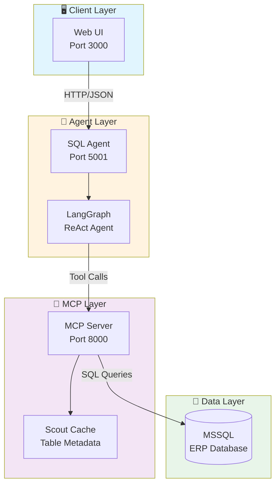
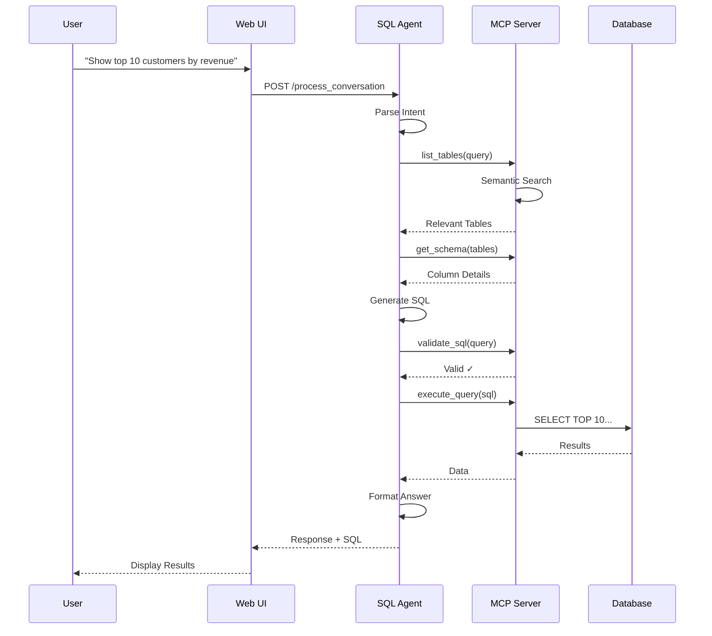
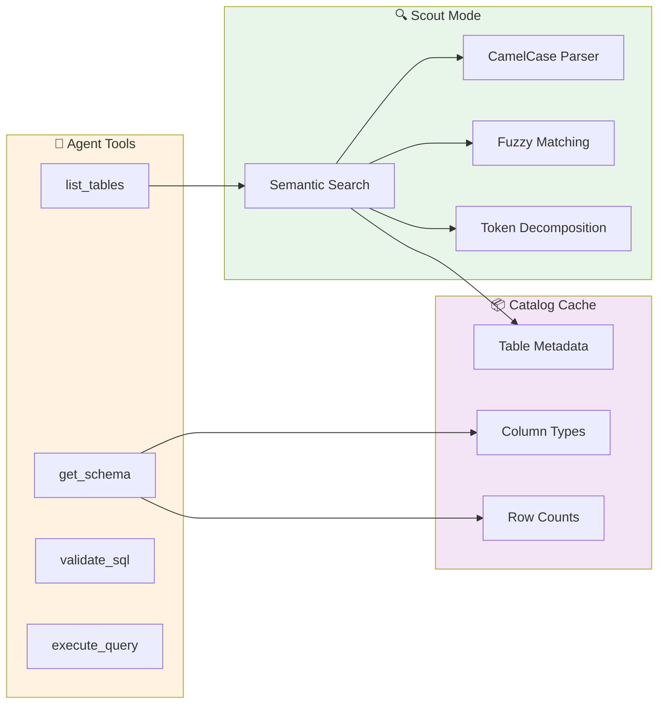

<!-- Logo placeholder -->
<p align="center">
  <!-- TODO: Add your logo here -->
  <!--  -->
  <h1 align="center">ERP Natural Language Query Assistant</h1>
</p>

<p align="center">
  <strong>Transform natural language into SQL queries for your ERP database</strong>
</p>

<!-- Badges -->
<p align="center">
  
  
  
  
  
  <!-- TODO: Add more badges as needed -->
  <!--  -->
</p>

<p align="center">
  <a href="#features">Features</a> •
  <a href="#architecture">Architecture</a> •
  <a href="#quick-start">Quick Start</a> •
  <a href="#api-reference">API</a> •
  <a href="#documentation">Docs</a>
</p>

---

<!-- Interface Screenshot -->
<p align="center">
  
</p>

---

## Features

- **Natural Language Queries** - Ask questions in plain English or German
- **Intelligent Table Discovery** - Automatically finds relevant tables using semantic search
- **SQL Generation & Validation** - Generates and validates MSSQL syntax
- **Interactive Clarifications** - Asks follow-up questions when queries are ambiguous
- **Real-time Streaming** - See results as they're generated
- **Secure Architecture** - API keys managed server-side, no client exposure

---

## Architecture

### System Overview



### Query Processing Flow



### Component Architecture



---

## Quick Start

### Prerequisites

| Requirement | Version | Notes |
|-------------|---------|-------|
| Python | 3.10+ | Agent runtime |
| Node.js | 18+ | Optional, for development |
| MSSQL | 2019+ | ERP database |
| OpenAI API | - | GPT-4o access |

### Installation

```bash
# Clone the repository
git clone https://github.com/yourusername/erp-assistant.git
cd erp-assistant

# Create virtual environment
python -m venv venv
source venv/bin/activate  # On Windows: venv\Scripts\activate

# Install dependencies
pip install -r requirements.txt
```

### Configuration

Create a `.env` file in the project root:

```bash
# Required
OPENAI_API_KEY=sk-your-key-here
MCP_SERVER_URL=http://YOUR_WINDOWS_IP:8000
MCP_API_KEY=your-mcp-api-key

# Optional
API_KEY=your-api-key  # For API authentication
```

### Running the System

```bash
# Start all services (Web UI + SQL Agent)
./start_scripts/start_all_services_mac.sh
```

This will:
1. Install dependencies
2. Check MCP server connectivity
3. Start SQL Agent on port 5001
4. Start Web UI on port 3000

### Access Points

| Service | URL | Description |
|---------|-----|-------------|
| Web UI | http://localhost:3000 | Chat interface |
| SQL Agent API | http://localhost:5001 | Agent endpoints |
| Health Check | http://localhost:5001/health | Service status |

### Deployment (Railway, Northwind Demo)

For production-style deployment with Northwind/Postgres on Railway, use the runbook:

- [deploy/railway/README.md](deploy/railway/README.md)

Railway Dockerfiles:

- `deploy/railway/Dockerfile.web-ui`
- `deploy/railway/Dockerfile.sql-agent`
- `deploy/railway/Dockerfile.mcp-server`

---

## API Reference

### Query Endpoint

```http
POST /query
Content-Type: application/json

{
  "question": "Who are our top 5 customers by revenue?"
}
```

**Response:**
```json
{
  "answer": "Based on the sales data, your top 5 customers are...",
  "sql_query": "SELECT TOP 5 c.Name, SUM(s.Amount) as Revenue...",
  "success": true,
  "latency_ms": 2500
}
```

### Conversation Endpoint

```http
POST /process_conversation
Content-Type: application/json

{
  "messages": [
    {"role": "user", "content": "Show me sales by region"}
  ]
}
```

### Health Endpoint

```http
GET /health
```

**Response:**
```json
{
  "status": "healthy",
  "mcp_connected": true,
  "catalog_tables": 943,
  "version": "1.0.0"
}
```

---

## Project Structure

```
.
├── simple_sql_agent/          # Main SQL agent package
│   ├── agent.py               # ReAct agent using LangGraph
│   ├── service.py             # FastAPI service (port 5001)
│   ├── tools/                 # Database tools
│   └── prompts/               # System prompts
├── chatbot_ui/                # Web interface
│   ├── web_app.py             # FastAPI server (port 3000)
│   ├── index.html             # Chat interface
│   ├── styles.css             # Styling
│   └── script.js              # Frontend logic
├── mcp_server/                # MCP database server
│   ├── scout/                 # Semantic search
│   │   └── runner.py          # Table ranking algorithm
│   └── catalog/               # Metadata caching
├── data/
│   └── concepts.json          # Domain knowledge
├── adrs/                      # Architecture Decision Records
├── start_scripts/             # Startup scripts
└── eval/                      # Evaluation framework
```

---

## Documentation

### Architecture Decision Records

| ADR | Title | Status |
|-----|-------|--------|
| [0030](adrs/0030-simple-sql-agent-architecture.md) | Simple SQL Agent Architecture | Accepted |
| [0031](adrs/0031-erp-chatbot-frontend-architecture-decision.md) | Frontend Architecture Decision | Accepted |
| [0032](adrs/0032-generic-table-search-ranking-fixes.md) | Generic Table Search Ranking | Accepted |

### Key Concepts

- **Scout Mode** - Pre-computed table metadata for fast semantic search
- **ReAct Agent** - Reasoning + Acting pattern for query decomposition
- **MCP Protocol** - Model Context Protocol for database access

---

## Running Benchmarks

```bash
cd simple_sql_agent
python run_benchmark.py --max 12
```

---

## Contributing

1. Fork the repository
2. Create a feature branch (`git checkout -b feature/amazing-feature`)
3. Commit your changes (`git commit -m 'Add amazing feature'`)
4. Push to the branch (`git push origin feature/amazing-feature`)
5. Open a Pull Request

---

## Authors

<!-- TODO: Fill in author information -->
<table>
  <tr>
    <td align="center">
      <!--  -->
      <br />
      <sub><b>Your Name</b></sub>
      <br />
      <!-- <a href="https://github.com/yourusername">GitHub</a> • -->
      <!-- <a href="https://linkedin.com/in/yourprofile">LinkedIn</a> -->
    </td>
  </tr>
</table>

---

## License

This project is licensed under the MIT License - see the [LICENSE](LICENSE) file for details.

---

<p align="center">
  Made with <a href="https://www.langchain.com/langgraph">LangGraph</a> and <a href="https://openai.com">OpenAI</a>
</p>
