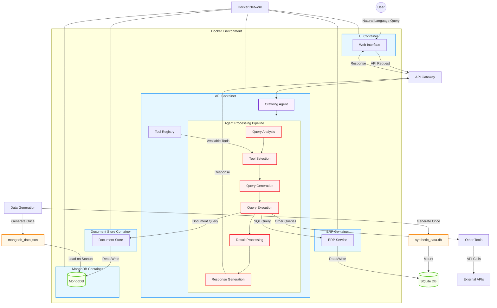

# ADR 0006: Agent Architecture and Data Integration

## Status

Accepted

## Context

The crawling agent system needs to integrate data from multiple sources, including a relational database (SQL) and a document store (MongoDB). The agent must be able to:

1. Process natural language queries from users
2. Identify relevant data sources
3. Generate appropriate queries for each data source
4. Execute these queries against the respective data stores
5. Combine and process the results
6. Generate coherent responses

We need to design a flexible architecture that allows for:
- Easy addition of new data sources and tools
- Consistent data processing across different sources
- Reliable deployment and operation
- Efficient data loading and persistence

## Decision

We have decided to implement a modular, service-oriented architecture with the following components:

### 1. Core Agent Architecture

The agent will follow a multi-step processing pipeline:
- **Query Analysis**: Parse and understand the user's natural language query
- **Tool Selection**: Determine which tools and data sources are needed
- **Query Generation**: Create structured queries for each selected tool
- **Query Execution**: Execute queries against the appropriate data sources
- **Result Processing**: Combine and process the results from different sources
- **Response Generation**: Create a coherent response for the user

### 2. Data Integration Layer

We will implement a data integration layer with the following components:

- **ERP API Service**: Provides access to relational data (SQL)
- **Document Store API Service**: Provides access to document data (MongoDB)
- **Connectors**: Client libraries that abstract the communication with data services

### 3. Data Persistence Strategy

To ensure consistent and reliable data access:

- **Pre-generated Data**: Generate synthetic data once and persist it to files
- **Data Loading on Startup**: Load the pre-generated data into the respective databases during system startup
- **Consistent Data Across Runs**: Use the same data across different runs for predictable behavior

### 4. Containerization and Deployment

- **Docker Containers**: Each service runs in its own Docker container
- **Docker Compose**: Orchestrate the containers and their dependencies
- **Shared Network**: All containers communicate over a shared Docker network
- **Volume Mounting**: Mount necessary files and directories for data persistence

### 5. Tool Registry and Extensibility

- **Tool Registry**: Maintain a registry of available tools and their capabilities
- **Tool Interface**: Define a common interface for all tools
- **Dynamic Tool Selection**: Select tools based on the query analysis

## Technical Implementation Details

### Data Storage and Loading

1. **SQL Database (SQLite)**:
   - Pre-generate synthetic data and store it in `synthetic_data.db`
   - Mount this file into the ERP container
   - The ERP service uses this file directly

2. **Document Store (MongoDB)**:
   - Generate document data using a JavaScript file
   - Load this data directly into MongoDB on startup
   - Create text indexes on all collections for efficient text search

### Service Communication

1. **API-based Communication**:
   - Services communicate via HTTP APIs
   - Each service exposes a RESTful API
   - The agent uses connectors to abstract the communication details

2. **Network Configuration**:
   - All services are on the same Docker network
   - Services reference each other by container name (e.g., `http://docstore:8002`)

### Dependency Management

1. **Comprehensive Requirements**:
   - Maintain a single comprehensive requirements file
   - Ensure all containers have the necessary dependencies installed
   - Use Docker build process to install dependencies

2. **Container-specific Requirements**:
   - Each container has its own Dockerfile
   - Install only the dependencies needed for that specific service

## Consequences

### Positive

1. **Modularity**: Each component has a single responsibility, making the system easier to understand and maintain.
2. **Extensibility**: New data sources and tools can be added without modifying the core agent logic.
3. **Consistency**: Pre-generated data ensures consistent behavior across runs.
4. **Isolation**: Each service runs in its own container, providing isolation and independent scaling.
5. **Flexibility**: The agent can dynamically select and combine tools based on the query.

### Negative

1. **Complexity**: The distributed nature of the system introduces complexity in deployment and debugging.
2. **Network Overhead**: Communication between services incurs network overhead.
3. **Dependency Management**: Ensuring all containers have the correct dependencies can be challenging.
4. **Data Synchronization**: Keeping data consistent across different stores requires careful management.

### Neutral

1. **Development Workflow**: Developers need to be familiar with Docker and service-oriented architectures.
2. **Testing Strategy**: Testing requires a more complex setup to simulate the entire system.

## System Architecture Diagram

```
┌─────────────────────────────────────────────────────────────────────┐
│                           User Interface                             │
└───────────────────────────────────┬─────────────────────────────────┘
                                    │
                                    ▼
┌─────────────────────────────────────────────────────────────────────┐
│                             API Gateway                              │
└───────────────────────────────────┬─────────────────────────────────┘
                                    │
                                    ▼
┌─────────────────────────────────────────────────────────────────────┐
│                           Crawling Agent                             │
│                                                                     │
│  ┌─────────────┐  ┌─────────────┐  ┌─────────────┐  ┌─────────────┐ │
│  │    Query    │  │    Tool     │  │    Query    │  │   Result    │ │
│  │   Analysis  │─▶│  Selection  │─▶│ Generation  │─▶│ Processing  │ │
│  └─────────────┘  └─────────────┘  └─────────────┘  └─────────────┘ │
│                                                                     │
└───────────┬───────────────────────────────┬───────────────┬─────────┘
            │                               │               │
            ▼                               ▼               ▼
┌───────────────────┐           ┌───────────────────┐    ┌───────────────────┐
│    ERP Service    │           │  Document Store   │    │   Other Tools     │
│    (SQL Data)     │           │   (MongoDB)       │    │                   │
└────────┬──────────┘           └────────┬──────────┘    └────────┬──────────┘
         │                               │                        │
         ▼                               ▼                        ▼
┌───────────────────┐           ┌───────────────────┐    ┌───────────────────┐
│  synthetic_data.db│           │  MongoDB Data     │    │  External APIs    │
│                   │           │                   │    │                   │
└───────────────────┘           └───────────────────┘    └───────────────────┘
```

### Detailed Architecture Diagram (Mermaid)



## Implementation Notes

### Data Generation and Loading

1. **SQL Database (SQLite)**:
   - Pre-generated synthetic data is stored in `synthetic_data.db`
   - This file is mounted into the ERP container
   - The ERP service uses this file directly for data access

2. **Document Store (MongoDB)**:
   - MongoDB data is generated using a JavaScript file (`generate_simple_mongodb_data.js`)
   - The script creates collections for:
     - Product details
     - Customer feedback
     - Support tickets
     - Knowledge base articles
   - Text indexes are created on all collections for efficient text search
   - The data is loaded directly into MongoDB on startup

### MongoDB Integration Details

We implemented a specific approach for MongoDB integration:

1. **Data Generation**:
   ```javascript
   // Example from generate_simple_mongodb_data.js
   db.product_details.createIndex(
       { 
           product_id: "text",
           detailed_description: "text",
           // Other fields...
       },
       { name: "product_details_text_index" }
   );
   ```

2. **Document Store API**:
   ```python
   # Example from doc_api.py
   @app.post("/query")
   async def query_documents(query: DocumentQuery):
       # Perform a text search if the query is not empty
       if query.query.strip():
           # Use text search
           cursor = collection.find(
               {"$text": {"$search": query.query}},
               {"score": {"$meta": "textScore"}}
           ).sort([("score", {"$meta": "textScore"})]).skip(query.skip).limit(query.limit)
   ```

3. **Data Loading Process**:
   ```bash
   # From run.sh
   # Copy the JavaScript file to the MongoDB container
   docker cp scripts/generate_simple_mongodb_data.js $(docker-compose ps -q mongo):/generate_data.js
   # Run the JavaScript file in the MongoDB shell
   docker-compose exec -T mongo mongosh --file /generate_data.js
   ```

### Service Communication

1. **API-based Communication**:
   - Services communicate via HTTP APIs
   - Each service exposes a RESTful API
   - The agent uses connectors to abstract the communication details

2. **Network Configuration**:
   - All services are on the same Docker network
   - Services reference each other by container name (e.g., `http://docstore:8002`)
   - This allows for hostname-based routing between containers

### Dependency Management

1. **Comprehensive Requirements**:
   - Maintain a single comprehensive requirements file (`all_requirements.txt`)
   - Ensure all containers have the necessary dependencies installed
   - Use Docker build process to install dependencies

2. **Container-specific Requirements**:
   - Each container has its own Dockerfile
   - Install only the dependencies needed for that specific service
   - Example from Dockerfile.api:
     ```dockerfile
     # Copy requirements first to leverage Docker cache
     COPY all_requirements.txt .
     # Install all dependencies
     RUN pip install --no-cache-dir -r all_requirements.txt
     ```

### Deployment

1. **Docker Compose Configuration**:
   - The system is deployed using Docker Compose
   - Each service runs in its own container
   - Data is persisted using Docker volumes
   - Example from docker-compose.yml:
     ```yaml
     services:
       api:
         build:
           context: .
           dockerfile: Dockerfile.api
         ports:
           - "8000:8000"
         volumes:
           - .:/app
         environment:
           - MONGO_URI=mongodb://mongo:27017/
     ```

2. **Build and Run Scripts**:
   - `rebuild.sh`: Rebuilds all containers from scratch
   - `run.sh`: Starts the system with existing containers
   - `run_mongo.sh`: Runs just the MongoDB container for testing

## Data Fusion and Agent Capabilities

The core value of our architecture lies in the agent's ability to fuse data from multiple sources to answer complex queries. This is achieved through:

### 1. Multi-Source Query Planning

The agent analyzes the user's query and determines which data sources are needed to provide a complete answer. For example:

- "What are the technical specifications of product PROD-0042?" → ERP + Document Store
- "Show me customer feedback for products with high return rates" → ERP + Document Store
- "Find knowledge base articles related to common issues with product PROD-0099" → Document Store

### 2. Parallel Query Execution

The agent can execute queries against multiple data sources in parallel, improving response time:

```python
# Example from agent.py
async def _execute_queries(self, structured_queries):
    """Execute structured queries in parallel."""
    tasks = []
    for query in structured_queries:
        tool_name = query.get('tool')
        tool = self.tool_registry.get_tool(tool_name)
        if tool:
            tasks.append(self._execute_single_query(tool, query))
    
    # Execute all queries in parallel
    results = await asyncio.gather(*tasks)
    return results
```

### 3. Result Combination and Processing

The agent combines results from different sources and processes them to create a coherent response:

```python
# Example from agent.py
async def _process_results(self, query, analysis, results):
    """Process and combine results from different sources."""
    # Prepare the prompt with all results
    prompt = RESULT_PROCESSING_PROMPT.format(
        query=query,
        analysis=json.dumps(analysis, indent=2),
        results=json.dumps(results, indent=2)
    )
    
    # Generate the processed results
    processed_results = await self.llm_provider.generate_with_json_output(
        prompt=prompt,
        output_schema=output_schema,
        system_message=SYSTEM_PROMPT,
        temperature=0.3
    )
    
    return processed_results
```

### 4. Data Type Normalization

The agent normalizes data from different sources to ensure consistent processing:

- SQL data is converted from relational tables to JSON objects
- MongoDB data is already in JSON format
- External API data is normalized to match the internal data model

### 5. Context-Aware Response Generation

The agent generates responses that take into account the context of the query and the available data:

- Identifies missing information and acknowledges limitations
- Provides explanations for how data from different sources relates
- Formats the response appropriately based on the query intent

## Future Considerations

1. **Additional Data Sources**: The architecture should support adding new data sources with minimal changes. Potential additions include:
   - Graph databases for relationship-focused queries
   - Vector databases for semantic search capabilities
   - Real-time data streams for time-sensitive information

2. **Scaling**: Consider how the system would scale with larger datasets or more users:
   - Horizontal scaling of individual services
   - Sharding of MongoDB for larger document collections
   - Read replicas for high-traffic scenarios

3. **Authentication and Authorization**: Add security measures for production deployment:
   - API authentication using JWT or OAuth
   - Role-based access control for different data sources
   - Data encryption for sensitive information

4. **Monitoring and Logging**: Implement comprehensive monitoring and logging for production use:
   - Centralized logging with ELK stack
   - Performance metrics collection
   - Alerting for system issues

5. **Caching**: Add caching mechanisms to improve performance for frequently accessed data:
   - Redis for fast in-memory caching
   - Query result caching with time-based invalidation
   - Precomputed aggregations for common queries

6. **Advanced Query Capabilities**:
   - Natural language to SQL/MongoDB query translation
   - Semantic search using embeddings
   - Multi-hop reasoning for complex queries