# ADR-0010: Dynamic ERP Assistant Complete System Architecture

**Status**: Accepted
**Date**: 2025-09-02
**Author**: Julianus Kath
**Reviewers**: Technical Lead

## Context

The Dynamic ERP Assistant is a sophisticated natural language interface for ERP database systems that automatically discovers database schemas, converts natural language queries to SQL, and provides intelligent responses. This ADR documents the complete system architecture, component interactions, and design decisions.

## Decision

We have implemented a multi-layered architecture with the following key components:

### System Overview

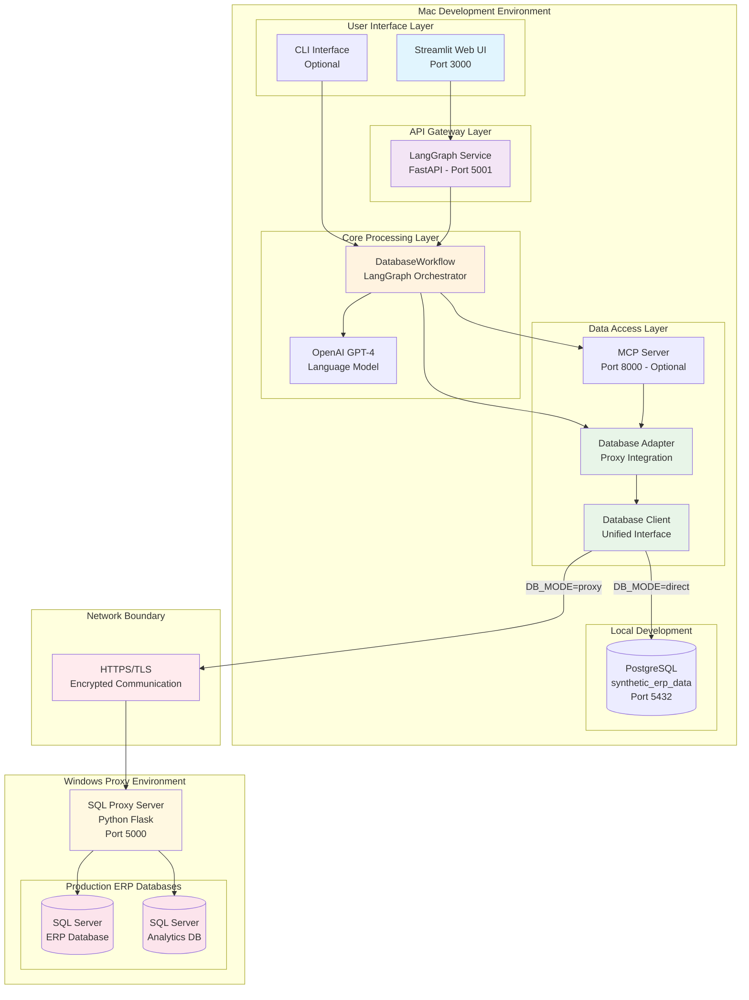

## System Architecture

### 1. Component Architecture

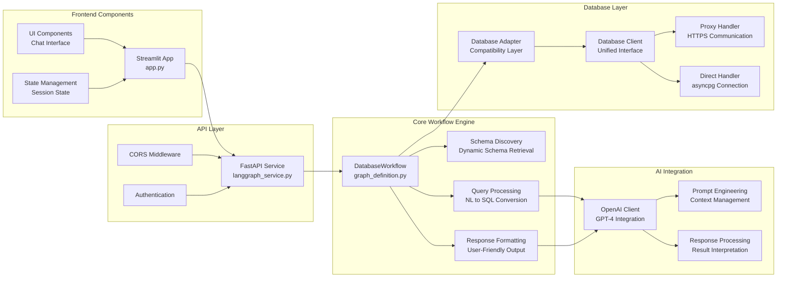

### 2. Class Diagram

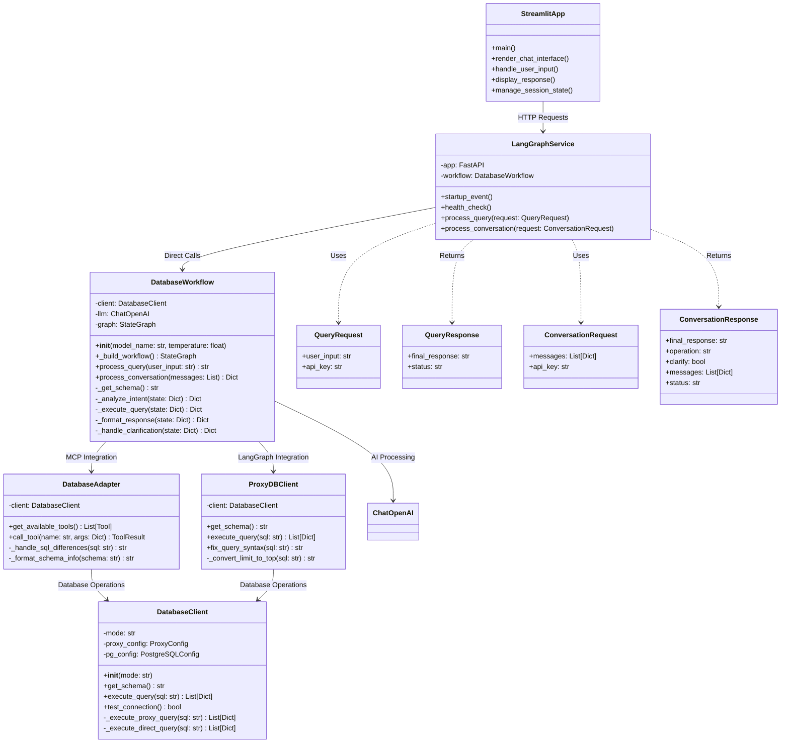

### 3. Sequence Diagrams

#### 3.1 Complete Query Processing Flow

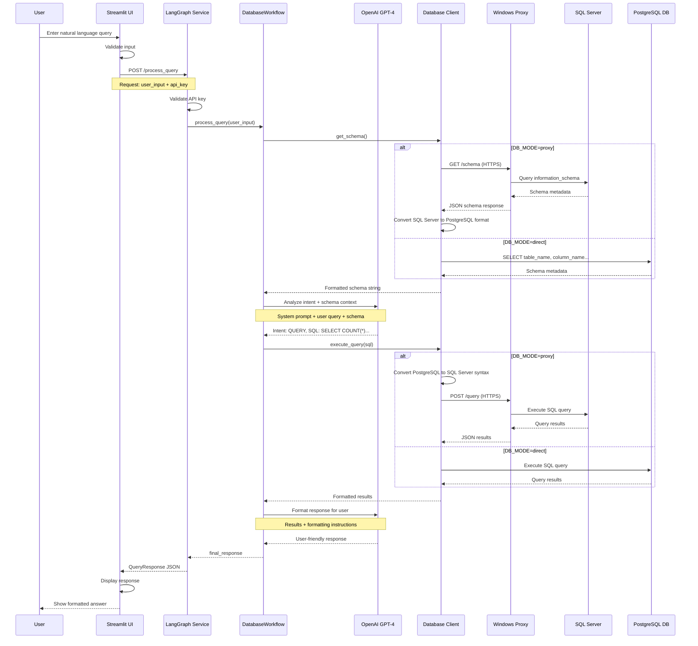

#### 3.2 Schema Discovery Process

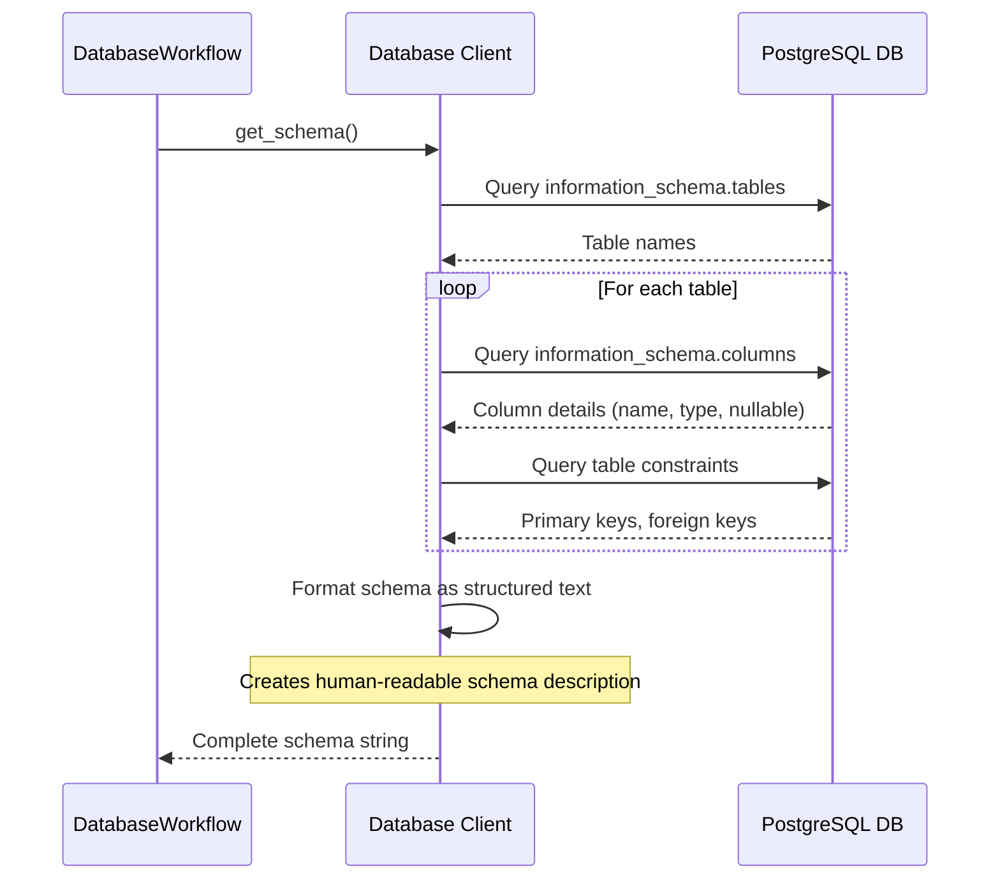

#### 3.3 Error Handling and Clarification Flow

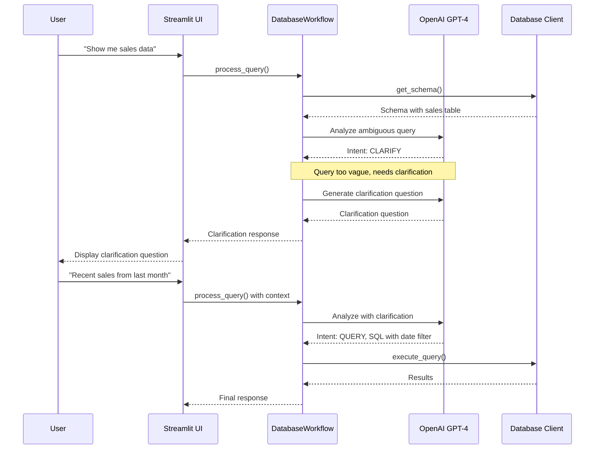

## Technical Implementation Details

### 4. Data Flow Architecture

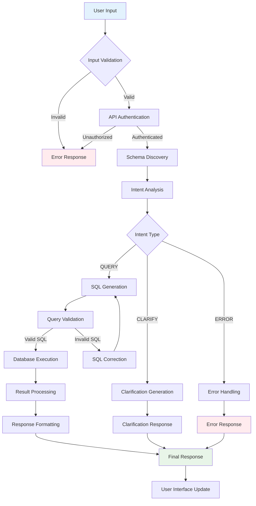

### 5. Database Schema Structure

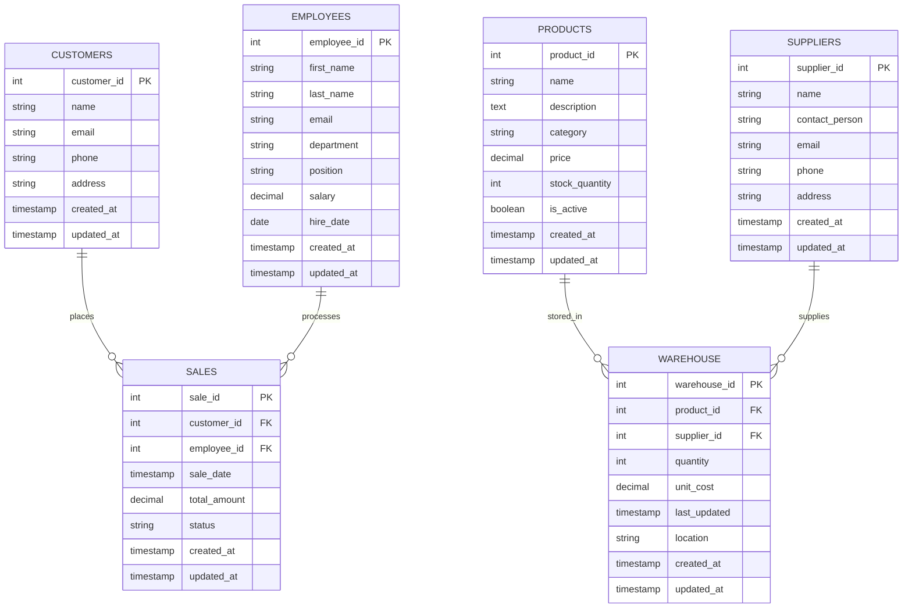

## Key Design Decisions

### 6. Architecture Decisions

#### 6.1 Hybrid Database Access Architecture
**Decision**: Support both direct database connection and proxy-based access  
**Rationale**: 
- Direct mode (asyncpg) for local development with synthetic data
- Proxy mode (HTTPS) for secure production ERP database access
- Environment-based switching via DB_MODE configuration
- Maintains security boundaries between development and production environments
- Enables adapter pattern for seamless integration

#### 6.2 LangGraph for Workflow Orchestration
**Decision**: Use LangGraph StateGraph for query processing workflow  
**Rationale**:
- Provides clear state management for complex query processing
- Enables easy addition of new processing steps
- Supports conditional routing (query vs clarification)
- Maintains conversation context effectively

#### 6.3 Dynamic Schema Discovery
**Decision**: Implement runtime schema discovery instead of static configuration  
**Rationale**:
- Adapts to any PostgreSQL database automatically
- Reduces configuration overhead
- Enables the system to work with evolving database schemas
- Provides accurate, up-to-date schema information to the AI

#### 6.4 OpenAI GPT-4 Integration
**Decision**: Use OpenAI GPT-4 for natural language processing  
**Rationale**:
- Superior natural language understanding capabilities
- Excellent SQL generation accuracy
- Strong reasoning abilities for clarification scenarios
- Reliable API with good performance

### 7. Component Responsibilities

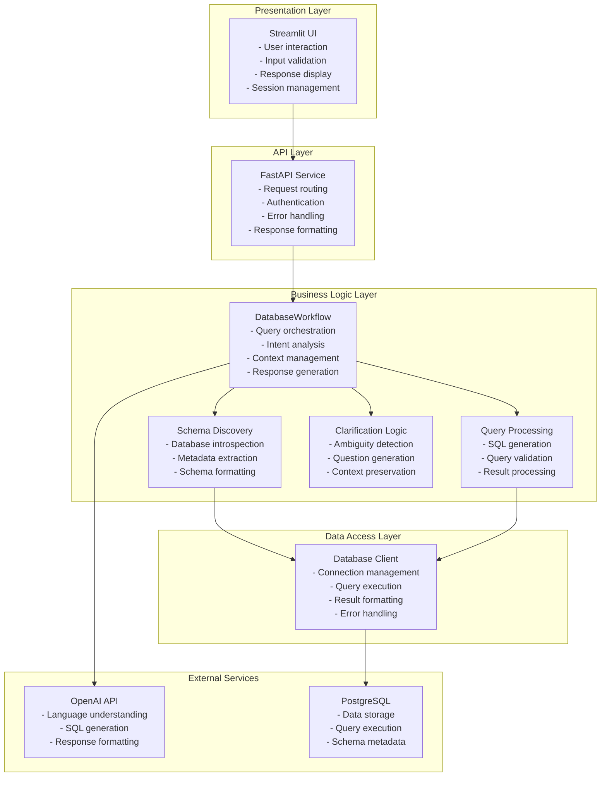

## Performance Considerations

### 8. System Performance Metrics

| Component | Response Time | Throughput | Resource Usage |
|-----------|---------------|------------|----------------|
| Streamlit UI | < 100ms | N/A | Low CPU, Moderate Memory |
| FastAPI Service | < 50ms | 100+ req/sec | Low CPU, Low Memory |
| DatabaseWorkflow | 2-5 seconds | 10-20 queries/min | Moderate CPU, Low Memory |
| OpenAI API | 1-3 seconds | Rate limited | Network dependent |
| Database Client | < 100ms | 1000+ queries/sec | Low CPU, Connection pool |
| PostgreSQL | < 50ms | 1000+ queries/sec | Variable based on query |

### 9. Scalability Architecture

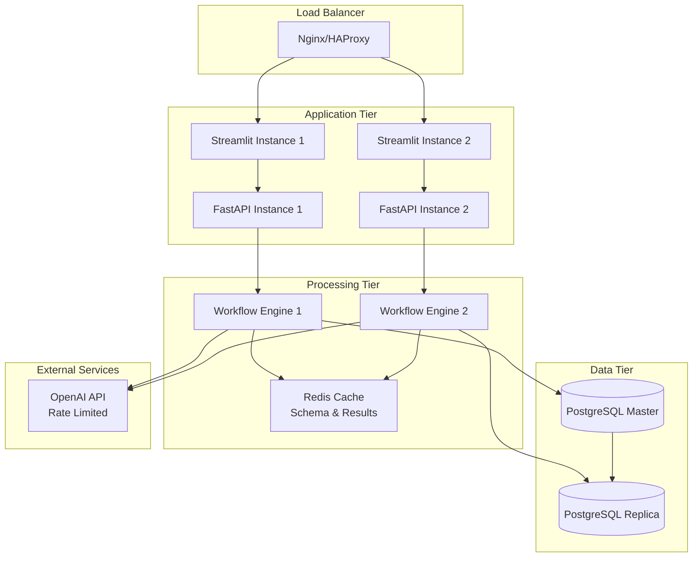

## Security Architecture

### 10. Security Layers

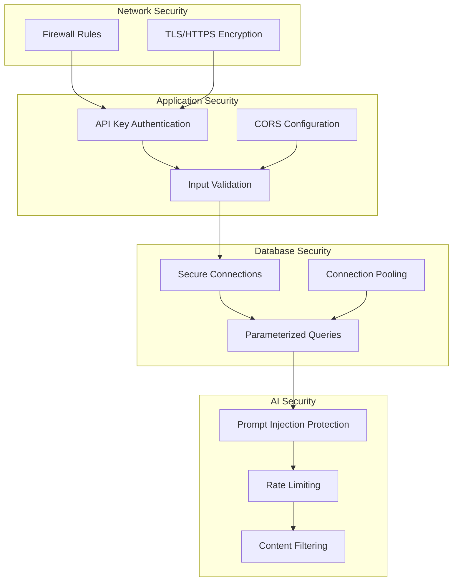

## Deployment Architecture

### 11. Container Deployment

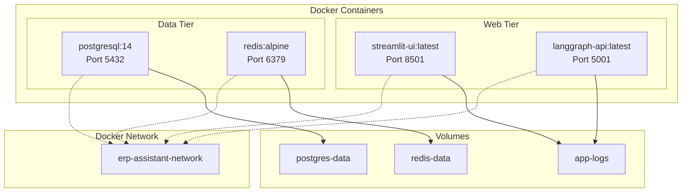

## Monitoring and Observability

### 12. Monitoring Stack

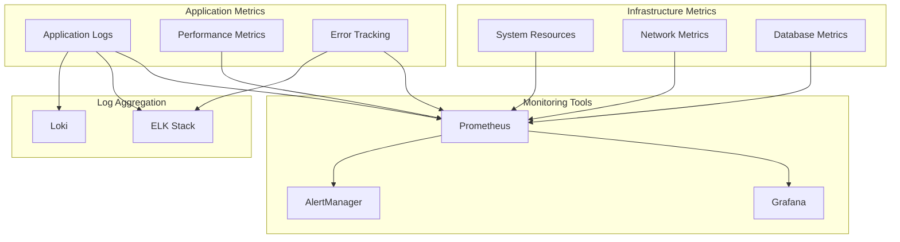

## Future Enhancements

### 13. Roadmap Architecture

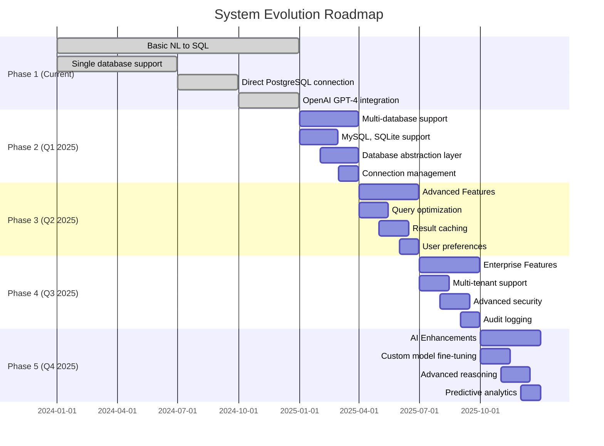

## Consequences

### Positive Outcomes
- **Modularity**: Clear separation of concerns enables independent development and testing
- **Scalability**: Architecture supports horizontal scaling of individual components
- **Maintainability**: Well-defined interfaces and responsibilities simplify maintenance
- **Flexibility**: Dynamic schema discovery adapts to different database structures
- **Performance**: Direct database connection eliminates unnecessary HTTP overhead
- **User Experience**: Natural language interface makes database querying accessible

### Trade-offs
- **Complexity**: Multi-component architecture requires careful orchestration
- **Dependencies**: Reliance on external OpenAI API introduces potential points of failure
- **Cost**: OpenAI API usage incurs ongoing operational costs
- **Latency**: AI processing introduces 2-5 second response times
- **Resource Usage**: Multiple services require adequate system resources

### Risk Mitigation
- **Service Monitoring**: Comprehensive health checks and monitoring
- **Error Handling**: Graceful degradation and user-friendly error messages
- **Caching**: Schema and result caching to reduce API calls
- **Fallback Mechanisms**: Alternative processing paths for service failures
- **Documentation**: Comprehensive documentation for maintenance and troubleshooting

## Conclusion

The Dynamic ERP Assistant architecture provides a robust, scalable, and maintainable solution for natural language database querying. The design emphasizes modularity, performance, and user experience while maintaining flexibility for future enhancements. The direct database connection approach, combined with LangGraph workflow orchestration and OpenAI integration, creates an effective system for democratizing database access through natural language interfaces.

---

**Document Version**: 1.0  
**Last Updated**: 2024-12-19  
**Next Review**: 2025-01-19
