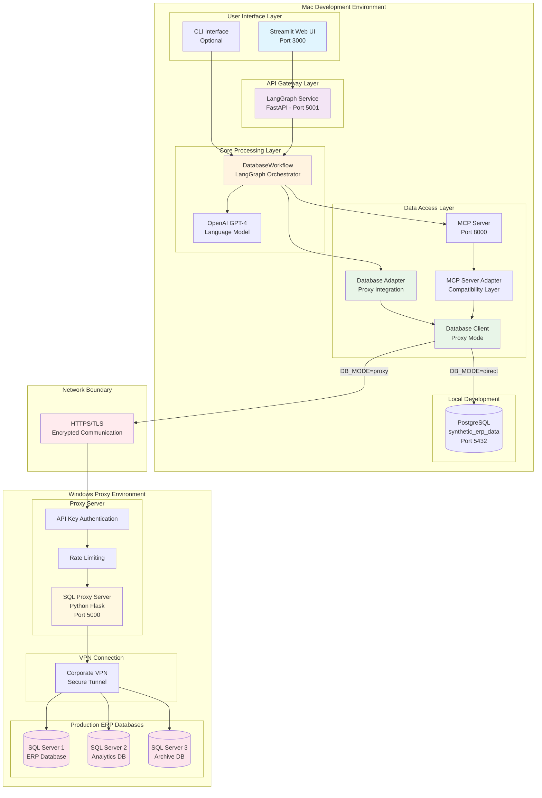
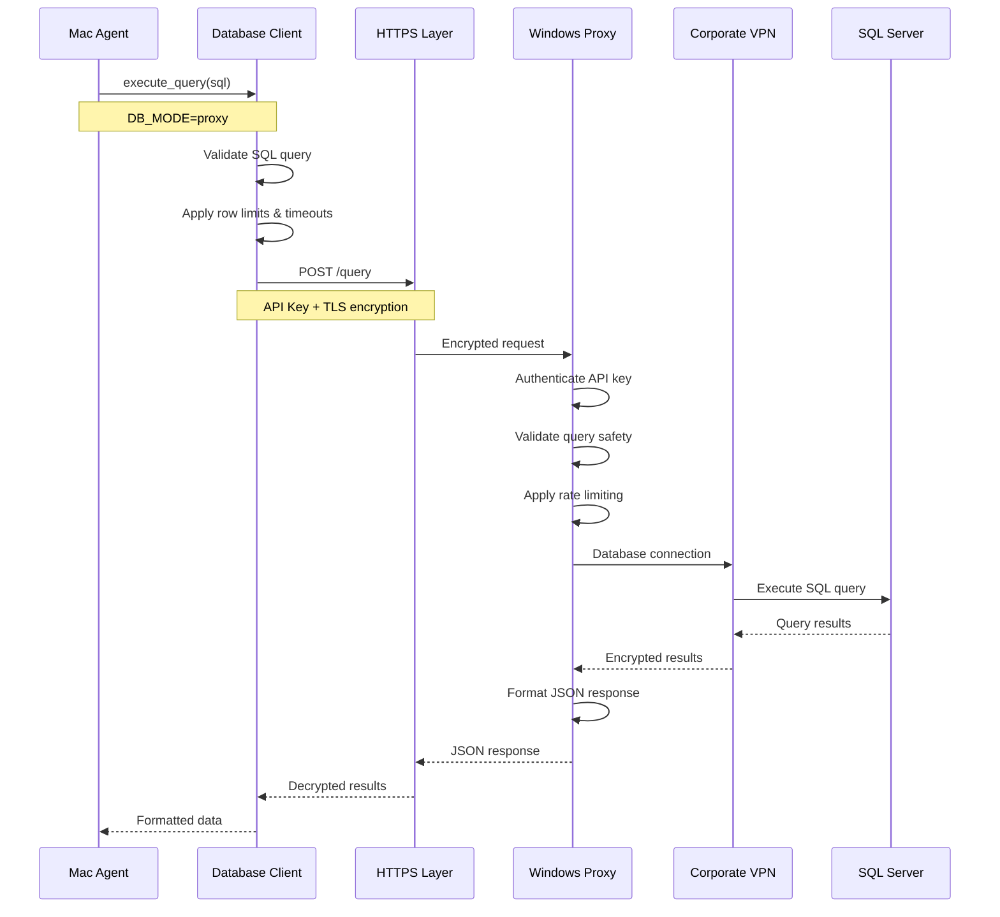
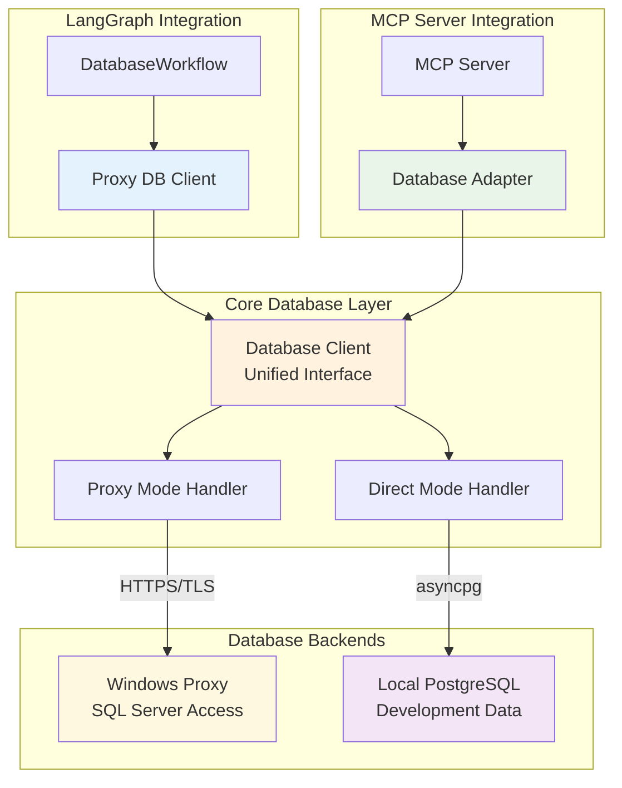
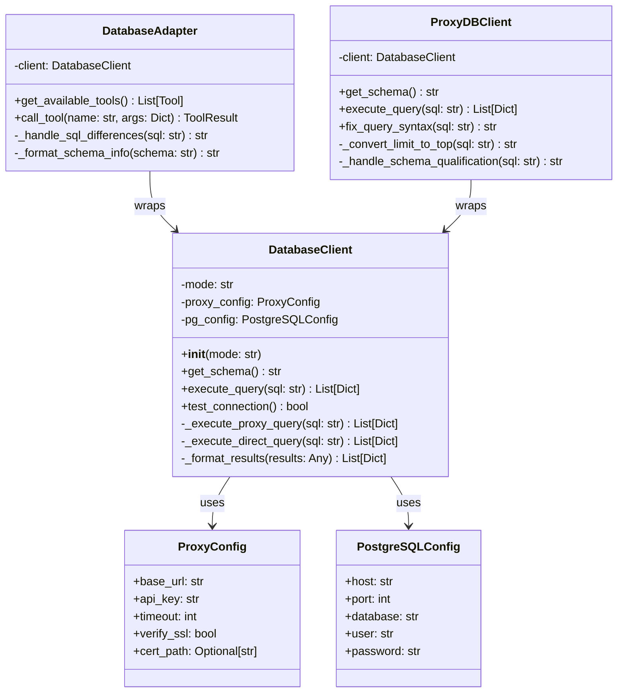
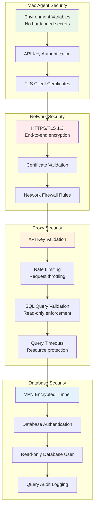
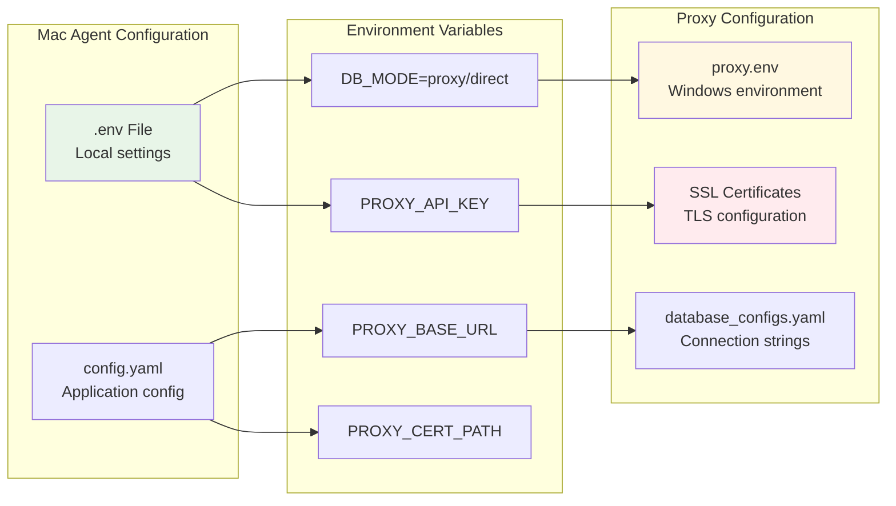
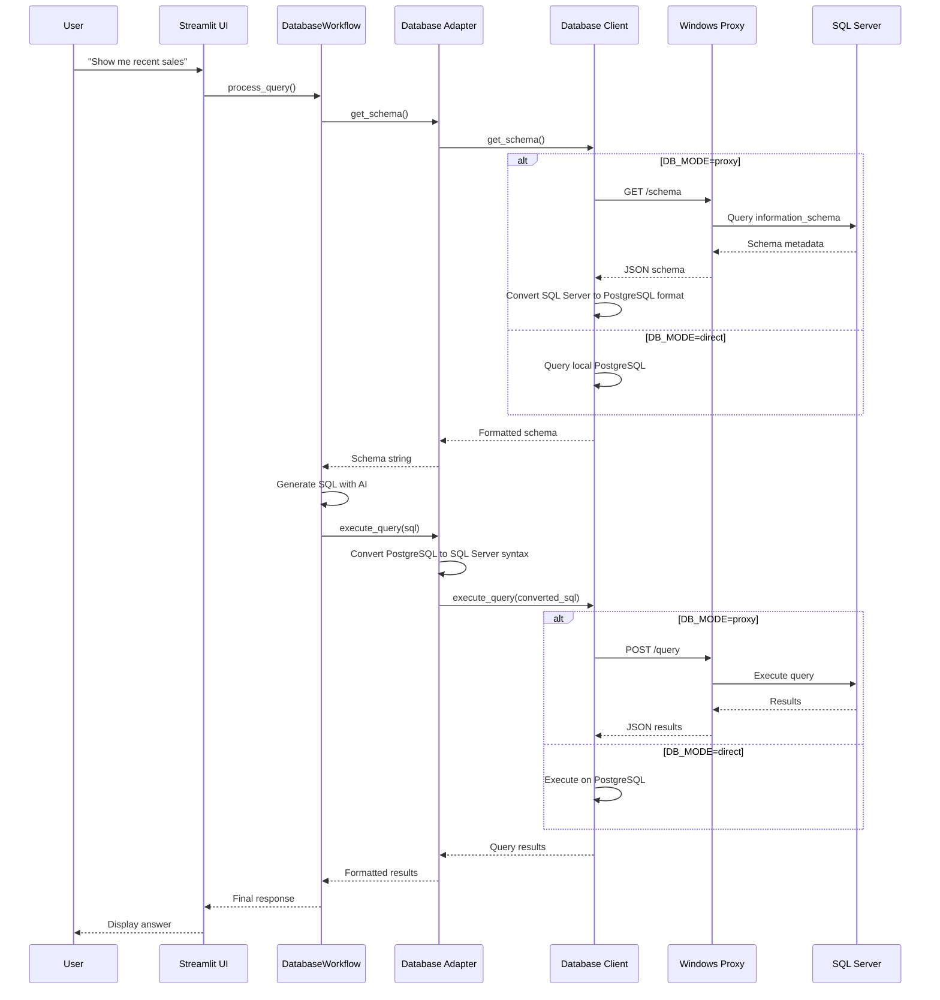
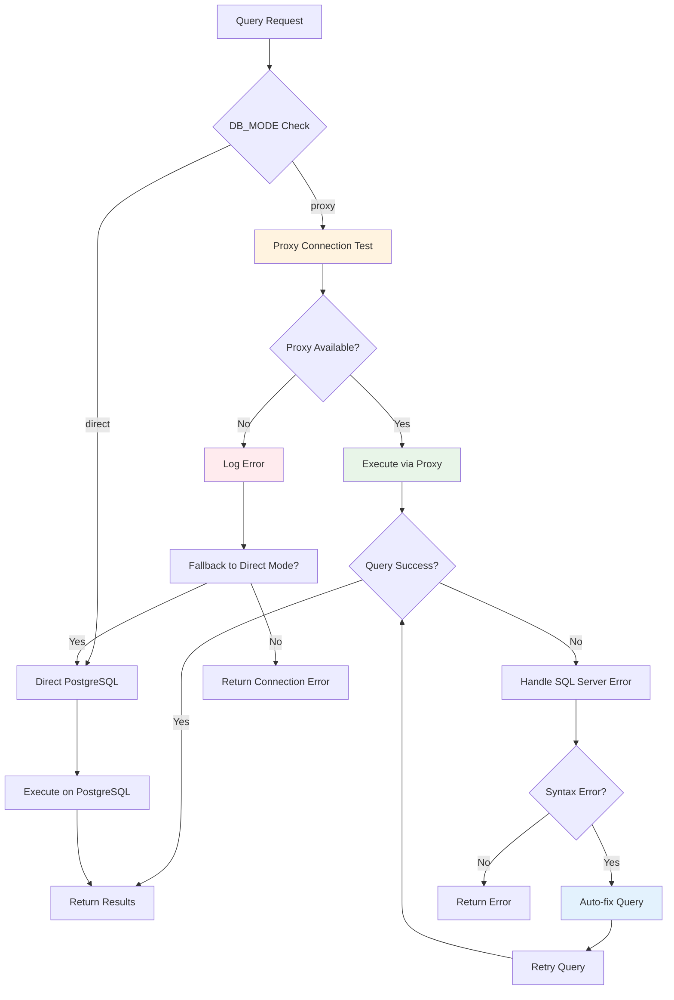
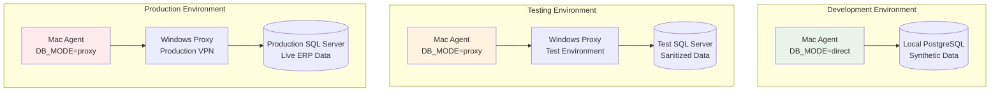
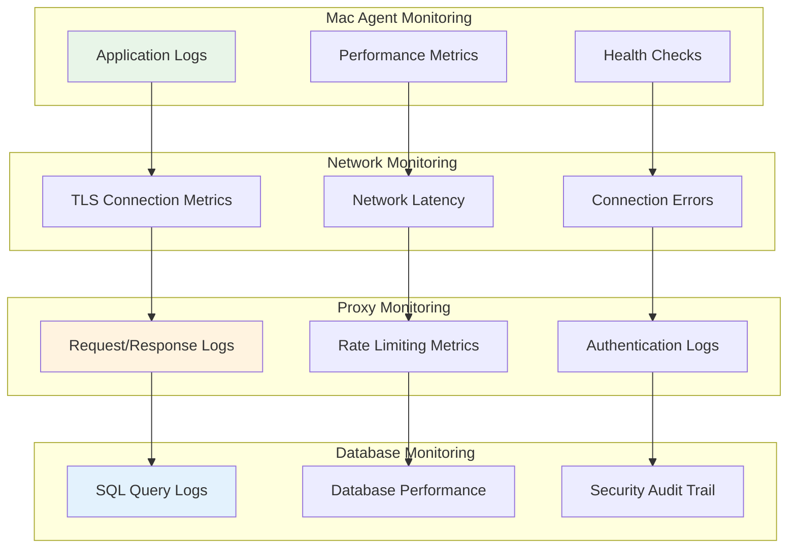

# ADR-0011: ERP Proxy Integration Architecture

**Status**: Accepted  
**Date**: 2025-10-06
**Author**: System Architecture Team  
**Reviewers**: Technical Lead  

## Context

The Dynamic ERP Assistant system has been enhanced to support secure access to production ERP databases through a Windows-hosted proxy server. This architecture enables the Mac-based agent to securely query SQL Server databases over VPN without storing production credentials locally.

## Decision

We have implemented a proxy-based architecture that maintains security boundaries while enabling seamless database access through adapter layers.

### System Overview with Proxy Integration

## Proxy Communication Architecture

### 1. Network Communication Flow

### 2. Adapter Layer Architecture

### 3. Database Client Abstraction

## Security Architecture

### 4. Multi-Layer Security Model

### 5. Configuration Management

## Implementation Details

### 6. Query Processing with Proxy Integration

### 7. Error Handling and Fallback

## Deployment Architecture

### 8. Multi-Environment Deployment

## Key Design Decisions

### 9. Architecture Decisions

#### 9.1 Proxy-Only Database Access
**Decision**: Use Windows proxy for all production database access  
**Rationale**: 
- Maintains security boundaries between development and production
- Eliminates need for VPN client on Mac development machine
- Centralizes database access control and monitoring
- Enables secure credential management on Windows environment

#### 9.2 Adapter Pattern for Integration
**Decision**: Implement adapter layers for existing components  
**Rationale**:
- Maintains backward compatibility with existing codebase
- Enables gradual migration from direct to proxy access
- Provides clean abstraction between database modes
- Supports both PostgreSQL and SQL Server syntax differences

#### 9.3 Environment-Based Mode Switching
**Decision**: Use DB_MODE environment variable for mode selection  
**Rationale**:
- Enables easy switching between development and production
- Supports testing with both local and remote databases
- Provides clear configuration management
- Allows for fallback scenarios during development

#### 9.4 SQL Syntax Translation
**Decision**: Implement automatic SQL syntax conversion  
**Rationale**:
- Handles differences between PostgreSQL and SQL Server
- Enables seamless operation across database types
- Reduces complexity in AI prompt engineering
- Provides consistent interface for application logic

## Performance Considerations

### 10. System Performance with Proxy

| Component | Direct Mode | Proxy Mode | Impact |
|-----------|-------------|------------|---------|
| Schema Discovery | < 100ms | 200-500ms | Network latency |
| Query Execution | < 50ms | 100-300ms | HTTPS overhead |
| Connection Setup | < 10ms | 50-100ms | TLS handshake |
| Error Recovery | Immediate | 200-400ms | Network retry |
| Throughput | 1000+ qps | 100-200 qps | Rate limiting |

### 11. Monitoring and Observability

## Consequences

### Positive
- **Security**: Production credentials never leave Windows environment
- **Flexibility**: Easy switching between development and production modes
- **Compatibility**: Maintains existing codebase with minimal changes
- **Monitoring**: Centralized logging and audit trail for database access
- **Scalability**: Proxy can serve multiple agent instances

### Negative
- **Latency**: Additional network hop increases response times
- **Complexity**: Additional layer increases system complexity
- **Dependency**: Agent depends on proxy availability for production access
- **Maintenance**: Requires maintaining both direct and proxy code paths

### Risks
- **Single Point of Failure**: Proxy server becomes critical dependency
- **Network Issues**: VPN or network problems affect system availability
- **Certificate Management**: TLS certificate renewal and management overhead

## Future Considerations

1. **Load Balancing**: Multiple proxy instances for high availability
2. **Caching**: Implement schema and query result caching
3. **Connection Pooling**: Optimize database connections on proxy side
4. **Monitoring Integration**: Enhanced observability and alerting
5. **Multi-Region**: Support for multiple geographic deployments

---

**Related ADRs**: ADR-0010 (System Architecture), ADR-0006 (Data Integration)  
**Implementation Status**: Complete  
**Next Review**: 2025-01-19