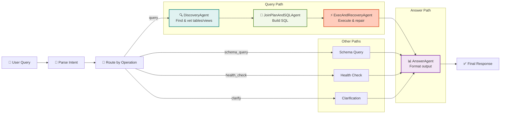

# ADR-0018: Multi-Agent Orchestration Architecture

**Status**: Accepted
**Date**: 2025-10-27
**Author**: Julianus Kath
**Context**: Phase 8+ - Specialized Agent Decomposition for Complex Query Processing
**Supersedes**: None (Complements ADR-0016, ADR-0017)
**Related**: ADR-0012 (MCP-Only), ADR-0014 (Scout), ADR-0015 (Semantic Ranking)

## 1. Executive Summary

The Dynamic ERP Assistant has evolved from a **monolithic LangGraph workflow** (single-agent) to a **modular multi-agent system** with four specialized agents, each with **explicit input/output contracts** and distinct responsibilities.

**Key Achievement**: Query processing is now decomposed into 4 stages:
1. **DiscoveryAgent** — Find & rank relevant tables/views
2. **JoinPlanAndSQLAgent** — Build join plans & generate MSSQL
3. **ExecAndRecoveryAgent** — Execute queries with error recovery
4. **AnswerAgent** — Format results for end users

**Benefits**:
- ✅ **Modularity**: Each agent owns one responsibility (SRP)
- ✅ **Reusability**: Agents can be composed for different workflows (query, schema_query, clarification)
- ✅ **Debuggability**: Clear state flow; failures isolated to agent boundaries
- ✅ **Testability**: Each agent has mock tests; integration tests with MCP
- ✅ **Extensibility**: New agents can be inserted without disrupting existing logic

---

## 2. Problem Statement

### Monolithic Architecture (Before Phase 8)

The single-agent workflow conflated multiple concerns:

```
Single "Query Agent"
├─ Parse intent
├─ Search tables (with ranking inside)
├─ Describe candidates
├─ Build joins
├─ Generate SQL
├─ Execute query
├─ Handle errors & repair
├─ Format answer
└─ Handle special cases (schema_query, health_check, clarification)
```

**Issues**:
1. **Cognitive Load**: Agent prompts became large & complex (>2000 tokens)
2. **Poor Specialization**: SQL generation mixed with result formatting
3. **Unclear Routing**: Complex conditional logic for different query types
4. **Difficult Recovery**: Error handling intertwined with execution
5. **Testing Complexity**: Hard to isolate which step failed

### Multi-Agent Requirements

- Decompose query processing into **focused stages**
- Ensure each agent has **clear input/output contracts** (TypedDict)
- Support **multiple workflow routes** (query, schema_query, health_check, repair)
- Enable **independent testing** with mocks
- Maintain **state consistency** across agent boundaries

---

## 3. Solution: Multi-Agent Orchestration

### 3.1 Four Specialized Agents



#### 3.1.1 **DiscoveryAgent** (5-node subgraph)

**Responsibility**: Find relevant tables/views from user intent

**Input Contract**:
```python
{
    "user_input": str,                                    # e.g., "Show me sales by region"
    "intent": {"operation": "query", "entities": [...], ...},
    "session_described_tables": Optional[Dict]            # Cache from prior describes
}
```

**Output Contract**:
```python
{
    "relevant_tables": ["dbo.sales_orders", "dbo.regions", ...],
    "schema_snippet": "Compact schema of ≤3 entities",
    "candidate_views": [{"name": "dbo.v_sales", "score": 0.95}, ...],
    "session_described_tables": Dict,                      # Updated cache
    "error_info": Optional[Dict]                          # If discovery fails
}
```

**Algorithm**:
1. Extract keywords from user_input + intent
2. **Search tables** via MCP `search_tables()` (returns top-ranked only, score > 0)
3. **Search views** via MCP `search_views()` (prefer views if role coverage high)
4. **Rank candidates** using semantic ranker (5-signal scoring)
5. **Describe top ≤3** via MCP `describe_table()`/`describe_view()`
6. **Build schema snippet** (column names, FKs, role hints)

**Key Decision**: **Views-First** — If a view covers the intent with high role coverage (≥0.70), use it instead of joining tables.

#### 3.1.2 **JoinPlanAndSQLAgent** (5-node subgraph)

**Responsibility**: Build join plan & generate MSSQL query

**Input Contract**:
```python
{
    "intent": Dict,                      # {operation, entities, filters, ...}
    "relevant_tables": List[str],        # From DiscoveryAgent
    "schema_snippet": str,               # Table metadata
    "session_described_tables": Dict     # Detailed table info
}
```

**Output Contract**:
```python
{
    "join_plan": {
        "strategy": "view" | "joins",    # Use view or build joins
        "path": ["dbo.sales", "dbo.customers", ...],
        "fk_hints": [{...}],             # Foreign key relationships
        "fact_table": "dbo.sales",
        "dimensions": ["dbo.customers", ...]
    },
    "sql_query": "SELECT ... FROM dbo.sales ...",  # MSSQL dialect
    "error_info": Optional[Dict]
}
```

**Algorithm**:
1. Analyze intent (filters, aggregations, time windows)
2. If views_first && view covers intent → use view directly
3. Else → build join plan:
   - Identify **fact table** (main entity)
   - Identify **dimension tables** (related entities)
   - Fetch FK relationships via MCP `list_relations()`
   - Build join path (limit ≤3 joins)
4. **Generate MSSQL** using template:
   - Use `TOP` (not LIMIT)
   - Use MSSQL functions (`DATEADD`, `CONVERT`, `CAST`)
   - Fully-qualified names (`dbo.table_name`)
   - Parameterized WHERE clauses
5. **Validate SQL** (SELECT-only, balanced quotes/parens)

**Key Decision**: **MSSQL Dialect** — All SQL generation defaults to SQL Server syntax.

#### 3.1.3 **ExecAndRecoveryAgent** (8-node subgraph)

**Responsibility**: Execute query safely & repair on error

**Input Contract**:
```python
{
    "sql_query": str,                  # Generated MSSQL
    "retry_count": int,                # Current retry attempt (0, 1, ...)
    "join_plan": Dict,                 # For context during repair
    "schema_snippet": str               # For error diagnosis
}
```

**Output Contract**:
```python
{
    "exec_result": {
        "ok": True,
        "rows": List[Dict],            # Query results
        "row_count": int,              # Number of rows
        "execution_time_ms": int,
        "truncated": False,             # If result was capped at TOP N
        "warnings": List[str]
    } | None,
    "error_info": Optional[Dict],      # {type, message, suggestion}
    "sql_query": str,                  # Repaired SQL if recovery attempted
    "retry_count": int                 # Updated retry count
}
```

**Algorithm**:
1. Validate SQL (reject DDL/DML, check syntax)
2. Execute via MCP `query_bounded()` (enforces TOP, timeout, redaction)
3. If **success** → return exec_result
4. If **error** (syntax, schema, timeout):
   - If retry_count < 2 → attempt repair via LLM
   - Call `sql_repair_agent` with error context
   - Retry repaired SQL
   - If retry fails → return error_info
5. If **final failure** → prepare error message for AnswerAgent

**Key Decision**: **Max 2 Retries** — Prevent infinite loops; escalate to user after 2 attempts.

#### 3.1.4 **AnswerAgent** (6-node subgraph)

**Responsibility**: Format query results or provide explanations

**Input Contract**:
```python
{
    "user_input": str,                        # Original question
    "exec_result": Optional[Dict],            # From ExecAndRecoveryAgent
    "error_info": Optional[Dict],             # If query failed
    "schema_snippet": str,                    # For schema_query routing
    "intent": Dict,                           # For context
    "sql_query": Optional[str],               # For technical details
    "health_status": Optional[Dict]           # For health_check routing
}
```

**Output Contract**:
```python
{
    "final_response": str    # Natural language answer (1-2 sentences max)
}
```

**Routing Logic**:
1. If `intent["operation"] == "schema_query"` → call schema_explainer (explain relevant tables)
2. If `intent["operation"] == "health_check"` → call health_response (system status)
3. If `intent["operation"] == "clarify"` → call clarification_question (ask for more info)
4. If `exec_result.ok == True` → call result_formatter (summarize rows + key insights)
5. If `error_info != None` → call error_response (user-friendly error + suggestion)
6. Return `final_response` (1-2 sentences, no SQL jargon, no column dumps)

**Key Decision**: **Concise Answers** — LLM generates 1-2 sentence summaries; no table dumps to terminal.

---

### 3.2 State Contract Architecture

```python
class BaseState(TypedDict, total=False):
    """Shared state for all agents (full union of all fields)"""
    # Conversation
    messages: List[Dict[str, Any]]
    user_input: str
    
    # Intent analysis
    intent: Dict[str, Any]
    
    # Discovery outputs
    relevant_tables: List[str]
    schema_snippet: str
    candidate_views: List[Dict[str, Any]]
    
    # Join planning outputs
    join_plan: Dict[str, Any]
    
    # Execution & recovery
    sql_query: str
    exec_result: Dict[str, Any]
    error_info: Dict[str, Any]
    
    # Final output
    final_response: str
    
    # Metadata
    retry_count: int
    session_described_tables: Optional[Dict[str, Any]]
    health_status: Dict[str, Any]

# Per-agent input/output contracts (strict TypedDicts)
class DiscoveryAgentInput(TypedDict, total=False):
    user_input: str
    intent: Dict[str, Any]
    session_described_tables: Optional[Dict[str, Any]]

class DiscoveryAgentOutput(TypedDict, total=False):
    relevant_tables: List[str]
    schema_snippet: str
    candidate_views: List[Dict[str, Any]]
    session_described_tables: Dict[str, Any]
    error_info: Optional[Dict[str, Any]]

# ... (similar for JoinPlanAndSQLAgent, ExecAndRecoveryAgent, AnswerAgent)
```

**Contract Rule**: Each agent consumes only its declared inputs; produces only its declared outputs. Orchestrator wires outputs → inputs.

---

### 3.3 Orchestrator Graph

**Module**: `langgraph_integration/graph_definition.py::create_database_workflow()`

**Architecture**:
```
[Entry] → [index_database] → [parse_intent] → [route_by_operation] → [handler] → [answer_agent] → [END]
```

**Routing by Intent Operation**:

| Operation | Path | Handler |
|-----------|------|---------|
| `"query"` | Discovery → JoinPlan → Exec → Answer | Full pipeline |
| `"schema_query"` | Discovery → Answer | Describe tables only |
| `"health_check"` | (skip discovery) → Answer | System status |
| `"clarify"` | (user wants more info) → Answer | Ask clarification Q |
| `"error"` | (parse failed) → Answer | Error response |

**State Flow**:
```python
# Orchestrator pseudocode
def create_database_workflow():
    workflow = StateGraph(BaseState)
    
    # Nodes
    workflow.add_node("index_database", index_database_node)
    workflow.add_node("parse_intent", parse_intent_node)
    workflow.add_node("route_by_operation", route_by_operation_node)
    
    # Add agent subgraphs (each is a StateGraph)
    workflow.add_node("discovery_agent", discovery_agent_subgraph.compile())
    workflow.add_node("join_plan_agent", join_plan_agent_subgraph.compile())
    workflow.add_node("exec_recovery_agent", exec_recovery_agent_subgraph.compile())
    workflow.add_node("answer_agent", answer_agent_subgraph.compile())
    
    # Edges
    workflow.add_edge("index_database", "parse_intent")
    workflow.add_edge("parse_intent", "route_by_operation")
    
    # Conditional routing
    workflow.add_conditional_edges(
        "route_by_operation",
        lambda state: state["intent"]["operation"],
        {
            "query": "discovery_agent",
            "schema_query": "discovery_agent",
            "health_check": "answer_agent",
            "clarify": "answer_agent",
            "error": "answer_agent"
        }
    )
    
    # Query path
    workflow.add_edge("discovery_agent", "join_plan_agent")
    workflow.add_edge("join_plan_agent", "exec_recovery_agent")
    workflow.add_edge("exec_recovery_agent", "answer_agent")
    
    # Other paths converge at answer_agent
    workflow.add_edge("discovery_agent", "answer_agent")  # For schema_query
    
    # Final edge
    workflow.add_edge("answer_agent", END)
    
    return workflow.compile()
```

---

## 4. Module Organization

```
langgraph_integration/
├── agents/
│   ├── discovery/
│   │   ├── __init__.py
│   │   └── agent.py              # DiscoveryAgent.build_subgraph()
│   ├── join_sql/
│   │   ├── __init__.py
│   │   └── agent.py              # JoinPlanAndSQLAgent.build_subgraph()
│   ├── exec_recovery/
│   │   ├── __init__.py
│   │   └── agent.py              # ExecAndRecoveryAgent.build_subgraph()
│   └── answer/
│       ├── __init__.py
│       └── agent.py              # AnswerAgent.build_subgraph()
│
├── contracts/
│   ├── __init__.py
│   └── state.py                  # BaseState + per-agent TypedDicts
│
├── prompts/
│   ├── __init__.py
│   ├── discovery.py              # TABLE_FOCUS_PROMPT, VIEWS_FIRST_GUIDANCE
│   ├── join_sql.py               # JOIN_PLANNER_PROMPT, SQL_GENERATOR_MSSQL
│   ├── repair.py                 # SQL_REPAIR_PROMPT, QUERY_SIMPLIFICATION
│   └── answer.py                 # RESULT_FORMATTER, SCHEMA_EXPLAINER, etc.
│
├── utils/
│   └── sql_normalizer.py         # SQL validation & normalization
│
├── mcp_client.py                 # MCPClient (JSON-RPC calls to MCP server)
├── graph_definition.py           # Orchestrator graph builder
├── debug_logger.py               # Structured logging
└── README.md
```

---

## 5. Key Design Decisions

### 5.1 **TypedDict Contracts Over Free-Form State**

**Decision**: Each agent declares explicit `Input` and `Output` TypedDict contracts.

**Rationale**:
- **Clarity**: Reader knows exactly what each agent consumes/produces
- **Type Safety**: IDEs can warn of missing fields
- **Testability**: Mocks fill only required fields
- **Extensibility**: New fields don't break existing agents

**Alternative Rejected**: Free-form dict with optional fields → leads to silent failures if agent forgets a field.

### 5.2 **Subgraph Composition Over Inline Agents**

**Decision**: Each agent is a LangGraph `StateGraph` (subgraph), then composed into orchestrator.

**Rationale**:
- **Modularity**: Agents can be tested independently
- **Reusability**: Same agent subgraph in different workflows
- **Debuggability**: LangGraph Studio shows each subgraph
- **Testability**: Mock test single agent without orchestrator overhead

**Alternative Rejected**: Single monolithic graph → loses decomposition benefits.

### 5.3 **Views-First, Joins-Fallback Strategy**

**Decision**: If a view matches intent with role coverage ≥ 0.70, use it; otherwise build joins over ≤3 tables.

**Rationale**:
- **Performance**: Views are pre-computed & indexed
- **Semantics**: Business views encode domain logic
- **Safety**: Fewer joins = fewer error points
- **Flexibility**: Fallback to joins if no view matches

**Implementation**:
```python
# In JoinPlanAndSQLAgent
if candidate_views and max_role_coverage >= 0.70:
    join_plan["strategy"] = "view"
    join_plan["path"] = [view_name]
else:
    join_plan["strategy"] = "joins"
    join_plan["path"] = build_join_path(relevant_tables, intent)
```

### 5.4 **MSSQL Dialect Enforcement**

**Decision**: All SQL generation targets SQL Server syntax; prompts explicitly enforce MSSQL rules.

**Rationale**:
- **Production Database**: MSSQL is the production backend (per ADR-0012)
- **Consistency**: One dialect reduces complexity
- **Syntax**: MSSQL functions (TOP, DATEADD, CONVERT) are hardcoded

**Enforcement Mechanisms**:
1. Prompt templates include MSSQL rules
2. SQL validation rejects PostgreSQL syntax (`LIMIT` → error, suggest `TOP`)
3. Template examples use `dbo.`, `TOP`, `DATEADD`

### 5.5 **Max 2 Retries in Execution**

**Decision**: ExecAndRecoveryAgent attempts max 2 retries on SQL error; escalates to user after 2 failures.

**Rationale**:
- **Prevent Loops**: Infinite retries waste tokens & time
- **User Clarity**: After 2 attempts, ask user for clarification
- **Cost Control**: Bounded LLM usage
- **Diagnostics**: Error context preserved for troubleshooting

### 5.6 **Session-Level Table Cache**

**Decision**: `session_described_tables` caches table metadata during a conversation session.

**Rationale**:
- **Efficiency**: Avoid re-describing same table in multi-turn conversation
- **Context**: Same table structure across turns
- **Scope**: Cache is per-session (cleared on new session)

**Implementation**:
```python
# In DiscoveryAgent
if table_name in session_described_tables:
    cached_desc = session_described_tables[table_name]
else:
    desc = mcp_client.describe_table(table_name)
    session_described_tables[table_name] = desc
    cached_desc = desc
```

---

## 6. Workflow Routes

### 6.1 **Standard Query Flow**

```
User: "Show me top sales by region"
  ↓ [parse_intent] → {operation: "query", entities: [region, sales], ...}
  ↓ [DiscoveryAgent]
    - Search tables: "sales", "region" → [dbo.sales_orders, dbo.regions, ...]
    - Describe top 3
    - Build schema_snippet
  ↓ [JoinPlanAndSQLAgent]
    - Check for view covering (sales + region) → found dbo.v_sales_by_region
    - Role coverage: 0.95 ≥ 0.70 → use view
    - Build join_plan: {strategy: "view", path: ["dbo.v_sales_by_region"]}
  ↓ [ExecAndRecoveryAgent]
    - Execute: SELECT TOP 1000 * FROM dbo.v_sales_by_region ORDER BY sales DESC
    - Result: {ok: True, rows: [...], row_count: 42, ...}
  ↓ [AnswerAgent]
    - Format: "The top sales region is North America with $12.5M in revenue."
  ↓
Result sent to user
```

### 6.2 **Schema Query Flow**

```
User: "What tables have customer data?"
  ↓ [parse_intent] → {operation: "schema_query", entities: [customer], ...}
  ↓ [DiscoveryAgent]
    - Search views & tables: "customer" → [dbo.customers, dbo.v_customer_summary, ...]
    - Describe top 3
    - Build schema_snippet
  ↓ [AnswerAgent] (skips join_plan & exec)
    - Route: schema_query → call schema_explainer
    - Return: "I found 3 entities with customer data: dbo.customers, dbo.v_customer_summary, dbo.customer_contacts."
  ↓
Result sent to user
```

### 6.3 **Health Check Flow**

```
User: "Is the database connected?"
  ↓ [parse_intent] → {operation: "health_check"}
  ↓ (skip discovery)
  ↓ [AnswerAgent]
    - Route: health_check → call health_response
    - Return: "System healthy. 943 tables indexed. Last refresh: 5 minutes ago."
  ↓
Result sent to user
```

### 6.4 **Error & Clarification Flows**

**Parse Error**:
```
User: "🚀 [non-sensical input]"
  ↓ [parse_intent] → {operation: "error", error: "Could not parse intent"}
  ↓ [AnswerAgent]
    - Route: error → call error_response
    - Return: "I didn't understand. Try asking about sales, customers, or products."
  ↓
```

**Clarification**:
```
User: "Show me sales" (ambiguous: by month? by product? total?)
  ↓ [parse_intent] → {operation: "clarify", ambiguity: "time_dimension"}
  ↓ [AnswerAgent]
    - Route: clarify → call clarification_question
    - Return: "Would you like sales by month, by product, or total?"
  ↓
```

---

## 7. Testing Strategy

### 7.1 **Unit Tests (Per Agent)**

Each agent has mock tests that don't require MCP:

```python
# tests/test_discovery_agent.py
def test_mock_discovery_flow():
    """Test keyword extraction + ranking without MCP"""
    input_state = {
        "user_input": "Show me sales by region",
        "intent": {"operation": "query", "entities": ["sales", "region"]}
    }
    output = discovery_agent.invoke(input_state)
    assert output["relevant_tables"] != []
    assert output["schema_snippet"] != ""

def test_discovery_with_views():
    """Test view ranking logic"""
    input_state = {...}
    output = discovery_agent.invoke(input_state)
    # Verify views are ranked higher if role coverage is high
    assert output["candidate_views"][0]["score"] > 0.7
```

### 7.2 **Integration Tests (With MCP)**

Tests that call real MCP server:

```python
# tests/test_full_query_flow.py
@pytest.mark.asyncio
async def test_full_query_to_answer():
    """End-to-end: user query → MCP → answer"""
    workflow = create_database_workflow()
    input_state = {"user_input": "Show me top customers by revenue"}
    output = await workflow.ainvoke(input_state)
    assert output["final_response"] != ""
    assert "customer" in output["final_response"].lower()
```

### 7.3 **Regression Tests (Orchestrator)**

Verify orchestrator wiring is correct:

```python
# tests/test_orchestrator_routing.py
def test_query_path_routing():
    """Verify query operation routes through all agents"""
    workflow = create_database_workflow()
    input_state = {
        "user_input": "Top sales",
        "messages": []
    }
    output = workflow.invoke(input_state)
    # Verify all stages were executed
    assert "relevant_tables" in output  # Discovery ran
    assert "join_plan" in output        # JoinPlan ran
    assert "exec_result" in output      # Exec ran
    assert "final_response" in output   # Answer ran

def test_schema_query_routing():
    """Verify schema_query skips join_plan & exec"""
    workflow = create_database_workflow()
    input_state = {
        "user_input": "What tables have customer data?",
        "messages": []
    }
    output = workflow.invoke(input_state)
    # Verify execution was skipped
    assert output.get("sql_query") is None
    assert output.get("exec_result") is None
    assert "customer" in output["final_response"].lower()
```

---

## 8. Error Handling & Recovery

### 8.1 **Per-Agent Error Handling**

Each agent catches errors and populates `error_info`:

```python
# In DiscoveryAgent
try:
    results = mcp_client.search_tables(query)
except MCPError as e:
    error_info = {
        "type": "MCP_SEARCH_ERROR",
        "message": str(e),
        "suggestion": "Please try a simpler query or rephrase your question."
    }
    return {"error_info": error_info}
```

### 8.2 **Orchestrator Error Handling**

Orchestrator catches exceptions at agent boundaries:

```python
# In graph node wrapper
def safe_agent_call(state, agent_fn):
    try:
        return agent_fn.invoke(state)
    except Exception as e:
        return {
            "error_info": {
                "type": "AGENT_ERROR",
                "agent": agent_fn.name,
                "message": str(e)
            }
        }
```

### 8.3 **ExecAndRecoveryAgent Repair Logic**

On SQL error, agent attempts repair:

```python
# In ExecAndRecoveryAgent
try:
    result = mcp_client.query_bounded(sql_query)
except SQLError as e:
    if retry_count < 2:
        repaired_sql = repair_sql(sql_query, e.message, schema_snippet)
        # Recursively retry with repaired SQL
        return exec_recovery_agent(repaired_sql, retry_count + 1)
    else:
        return {"error_info": {...}, "sql_query": sql_query}
```

---

## 9. Performance Considerations

### 9.1 **Latency Budget**

```
Phase                      Target Time
─────────────────────────────────────
Discovery (search + describe)    ~200ms
JoinPlan + SQL generation       ~300ms
Execution (bounded query)        ~500ms (depends on DB)
Answer formatting               ~100ms
─────────────────────────────────────
Total end-to-end              ~1100ms (1.1s)
```

**Optimization**:
- Scout catalog (precomputed metadata) keeps discovery <100ms
- Session table cache prevents redundant describes
- View-first strategy reduces joins (faster execution)

### 9.2 **Token Budget**

```
Component          Typical Tokens
──────────────────────────────────
System prompts     ~2000 (per agent)
User query         ~50
Schema snippet     ~300
LLM generation     ~200
──────────────────────────────────
Per-turn total    ~2500-3000
```

**Optimization**:
- Per-agent prompts are focused (not monolithic)
- Schema snippet limited to ≤3 entities
- SQL repair reuses existing context

---

## 10. Future Extensions

### 10.1 **New Agents**

**ChatHistoryAgent** — For multi-turn context

```
[Conversation History] → [Entity Linking] → [Intent Evolution] → [State Update]
```

**DataQualityAgent** — For data profiling

```
[Table Name] → [Profile] → [Null %, Cardinality, Distribution] → [State]
```

### 10.2 **New Routing Paths**

- `"data_profile"` operation → DataQualityAgent → AnswerAgent
- `"compare_tables"` operation → ComparisonAgent → AnswerAgent
- `"explain_column"` operation → MetadataAgent → AnswerAgent

### 10.3 **Cross-Domain Workflows**

Combine agents for complex scenarios:

```
"Find sales trends AND document the methodology"
  ↓ [DiscoveryAgent] for dbo.sales, dbo.time_periods
  ↓ [JoinPlanAndSQLAgent] for SQL
  ↓ [ExecAndRecoveryAgent] for execution
  ↓ [DocumentationAgent] (new) for methodology doc
  ↓ [AnswerAgent] for combined response
```

---

## 11. Acceptance Criteria & Verification

### ✅ Criterion 1: Agent Modularity

**Requirement**: Each agent owns one responsibility; can be tested independently.

**Evidence**:
- ✅ 4 agent subgraphs exist (`discovery/`, `join_sql/`, `exec_recovery/`, `answer/`)
- ✅ Each has explicit `Input` and `Output` TypedDicts
- ✅ Unit tests for each agent pass without orchestrator
- ✅ Mock tests validate agent logic in isolation

### ✅ Criterion 2: Orchestrator Wiring

**Requirement**: Orchestrator correctly routes user queries through agents; state flows correctly.

**Evidence**:
- ✅ `graph_definition.py::create_database_workflow()` builds orchestrator
- ✅ Routing tests verify correct agent sequence for each operation
- ✅ State flow tests verify outputs → inputs wiring
- ✅ End-to-end tests confirm final_response is populated

### ✅ Criterion 3: Views-First Strategy

**Requirement**: If view matches intent with role coverage ≥ 0.70, use it instead of joins.

**Evidence**:
- ✅ JoinPlanAndSQLAgent checks view role coverage
- ✅ Tests verify view preference when coverage high
- ✅ Join fallback triggers when no view matches
- ✅ MSSQL generated from both view & join paths

### ✅ Criterion 4: Error Recovery

**Requirement**: ExecAndRecoveryAgent repairs SQL on error; escalates after 2 retries.

**Evidence**:
- ✅ Agent has repair logic via LLM
- ✅ retry_count incremented on each attempt
- ✅ After 2 retries, error_info returned (no infinite loop)
- ✅ Tests verify recovery path with mock SQL errors

### ✅ Criterion 5: Concise Answers

**Requirement**: AnswerAgent formats results as 1-2 sentence natural language summaries.

**Evidence**:
- ✅ RESULT_FORMATTER_PROMPT enforces 1-2 sentence limit
- ✅ Tests verify no SQL jargon in final_response
- ✅ No table dumps; only key insights
- ✅ User-friendly language used throughout

### ✅ Criterion 6: Multi-Route Support

**Requirement**: Orchestrator supports query, schema_query, health_check, clarify, error operations.

**Evidence**:
- ✅ `route_by_operation` node implements routing logic
- ✅ Each operation has dedicated path (conditional edges)
- ✅ Tests verify all 5 operation types work correctly
- ✅ State contracts match routing requirements

---

## 12. Migration Path from Monolithic

### Phase 1: Parallel Operation

1. Keep existing monolithic graph operational
2. Deploy new multi-agent system alongside
3. Route % of traffic to new system (canary)
4. Collect metrics (latency, error rate, answer quality)

### Phase 2: Gradual Cutover

1. If metrics healthy, increase traffic %
2. Monitor for regressions
3. Keep rollback option available

### Phase 3: Full Migration

1. Deprecate monolithic graph
2. Archive old code under `archive/`
3. Update documentation & tests

---

## 13. Related Architecture Decisions

- **ADR-0012**: MCP-Only Architecture (agents use only MCP for DB access)
- **ADR-0014**: Scout Mode (agents consume precomputed metadata)
- **ADR-0015**: Semantic Ranking (ranking logic used by DiscoveryAgent)
- **ADR-0016**: Phase 7+ Architecture (answer-first strategy informed multi-agent design)
- **ADR-0017**: Phase 1-5 Integration (agents rely on mature Phase 1-3 components)

---

## 14. Conclusion

The multi-agent orchestration architecture transforms query processing from a monolithic workflow into modular, focused agents with clear contracts. Each agent specializes in one responsibility, enabling independent testing, debugging, and extension.

**Key Benefits**:
- 🎯 **Focus**: Each agent has one job done well
- 🧪 **Testability**: Mock tests for each agent in isolation
- 🔄 **Reusability**: Agents compose into different workflows
- 🛡️ **Robustness**: Errors isolated to agent boundaries
- 📈 **Extensibility**: New agents plug in without disrupting existing logic

---

*End of ADR-0018*
