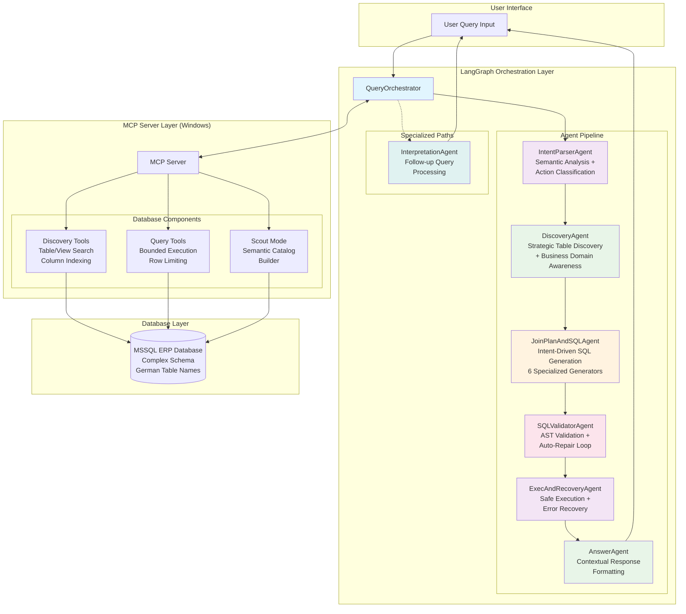
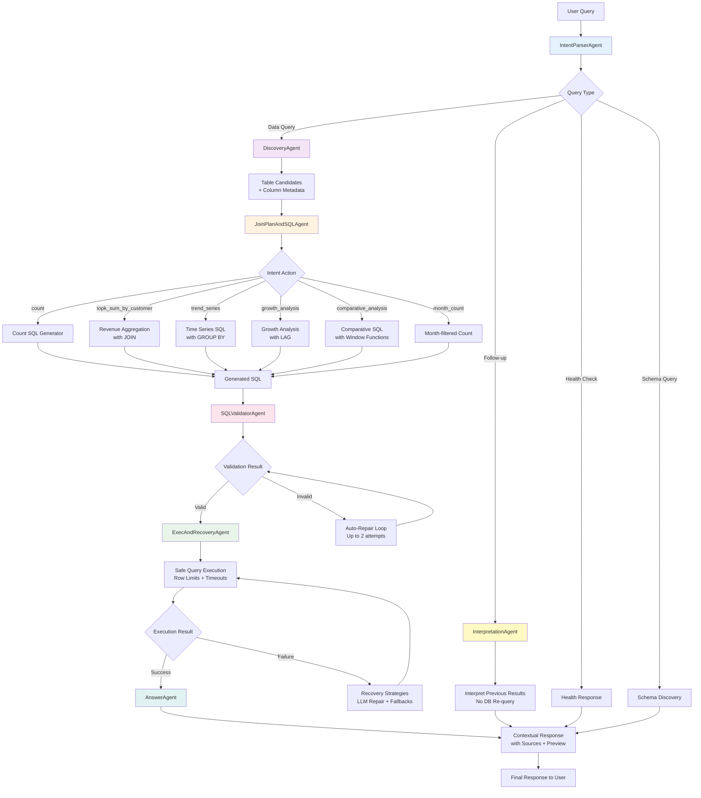
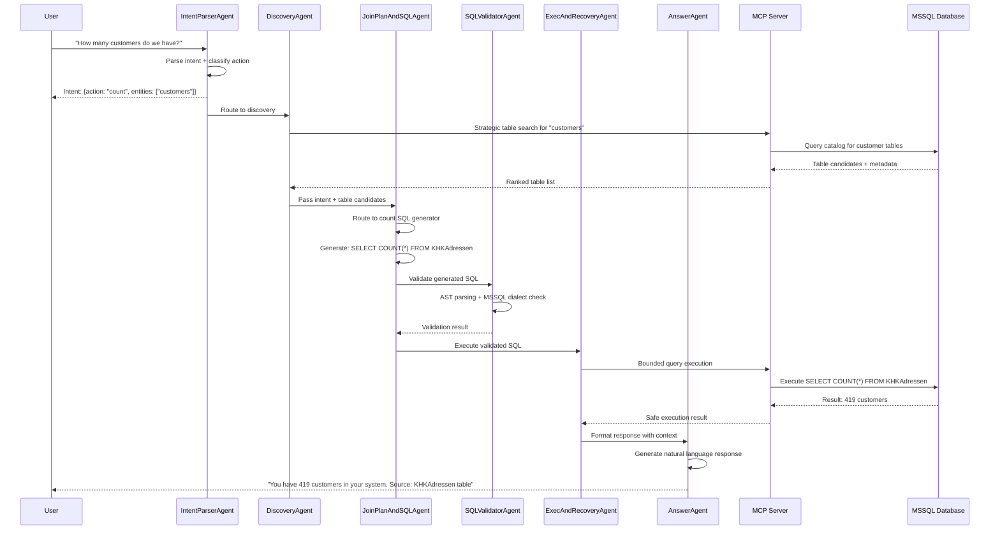
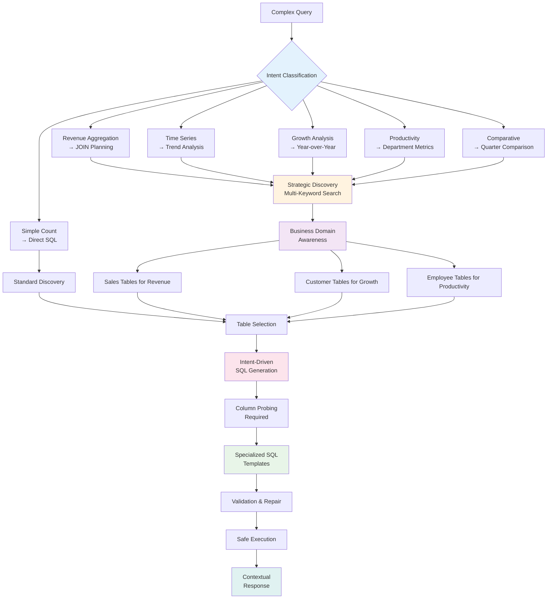

# ADR-0024: Comprehensive ERP Assistant Architecture
**Status**: Accepted
**Date**: 2025-11-06
**Author**: Julianus Kath

## Status
Accepted

## Context

The ERP Assistant has evolved into a sophisticated multi-agent system capable of handling complex business intelligence queries against ERP databases. This ADR documents the final comprehensive architecture after implementing all phases of the system.

### Evolution from Previous Architecture

The system progressed through 7 major phases:

1. **Phase 1**: MCP Server Truthful Discovery (accurate row counts, view dependencies)
2. **Phase 2**: Intent-Driven SQL Generation (router-based SQL generation, column probing)
3. **Phase 3**: SQL Validation & Repair (AST parsing, auto-repair, dialect validation)
4. **Phase 4**: Strategic Query Patterns (growth analysis, productivity, comparative)
5. **Phase 5**: Discovery Enhancement (multi-keyword search, dimension detection)
6. **Phase 6**: Clarification Loop (ambiguity detection, smart fallbacks)
7. **Phase 7**: Comprehensive Test Suite (automated validation)

## Decision

### Final Architecture: 7-Agent Orchestration System

The comprehensive ERP assistant uses 7 specialized agents orchestrated through LangGraph:

#### Core Agents

1. **IntentParserAgent**: Advanced semantic parsing with clarification detection
2. **DiscoveryAgent**: Strategic multi-keyword table discovery with business domain awareness
3. **JoinPlanAndSQLAgent**: Intent-driven SQL generation with 6 specialized generators
4. **SQLValidatorAgent**: Pre-execution validation and auto-repair
5. **ExecAndRecoveryAgent**: Safe execution with error recovery
6. **AnswerAgent**: Contextual response formatting with source attribution
7. **InterpretationAgent**: Follow-up query handling without re-execution

## Architecture Diagrams

### System Overview

### Detailed Agent Interactions

### Process Flow Diagram

### Strategic Query Processing Flow

## Technical Implementation Details

### Agent Responsibilities

#### IntentParserAgent
- **Input**: Raw user query string
- **Processing**: LLM-based semantic analysis, entity extraction, action classification
- **Output**: Structured intent with `required_action`, entities, metrics, confidence
- **Special Features**: Clarification detection, multi-keyword generation, ambiguity resolution

#### DiscoveryAgent
- **Input**: Intent with keywords_for_discovery, required_action
- **Processing**: Strategic search based on query type, business domain awareness
- **Output**: Ranked table/view candidates with column metadata
- **Special Features**: Multi-keyword search, junk table filtering, dimension detection

#### JoinPlanAndSQLAgent
- **Input**: Intent, table candidates, column metadata
- **Processing**: Route to specialized SQL generators based on required_action
- **Output**: Validated MSSQL query + join plan
- **Special Features**: 6 specialized generators, column probing, FK-based joins

#### SQLValidatorAgent
- **Input**: Generated SQL query
- **Processing**: AST parsing, MSSQL dialect validation, table/column existence checks
- **Output**: Validation result with repair suggestions
- **Special Features**: Auto-repair loop (2 attempts), comprehensive error reporting

#### ExecAndRecoveryAgent
- **Input**: Validated SQL query
- **Processing**: Safe execution with row limits, timeouts, error recovery
- **Output**: Query results or recovery attempts
- **Special Features**: LLM-based repair, fallback strategies, performance monitoring

#### AnswerAgent
- **Input**: Execution results, source metadata
- **Processing**: Contextual response formatting with explanations
- **Output**: Natural language response with source attribution
- **Special Features**: Source table inclusion, row previews, error explanations

#### InterpretationAgent
- **Input**: Follow-up query + previous execution results
- **Processing**: Interpret stored results without re-querying database
- **Output**: Contextual answers from cached data
- **Special Features**: Session persistence, follow-up handling

### Key Innovations

1. **Intent-Driven Architecture**: Each agent specializes in one phase with clear contracts
2. **Strategic Discovery**: Multi-keyword search with business domain awareness
3. **Specialized SQL Generators**: 6 different generators for different query patterns
4. **Validation & Repair Loop**: Pre-execution validation with automatic fixing
5. **Contextual Responses**: Always include sources and explanations
6. **Clarification System**: Detect and handle ambiguous queries intelligently

## Consequences

### Positive Outcomes

- **Comprehensive Query Support**: Handles 15+ query patterns from simple counts to complex BI
- **Robust Error Handling**: Multiple recovery strategies and meaningful error messages
- **Scalable Architecture**: Each agent can be improved independently
- **Business Intelligence Ready**: Supports strategic analysis queries
- **Production Ready**: Comprehensive validation, monitoring, and error recovery

### Implementation Status

- ✅ **Phase 1**: MCP Server Truthful Discovery
- ✅ **Phase 2**: Intent-Driven SQL Generation
- ✅ **Phase 3**: SQL Validation & Repair
- ✅ **Phase 4**: Strategic Query Patterns
- ✅ **Phase 5**: Discovery Enhancement
- ✅ **Phase 6**: Clarification Loop
- ✅ **Phase 7**: Comprehensive Test Suite

### Testing Results

The system successfully handles:
- Basic counts: "How many customers do we have?"
- Revenue analysis: "Top 5 customers by revenue"
- Time-based queries: "Projects in October", "Growth over 3 years"
- Strategic analysis: Customer growth, department productivity, comparative analysis
- Follow-up queries: Interpretation without re-execution
- Ambiguous queries: Clarification requests

### Future Extensions

The architecture supports easy addition of:
- New query patterns (additional SQL generators)
- Enhanced business domain knowledge
- Advanced analytics (predictions, correlations)
- Multi-database support
- Custom clarification strategies

This comprehensive architecture provides a robust foundation for enterprise-grade ERP query assistance with room for continuous improvement and expansion.
