# ADR 0031: Simple SQL Agent - Complete Architecture

## Status
Accepted

## Date
2026-01-11

## Context

This ADR provides a comprehensive overview of the Simple SQL Agent architecture, building on ADR-0030 and incorporating all subsequent improvements including composite discovery tools, debug logging, error handling, and iteration limits.

### Evolution from ADR-0030

The initial simple agent (ADR-0030) achieved 58% success rate with 4 basic tools. This version adds:
- **Composite discovery tool** (`discover_tables`) reducing tool calls
- **Debug logging system** for real-time observability
- **Configurable iteration limits** to prevent runaway API costs
- **Structured error handling** in the system prompt
- **ToolMessage parsing fixes** for LangGraph event streaming

## Architecture Overview

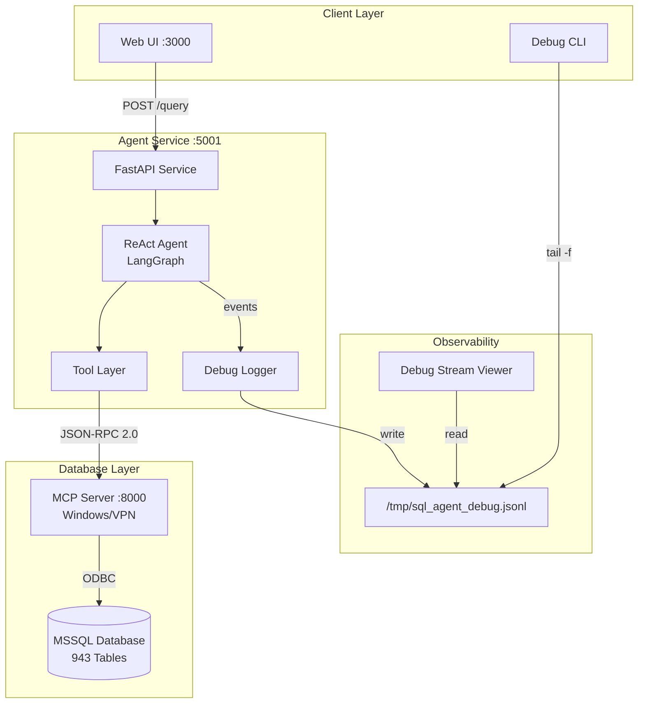
```mermaid
graph TB
    subgraph "Client Layer"
        UI[Web UI :3000]
        CLI[Debug CLI]
    end

    subgraph "Agent Service :5001"
        API[FastAPI Service]
        AGENT[ReAct Agent<br/>LangGraph]
        TOOLS[Tool Layer]
        LOGGER[Debug Logger]
    end

    subgraph "Database Layer"
        MCP[MCP Server :8000<br/>Windows/VPN]
        DB[(MSSQL Database<br/>943 Tables)]
    end

    subgraph "Observability"
        LOGFILE["/tmp/sql_agent_debug.jsonl"]
        STREAM[Debug Stream Viewer]
    end

    UI -->|POST /query| API
    API --> AGENT
    AGENT --> TOOLS
    TOOLS -->|JSON-RPC 2.0| MCP
    MCP -->|ODBC| DB

    AGENT -->|events| LOGGER
    LOGGER -->|write| LOGFILE
    CLI -->|tail -f| LOGFILE
    STREAM -->|read| LOGFILE
```

## LangGraph Implementation Details

### Core Dependencies

```python
from langchain_openai import ChatOpenAI
from langchain_core.messages import HumanMessage, SystemMessage, ToolMessage
from langgraph.graph import StateGraph, START, END
from langgraph.prebuilt import create_react_agent
```

### ReAct Agent Pattern

The agent uses LangGraph's `create_react_agent` - a prebuilt graph that implements the ReAct (Reason + Act) pattern:

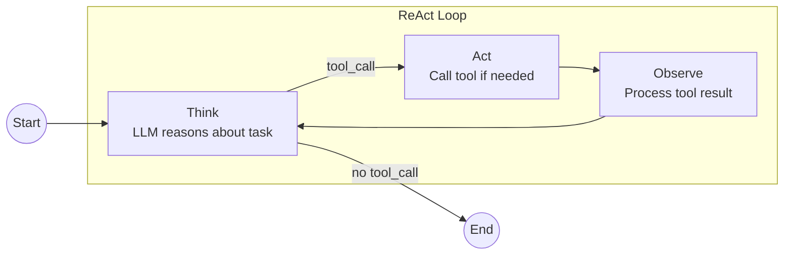
```mermaid
graph LR
    subgraph "ReAct Loop"
        THINK[Think<br/>LLM reasons about task]
        ACT[Act<br/>Call tool if needed]
        OBSERVE[Observe<br/>Process tool result]
    end

    START((Start)) --> THINK
    THINK -->|tool_call| ACT
    ACT --> OBSERVE
    OBSERVE --> THINK
    THINK -->|no tool_call| END((End))
```

### Agent Initialization

```python
class SQLAgentGraph:
    def __init__(
        self,
        model_name: str = "gpt-4o",
        temperature: float = 0.0,
        concepts_path: Optional[str] = None,
        max_iterations: int = 15,
    ):
        # 1. Initialize LLM
        self.llm = ChatOpenAI(
            model=model_name,
            temperature=temperature,  # 0.0 = deterministic
        )

        # 2. Load domain concepts from JSON
        self.concepts = load_concepts(concepts_path)

        # 3. Build the graph
        self.graph = self._build_graph()
```

### Graph Construction

```python
def _build_graph(self):
    # Define tools available to the agent
    tools = [
        discover_tables,   # Primary discovery
        list_tables,       # Full table list
        get_schema,        # Column details
        get_column_index,  # Exact column names
        execute_query,     # Run SQL
    ]

    # Get system prompt with domain knowledge
    system_prompt = get_system_prompt(self.concepts)

    # Create ReAct agent with prompt injection
    agent = create_react_agent(
        model=self.llm,
        tools=tools,
        prompt=system_prompt,  # Injected as SystemMessage
    )

    return agent
```

### State Schema

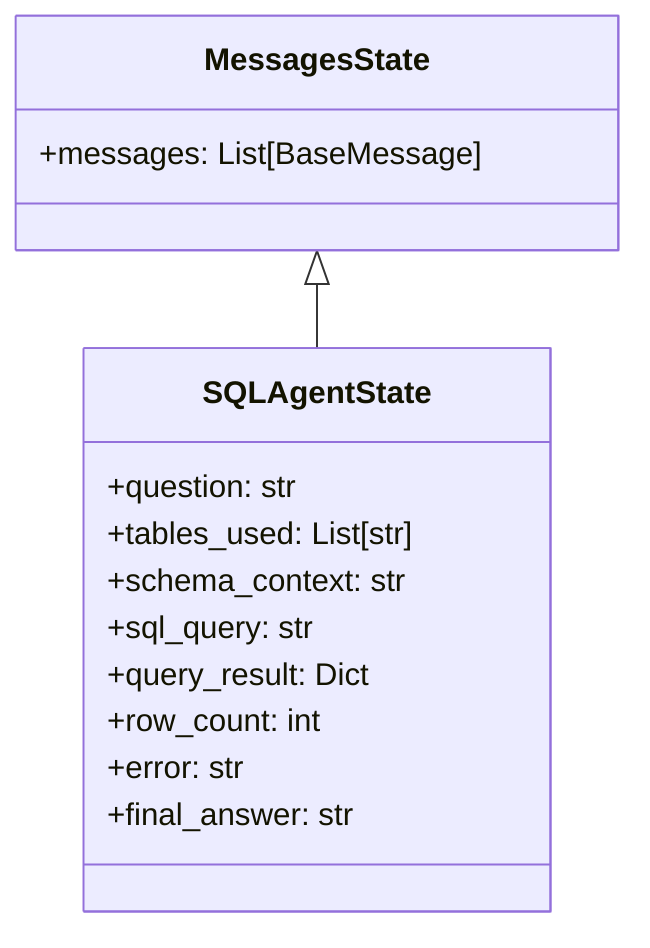
```mermaid
classDiagram
    class MessagesState {
        +messages: List[BaseMessage]
    }

    class SQLAgentState {
        +question: str
        +tables_used: List[str]
        +schema_context: str
        +sql_query: str
        +query_result: Dict
        +row_count: int
        +error: str
        +final_answer: str
    }

    MessagesState <|-- SQLAgentState
```

The state extends LangGraph's `MessagesState` which provides automatic message list management:

```python
class SQLAgentState(MessagesState):
    """
    Extends MessagesState which provides:
    - messages: List of conversation messages (used by ReAct agent)
    """
    question: str
    tables_used: Optional[List[str]]
    schema_context: Optional[str]
    sql_query: Optional[str]
    query_result: Optional[Dict[str, Any]]
    row_count: Optional[int]
    error: Optional[str]
    final_answer: Optional[str]
```

### Event Streaming with astream_events v2

The agent uses `astream_events(version="v2")` for real-time observability:

```python
async for event in self.graph.astream_events(
    initial_state,
    config={"recursion_limit": limit},
    version="v2"
):
    event_type = event.get("event", "")
    event_name = event.get("name", "")
    event_data = event.get("data", {})
```

#### Event Types and Handling

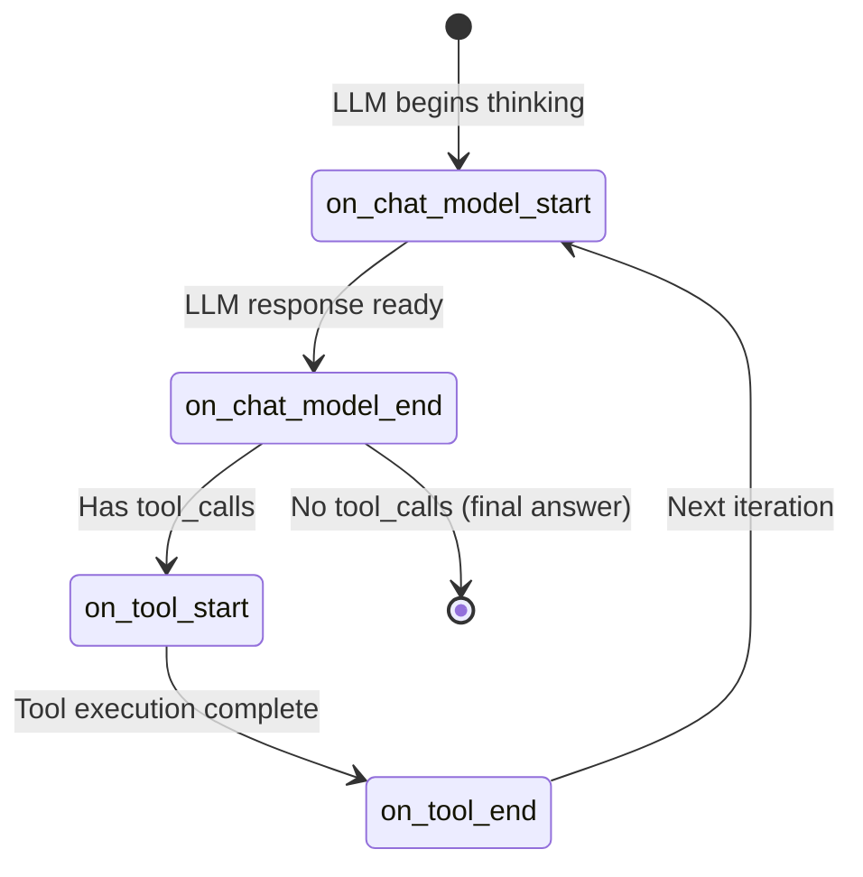
```mermaid
stateDiagram-v2
    [*] --> on_chat_model_start: LLM begins thinking
    on_chat_model_start --> on_chat_model_end: LLM response ready

    on_chat_model_end --> on_tool_start: Has tool_calls
    on_chat_model_end --> [*]: No tool_calls (final answer)

    on_tool_start --> on_tool_end: Tool execution complete
    on_tool_end --> on_chat_model_start: Next iteration
```

| Event Type | When Fired | Data Available |
|------------|------------|----------------|
| `on_chat_model_start` | LLM begins thinking | Input messages |
| `on_chat_model_end` | LLM response ready | `output.content`, `output.tool_calls` |
| `on_tool_start` | Tool execution begins | Tool name, input args |
| `on_tool_end` | Tool execution complete | `output` (ToolMessage) |

#### ToolMessage Handling

Tool results come back as `ToolMessage` objects, not strings:

```python
elif event_type == "on_tool_end":
    tool_output = event_data.get("output", "")

    # Extract content from ToolMessage
    if hasattr(tool_output, "content"):
        tool_output_str = tool_output.content
    else:
        tool_output_str = str(tool_output) if tool_output else ""
```

### Recursion Limit vs Iterations

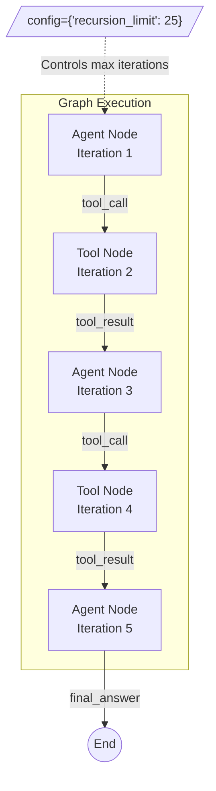
```mermaid
graph TB
    subgraph "Graph Execution"
        NODE1[Agent Node<br/>Iteration 1]
        NODE2[Tool Node<br/>Iteration 2]
        NODE3[Agent Node<br/>Iteration 3]
        NODE4[Tool Node<br/>Iteration 4]
        NODE5[Agent Node<br/>Iteration 5]
    end

    NODE1 -->|"tool_call"| NODE2
    NODE2 -->|"tool_result"| NODE3
    NODE3 -->|"tool_call"| NODE4
    NODE4 -->|"tool_result"| NODE5
    NODE5 -->|"final_answer"| END((End))

    CONFIG[/"config={'recursion_limit': 25}"/]
    CONFIG -.->|"Controls max iterations"| NODE1
```

The `recursion_limit` in LangGraph config controls how many times the graph can transition between nodes:

```python
config = {"recursion_limit": limit}  # default: 25

async for event in self.graph.astream_events(
    initial_state,
    config=config,
    version="v2"
):
```

### Tool Binding Architecture

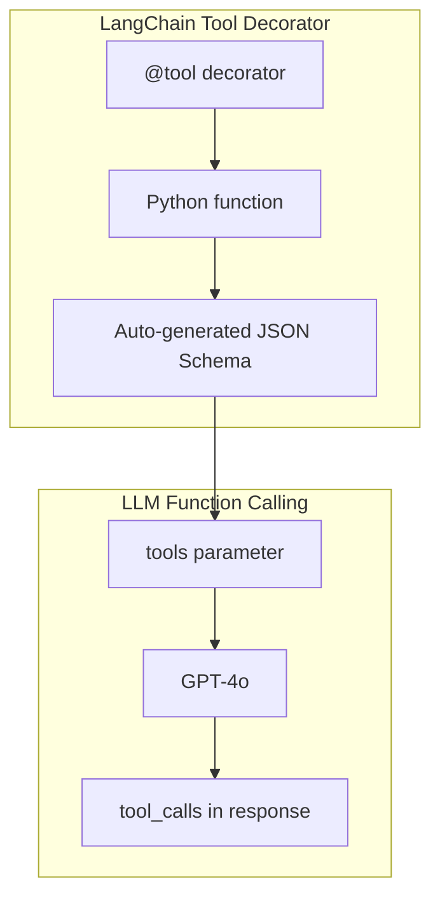
```mermaid
graph TB
    subgraph "LangChain Tool Decorator"
        DECORATOR["@tool decorator"]
        FUNC["Python function"]
        SCHEMA["Auto-generated JSON Schema"]
    end

    subgraph "LLM Function Calling"
        LLM["GPT-4o"]
        TOOLS_LIST["tools parameter"]
        TOOL_CALL["tool_calls in response"]
    end

    DECORATOR --> FUNC
    FUNC --> SCHEMA
    SCHEMA --> TOOLS_LIST
    TOOLS_LIST --> LLM
    LLM --> TOOL_CALL
```

Tools are defined with the `@tool` decorator:

```python
from langchain_core.tools import tool

@tool
def execute_query(sql: str) -> str:
    """
    Execute a SQL query against the database.

    Args:
        sql: The SQL query to execute (must be SELECT)

    Returns:
        Query results as formatted markdown table
    """
    # Implementation...
```

The decorator:
1. Extracts function signature for JSON schema
2. Uses docstring for tool description
3. Binds to LLM via OpenAI function calling

## Component Architecture

### 1. Agent Core (`agent.py`)

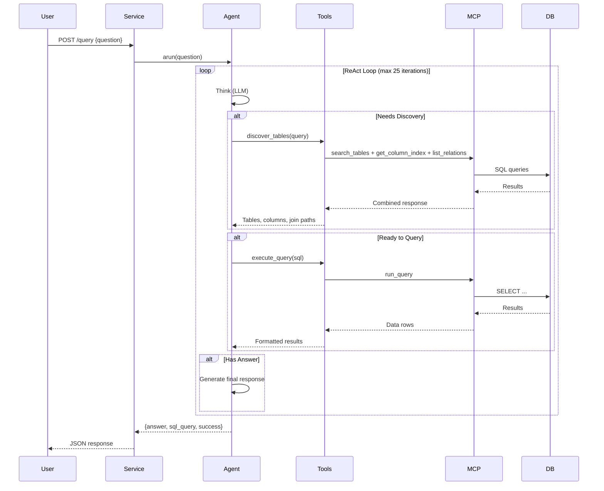
```mermaid
sequenceDiagram
    participant User
    participant Service
    participant Agent
    participant Tools
    participant MCP
    participant DB

    User->>Service: POST /query {question}
    Service->>Agent: arun(question)

    loop ReAct Loop (max 25 iterations)
        Agent->>Agent: Think (LLM)

        alt Needs Discovery
            Agent->>Tools: discover_tables(query)
            Tools->>MCP: search_tables + get_column_index + list_relations
            MCP->>DB: SQL queries
            DB-->>MCP: Results
            MCP-->>Tools: Combined response
            Tools-->>Agent: Tables, columns, join paths
        end

        alt Ready to Query
            Agent->>Tools: execute_query(sql)
            Tools->>MCP: run_query
            MCP->>DB: SELECT ...
            DB-->>MCP: Results
            MCP-->>Tools: Data rows
            Tools-->>Agent: Formatted results
        end

        alt Has Answer
            Agent->>Agent: Generate final response
        end
    end

    Agent-->>Service: {answer, sql_query, success}
    Service-->>User: JSON response
```

### 2. Tool Layer (`tools/`)

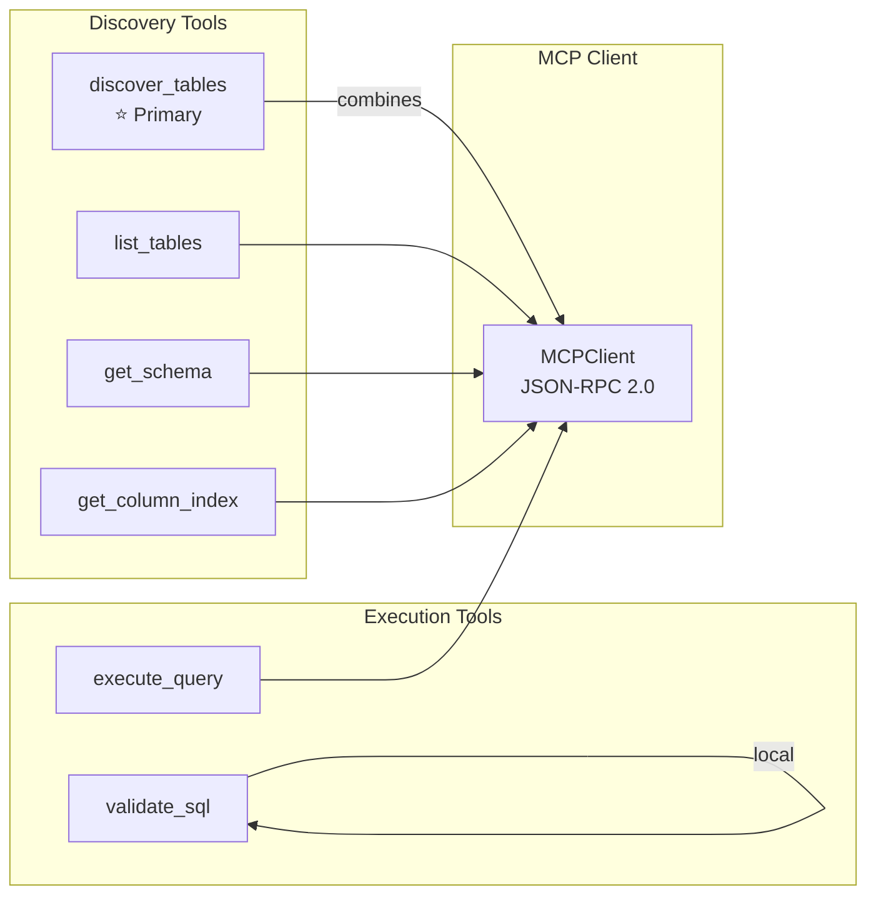
```mermaid
graph LR
    subgraph "Discovery Tools"
        DT[discover_tables<br/>⭐ Primary]
        LT[list_tables]
        GS[get_schema]
        GCI[get_column_index]
    end

    subgraph "Execution Tools"
        EQ[execute_query]
        VS[validate_sql]
    end

    subgraph "MCP Client"
        MC[MCPClient<br/>JSON-RPC 2.0]
    end

    DT -->|combines| MC
    LT --> MC
    GS --> MC
    GCI --> MC
    EQ --> MC
    VS -->|local| VS
```

#### Tool Descriptions

| Tool | Purpose | MCP Calls | Use Case |
|------|---------|-----------|----------|
| `discover_tables(query)` | **Primary discovery** - combines search, schema, and relations | 3 | Start of every query |
| `list_tables()` | Full table listing | 1 | Overview/exploration |
| `get_schema(tables)` | Detailed column info | 1 | When discover_tables insufficient |
| `get_column_index(tables)` | Verify exact column names | 1 | Error recovery |
| `execute_query(sql)` | Run SELECT query | 1 | Final execution |
| `validate_sql(sql)` | Check MSSQL syntax | 0 (local) | Pre-execution validation |

### Composite Discovery Tool (`discover_tables`)

The `discover_tables` tool is the primary discovery mechanism, combining 3 MCP calls into 1 tool call:

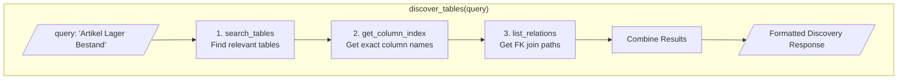
```mermaid
graph TB
    subgraph "discover_tables(query)"
        INPUT[/"query: 'Artikel Lager Bestand'"/]

        STEP1[1. search_tables<br/>Find relevant tables]
        STEP2[2. get_column_index<br/>Get exact column names]
        STEP3[3. list_relations<br/>Get FK join paths]

        COMBINE[Combine Results]

        OUTPUT[/"Formatted Discovery Response"/]
    end

    INPUT --> STEP1
    STEP1 --> STEP2
    STEP2 --> STEP3
    STEP3 --> COMBINE
    COMBINE --> OUTPUT
```

```python
@tool
def discover_tables(query: str, include_join_paths: bool = True) -> str:
    """
    Comprehensive table discovery for query planning.
    Combines search, schema, and relationship information in a single call.
    """
    async def _discover():
        client = get_mcp_client()
        try:
            # Step 1: Search for relevant tables
            search_results = await client.search_tables(query, limit=5)
            table_names = extract_table_names(search_results)

            # Step 2: Get column index for all tables
            columns_result = await client.get_column_index(table_names)

            # Step 3: Get relationships for join paths
            relationships = {}
            if include_join_paths:
                for table_name in table_names[:3]:
                    rels = await client.list_relations(table_name)
                    relationships[table_name] = rels.get("neighbors", [])

            # Build consolidated response
            return {
                "tables": [...],
                "join_paths": [...],
            }
        finally:
            await client.close()
```

**Output Format:**
```markdown
## Discovery Results for 'Artikel Lager Bestand'

### dbo.KHKLagerplatzbestaende (relevance: 0.89, ~125000 rows)
Columns: BestandsID, Artikelnummer, Lagerplatz, Bestand, Mandant, ...

### dbo.KHKArtikel (relevance: 0.75, ~45000 rows)
Columns: Artikelnummer, Bezeichnung, Artikelgruppe, ...

### Join Paths
- dbo.KHKLagerplatzbestaende -> dbo.KHKArtikel (FK)
```

### execute_query Tool Implementation

```python
@tool
def execute_query(sql: str) -> str:
    """Execute a SQL query against the database."""

    async def _execute():
        client = get_mcp_client()
        try:
            start = time.time()
            result = await client.execute_query(sql, limit=100)
            elapsed = int((time.time() - start) * 1000)

            if not result.get("ok", True):
                return f"Query execution failed: {result.get('error')}"

            # Format as markdown table
            rows = result.get("rows", result.get("data", []))
            return format_as_markdown_table(rows, elapsed)
        finally:
            await client.close()

    return _run_async(_execute())
```

**Output Format:**
```
Query executed successfully in 44ms
Returned 5 rows

| Artikelnummer | Bestand | Lagerplatz |
|---|---|---|
| A001 | 1500 | L-01-A |
| A002 | 890 | L-01-B |
...
```

### 3. Debug System

```mermaid
graph TB
    subgraph "Agent Process"
        AGENT[ReAct Agent]
        EVENTS[astream_events v2]
        DLOG[DebugLogger]
    end

    subgraph "Log File"
        JSONL["/tmp/sql_agent_debug.jsonl"]
    end

    subgraph "Viewers"
        CLI[debug_stream.py<br/>Terminal Viewer]
        HTTP[/stream endpoint<br/>SSE for Web]
    end

    AGENT --> EVENTS
    EVENTS --> DLOG
    DLOG -->|append JSONL| JSONL
    JSONL -->|tail -f| CLI
    EVENTS -->|SSE| HTTP
```

#### DebugLogger Implementation

```python
class DebugLogger:
    """Writes structured events to JSONL log file."""

    def __init__(self, log_file: Optional[str] = None):
        self.log_file = log_file or os.getenv(
            "SQL_AGENT_DEBUG_LOG",
            "/tmp/sql_agent_debug.jsonl"
        )

    def _write(self, event: Dict[str, Any]):
        """Append event to log file with timestamp."""
        event["timestamp"] = datetime.now().isoformat()
        with open(self.log_file, "a") as f:
            f.write(json.dumps(event, default=str) + "\n")
            f.flush()  # Immediate write for real-time viewing

    def query_start(self, question: str):
        self._write({"type": "query_start", "question": question})

    def llm_start(self):
        self._write({"type": "llm_start"})

    def llm_end(self, content: str = "", has_tool_calls: bool = False):
        self._write({
            "type": "llm_end",
            "content": content[:500] if content else "",
            "has_tool_calls": has_tool_calls
        })

    def tool_call(self, tool_name: str, tool_input: Dict):
        self._write({
            "type": "tool_call",
            "tool_name": tool_name,
            "tool_input": tool_input
        })

    def tool_result(self, tool_name: str, output: Any):
        self._write({
            "type": "tool_result",
            "tool_name": tool_name,
            "output": str(output)[:1000]  # Truncate large outputs
        })

    def final_answer(self, answer: str, sql_query: str = None,
                     latency_ms: int = 0, iterations: int = 0):
        self._write({
            "type": "final_answer",
            "answer": answer,
            "sql_query": sql_query,
            "latency_ms": latency_ms,
            "iterations": iterations
        })

    def error(self, error: str):
        self._write({"type": "error", "error": error})
```

#### Singleton Pattern for Logger

```python
_debug_logger: Optional[DebugLogger] = None

def get_debug_logger() -> DebugLogger:
    """Get or create the singleton debug logger."""
    global _debug_logger
    if _debug_logger is None:
        _debug_logger = DebugLogger()
    return _debug_logger
```

#### Event Types

```json
{"type": "query_start", "question": "...", "timestamp": "..."}
{"type": "llm_start", "timestamp": "..."}
{"type": "llm_end", "content": "...", "has_tool_calls": true}
{"type": "tool_call", "tool_name": "discover_tables", "tool_input": {...}}
{"type": "tool_result", "tool_name": "discover_tables", "output": "..."}
{"type": "final_answer", "answer": "...", "sql_query": "...", "iterations": 5}
{"type": "error", "error": "..."}
```

#### Debug Stream Viewer

The `debug_stream.py` provides a colorized terminal view:

```python
class DebugStreamFormatter:
    """Formats and colorizes debug events for terminal display."""

    COLORS = {
        "BLUE": "\033[94m",
        "GREEN": "\033[92m",
        "YELLOW": "\033[93m",
        "RED": "\033[91m",
        "CYAN": "\033[96m",
        "RESET": "\033[0m",
    }

    def format_event(self, event: Dict) -> Optional[str]:
        event_type = event.get("type", "")

        if event_type == "query_start":
            return self._format_query_start(event)
        elif event_type == "tool_call":
            return self._format_tool_call(event)
        # ... etc

def tail_log_file(log_file: str, formatter: DebugStreamFormatter):
    """Tail the log file and display formatted events."""
    with open(log_file, 'r') as f:
        f.seek(0, 2)  # Go to end
        while True:
            line = f.readline()
            if line:
                event = json.loads(line.strip())
                formatted = formatter.format_event(event)
                if formatted:
                    print(formatted, flush=True)
            else:
                time.sleep(0.1)  # Poll interval
```

### Query Result Parsing

The `parse_query_result` function extracts structured data from the markdown table output:

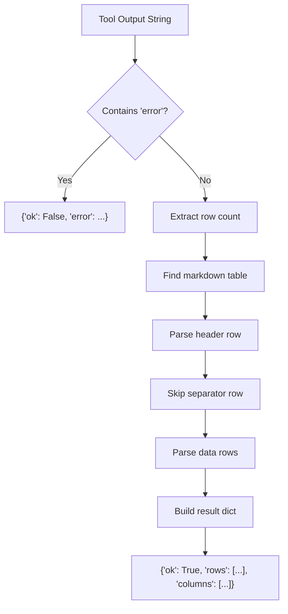
```mermaid
graph TD
    INPUT["Tool Output String"]

    INPUT --> CHECK_ERR{Contains 'error'?}
    CHECK_ERR -->|Yes| RETURN_ERR["{'ok': False, 'error': ...}"]
    CHECK_ERR -->|No| PARSE_COUNT[Extract row count]

    PARSE_COUNT --> FIND_TABLE[Find markdown table]
    FIND_TABLE --> PARSE_HEADER[Parse header row]
    PARSE_HEADER --> SKIP_SEP[Skip separator row]
    SKIP_SEP --> PARSE_ROWS[Parse data rows]

    PARSE_ROWS --> BUILD[Build result dict]
    BUILD --> RETURN["{'ok': True, 'rows': [...], 'columns': [...]}"]
```

```python
def parse_query_result(content: str) -> Dict[str, Any]:
    """
    Parse execute_query tool output into structured result.

    Input format:
        Query executed successfully in 19ms
        Returned 5 rows

        | product_name | price |
        |---|---|
        | Chai | 18.00 |
        | Chang | 19.00 |

    Returns:
        {
            "ok": True,
            "rows": [{"product_name": "Chai", "price": "18.00"}, ...],
            "columns": ["product_name", "price"],
            "row_count": 5
        }
    """
    result = {"ok": True, "rows": [], "columns": [], "row_count": 0}

    # Check for error
    if "failed" in content.lower() or "error" in content.lower():
        result["ok"] = False
        result["error"] = content
        return result

    # Extract row count from "Returned X rows"
    match = re.search(r'Returned (\d+) row', content)
    if match:
        result["row_count"] = int(match.group(1))

    # Parse markdown table
    for line in content.split('\n'):
        if line.startswith('|'):
            parts = [p.strip() for p in line.split('|') if p.strip()]

            # Skip separator row (|---|---|)
            if all(c in '-' for c in ''.join(parts)):
                continue

            # First row = headers
            if not result["columns"]:
                result["columns"] = parts
            else:
                # Data rows
                row = dict(zip(result["columns"], parts))
                result["rows"].append(row)

    return result
```

## File Structure

```
simple_sql_agent/
├── __init__.py              # Package exports
├── agent.py                 # SQLAgentGraph - ReAct agent with astream_events
├── state.py                 # SQLAgentState TypedDict (minimal)
├── service.py               # FastAPI service (port 5001)
│
├── tools/
│   ├── __init__.py          # Tool exports
│   ├── db_tools.py          # discover_tables, list_tables, get_schema,
│   │                        # get_column_index, execute_query
│   └── validation.py        # validate_sql (local MSSQL syntax check)
│
├── prompts/
│   ├── __init__.py
│   └── system.py            # System prompt generator with:
│                            # - MSSQL syntax rules
│                            # - Error handling instructions
│                            # - Domain concepts injection
│                            # - Date context
│
├── db/
│   ├── __init__.py
│   └── mcp_client.py        # MCPClient - HTTP JSON-RPC 2.0 client
│
├── debug_logger.py          # DebugLogger - writes JSONL events
├── debug_stream.py          # Log viewer (tail -f) + SSE streaming
│
├── run_benchmark.py         # Benchmark runner for eval/
└── test_agent.py            # Quick test script
```

## Configuration

### Environment Variables

| Variable | Default | Description |
|----------|---------|-------------|
| `OPENAI_API_KEY` | - | OpenAI API key (required) |
| `MCP_SERVER_URL` | - | MCP server URL (required) |
| `MCP_API_KEY` | - | MCP authentication key |
| `SQL_AGENT_MAX_ITERATIONS` | `25` | Max LLM calls per query |
| `SQL_AGENT_DEBUG_LOG` | `/tmp/sql_agent_debug.jsonl` | Debug log path |
| `DB_DIALECT` | `postgres` | Database dialect (`mssql` or `postgres`) |

### Iteration Limits

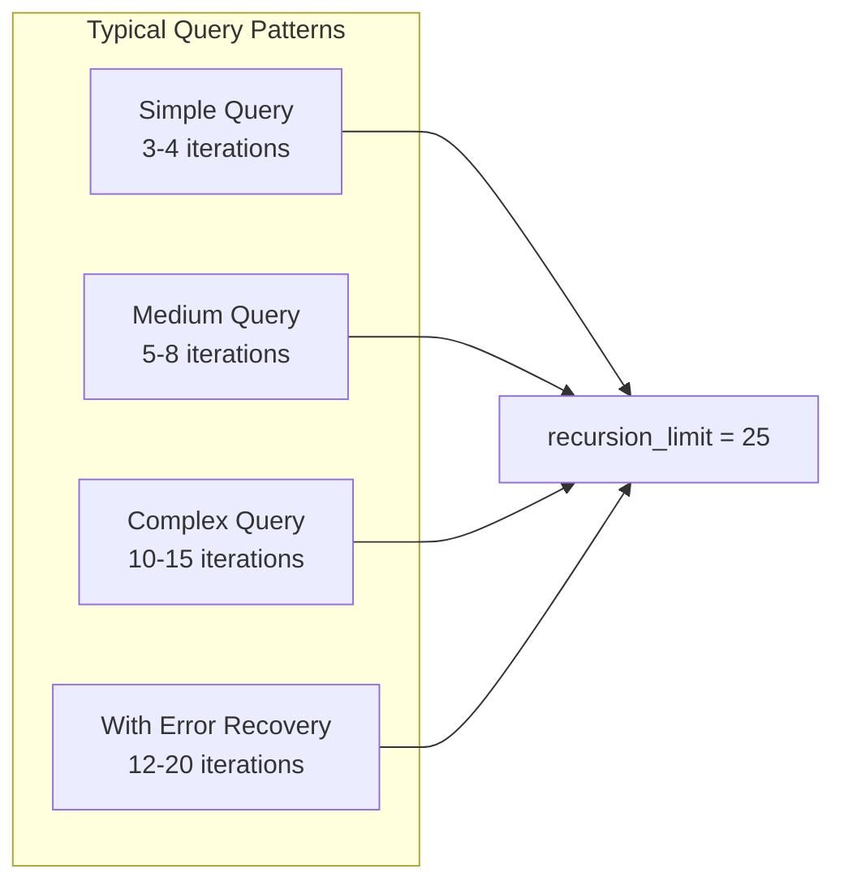
```mermaid
graph LR
    subgraph "Typical Query Patterns"
        SIMPLE[Simple Query<br/>3-4 iterations]
        MEDIUM[Medium Query<br/>5-8 iterations]
        COMPLEX[Complex Query<br/>10-15 iterations]
        RECOVERY[With Error Recovery<br/>12-20 iterations]
    end

    LIMIT[recursion_limit = 25]

    SIMPLE --> LIMIT
    MEDIUM --> LIMIT
    COMPLEX --> LIMIT
    RECOVERY --> LIMIT
```

## Request Flow

### Typical Successful Query

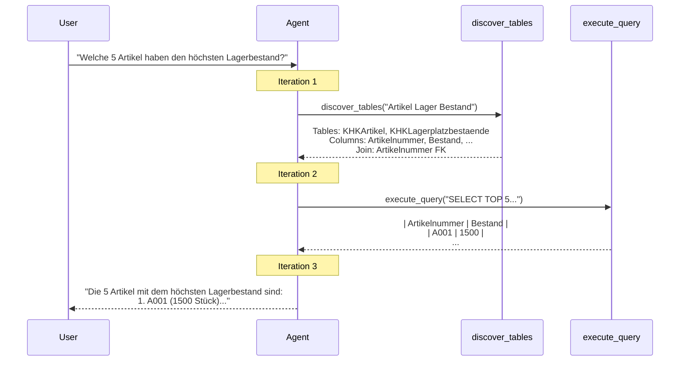
```mermaid
sequenceDiagram
    participant U as User
    participant A as Agent
    participant D as discover_tables
    participant E as execute_query

    U->>A: "Welche 5 Artikel haben den höchsten Lagerbestand?"

    Note over A: Iteration 1
    A->>D: discover_tables("Artikel Lager Bestand")
    D-->>A: Tables: KHKArtikel, KHKLagerplatzbestaende<br/>Columns: Artikelnummer, Bestand, ...<br/>Join: Artikelnummer FK

    Note over A: Iteration 2
    A->>E: execute_query("SELECT TOP 5...")
    E-->>A: | Artikelnummer | Bestand |<br/>| A001 | 1500 |<br/>...

    Note over A: Iteration 3
    A-->>U: "Die 5 Artikel mit dem höchsten Lagerbestand sind:<br/>1. A001 (1500 Stück)..."
```

### Query with Error Recovery

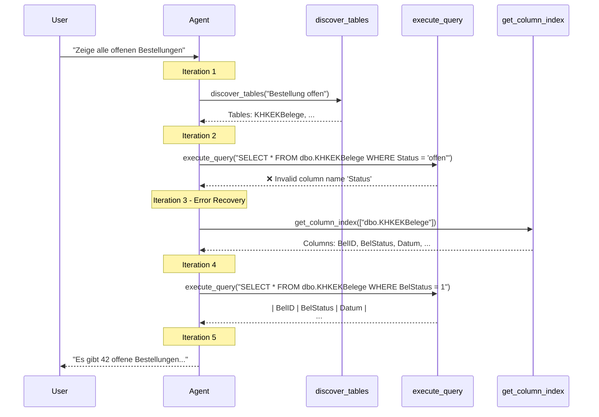
```mermaid
sequenceDiagram
    participant U as User
    participant A as Agent
    participant D as discover_tables
    participant E as execute_query
    participant G as get_column_index

    U->>A: "Zeige alle offenen Bestellungen"

    Note over A: Iteration 1
    A->>D: discover_tables("Bestellung offen")
    D-->>A: Tables: KHKEKBelege, ...

    Note over A: Iteration 2
    A->>E: execute_query("SELECT * FROM dbo.KHKEKBelege WHERE Status = 'offen'")
    E-->>A: ❌ Invalid column name 'Status'

    Note over A: Iteration 3 - Error Recovery
    A->>G: get_column_index(["dbo.KHKEKBelege"])
    G-->>A: Columns: BelID, BelStatus, Datum, ...

    Note over A: Iteration 4
    A->>E: execute_query("SELECT * FROM dbo.KHKEKBelege WHERE BelStatus = 1")
    E-->>A: | BelID | BelStatus | Datum |<br/>...

    Note over A: Iteration 5
    A-->>U: "Es gibt 42 offene Bestellungen..."
```

## System Prompt Structure


```mermaid
graph TB
    subgraph "System Prompt Components"
        INTRO["Role Definition<br/>Du bist ein SQL-Assistent"]
        TOOLS["Tool Documentation<br/>discover_tables, execute_query"]
        WORKFLOW["Workflow Steps<br/>1. DISCOVER - 2. SQL - 3. EXECUTE"]
        SYNTAX["SQL Syntax Rules<br/>MSSQL: TOP, DATEADD, brackets"]
        DATE["Date Context<br/>Heute: 2026-01-11, KW 2"]
        ERRORS["Error Handling<br/>Invalid column - get_column_index"]
        META["Non-DB Questions<br/>Politely decline"]
        RULES["Important Rules<br/>Never guess columns"]
        CONCEPTS["Business Concepts<br/>From concepts.json"]
    end

    INTRO --> TOOLS
    TOOLS --> WORKFLOW
    WORKFLOW --> SYNTAX
    SYNTAX --> DATE
    DATE --> ERRORS
    ERRORS --> META
    META --> RULES
    RULES --> CONCEPTS
```

## MCP Client Implementation

### Client Architecture

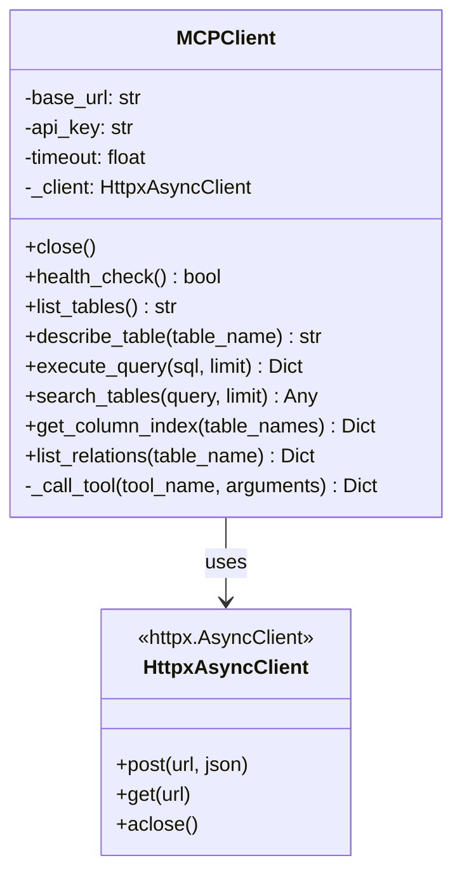
```mermaid
classDiagram
    class MCPClient {
        -base_url: str
        -api_key: str
        -timeout: float
        -_client: HttpxAsyncClient
        +close()
        +health_check() bool
        +list_tables() str
        +describe_table(table_name) str
        +execute_query(sql, limit) Dict
        +search_tables(query, limit) Any
        +get_column_index(table_names) Dict
        +list_relations(table_name) Dict
        -_call_tool(tool_name, arguments) Dict
    }

    class HttpxAsyncClient {
        <<httpx.AsyncClient>>
        +post(url, json)
        +get(url)
        +aclose()
    }

    MCPClient --> HttpxAsyncClient : uses
```

### Client Initialization

```python
class MCPClient:
    def __init__(
        self,
        base_url: Optional[str] = None,
        api_key: Optional[str] = None,
        timeout: float = 30.0,
    ):
        self.base_url = base_url or os.getenv("MCP_SERVER_URL")
        self.api_key = api_key or os.getenv("MCP_API_KEY")
        self.timeout = timeout

        self._client = httpx.AsyncClient(
            base_url=self.base_url,
            timeout=timeout,
            headers={
                "X-API-Key": self.api_key,
                "Content-Type": "application/json",
            }
        )
```

### Response Format Handling

The MCP server returns responses in various formats that must be normalized:

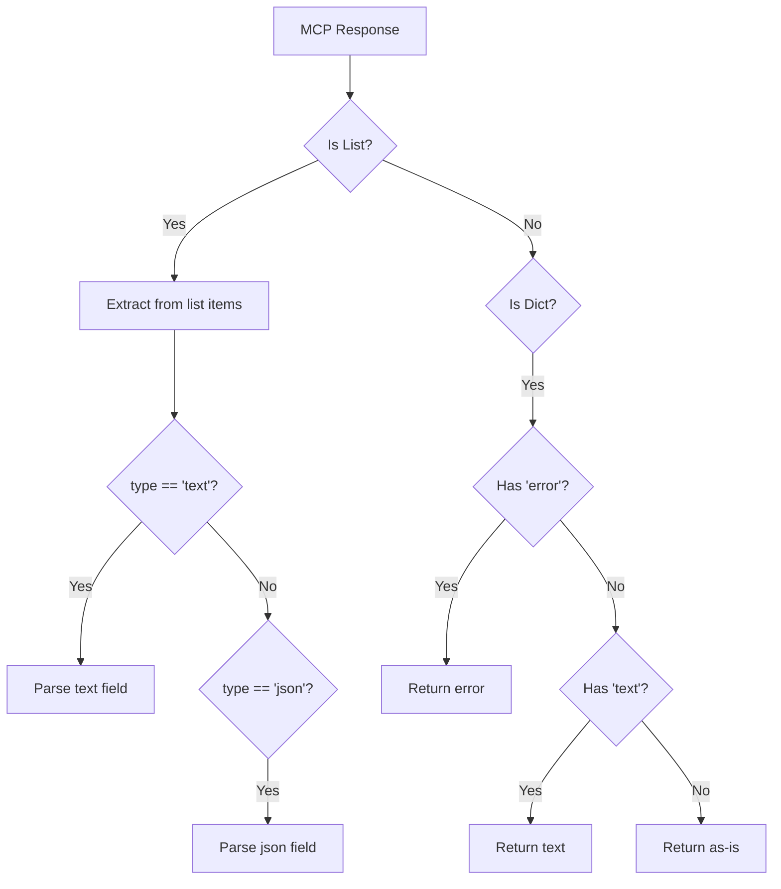
```mermaid
graph TD
    RESPONSE[MCP Response]

    RESPONSE --> LIST{"Is List?"}
    LIST -->|Yes| EXTRACT[Extract from list items]
    LIST -->|No| DICT{"Is Dict?"}

    EXTRACT --> TEXT_TYPE{"type == 'text'?"}
    TEXT_TYPE -->|Yes| PARSE_TEXT[Parse text field]
    TEXT_TYPE -->|No| JSON_TYPE{"type == 'json'?"}
    JSON_TYPE -->|Yes| PARSE_JSON[Parse json field]

    DICT -->|Yes| CHECK_ERR{"Has 'error'?"}
    CHECK_ERR -->|Yes| RETURN_ERR[Return error]
    CHECK_ERR -->|No| CHECK_TEXT{"Has 'text'?"}
    CHECK_TEXT -->|Yes| RETURN_TEXT[Return text]
    CHECK_TEXT -->|No| RETURN_DICT[Return as-is]
```

```python
# MCP returns: [{"type": "text", "text": "..."}]
# or: [{"type": "json", "json": {...}}]
# or: {"error": "...", "ok": false}
# or: {"text": "...", "ok": true}

if isinstance(result, list) and len(result) > 0:
    first_item = result[0]
    if first_item.get("type") == "json":
        return first_item["json"]
    elif first_item.get("type") == "text":
        return first_item["text"]
```

### Async Event Loop Handling

Tools are synchronous but MCP client is async. The bridge uses `_run_async`:

```python
def _run_async(coro):
    """Run async coroutine from sync context."""
    try:
        loop = asyncio.get_event_loop()
        if loop.is_running():
            # Create new loop in thread
            import concurrent.futures
            with concurrent.futures.ThreadPoolExecutor() as pool:
                future = pool.submit(asyncio.run, coro)
                return future.result(timeout=60)
        else:
            return loop.run_until_complete(coro)
    except RuntimeError:
        return asyncio.run(coro)
```

## MCP Communication

### JSON-RPC 2.0 Protocol

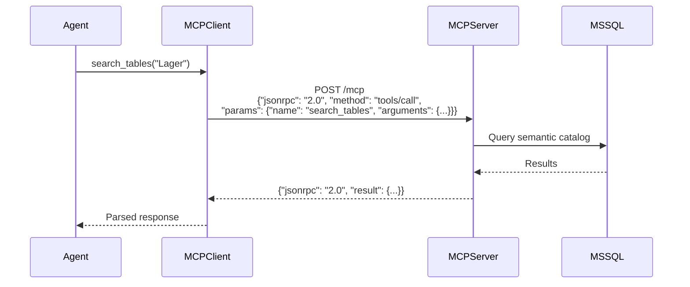
```mermaid
sequenceDiagram
    participant Agent
    participant MCPClient
    participant MCPServer
    participant MSSQL

    Agent->>MCPClient: search_tables("Lager")
    MCPClient->>MCPServer: POST /mcp<br/>{"jsonrpc": "2.0", "method": "tools/call",<br/>"params": {"name": "search_tables", "arguments": {...}}}
    MCPServer->>MSSQL: Query semantic catalog
    MSSQL-->>MCPServer: Results
    MCPServer-->>MCPClient: {"jsonrpc": "2.0", "result": {...}}
    MCPClient-->>Agent: Parsed response
```

### MCP Tools Mapping

| Agent Tool | MCP Tool | Purpose |
|------------|----------|---------|
| `discover_tables` | `search_tables` + `get_column_index` + `list_relations` | Composite discovery |
| `list_tables` | `list_tables` | Full table list |
| `get_schema` | `get_schema` | Column details |
| `get_column_index` | `get_column_index` | Column names only |
| `execute_query` | `run_query` | Execute SQL |

## Scout Mode Architecture

The Simple SQL Agent leverages **Scout Mode** indirectly through the MCP Server. Scout Mode is an autonomous startup discovery system that pre-indexes the database schema for fast semantic search, eliminating the 10-50 second discovery bottleneck on each query.

### How the Agent Uses Scout

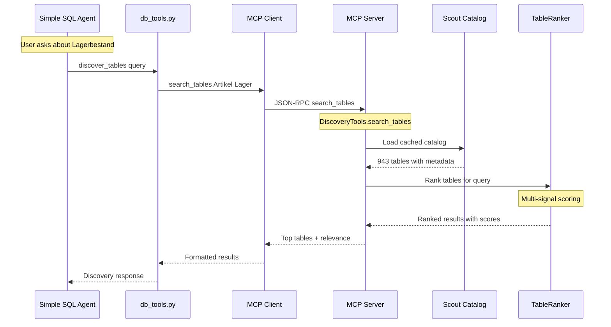
```mermaid
sequenceDiagram
    participant Agent as Simple SQL Agent
    participant Tools as db_tools.py
    participant MCP_Client as MCP Client
    participant MCP_Server as MCP Server
    participant Scout as Scout Catalog
    participant Ranker as TableRanker

    Note over Agent: User asks about Lagerbestand
    Agent->>Tools: discover_tables query
    Tools->>MCP_Client: search_tables Artikel Lager
    MCP_Client->>MCP_Server: JSON-RPC search_tables

    Note over MCP_Server: DiscoveryTools.search_tables
    MCP_Server->>Scout: Load cached catalog
    Scout-->>MCP_Server: 943 tables with metadata
    MCP_Server->>Ranker: Rank tables for query

    Note over Ranker: Multi-signal scoring
    Ranker-->>MCP_Server: Ranked results with scores
    MCP_Server-->>MCP_Client: Top tables + relevance
    MCP_Client-->>Tools: Formatted results
    Tools-->>Agent: Discovery response
```

### Scout Mode Components

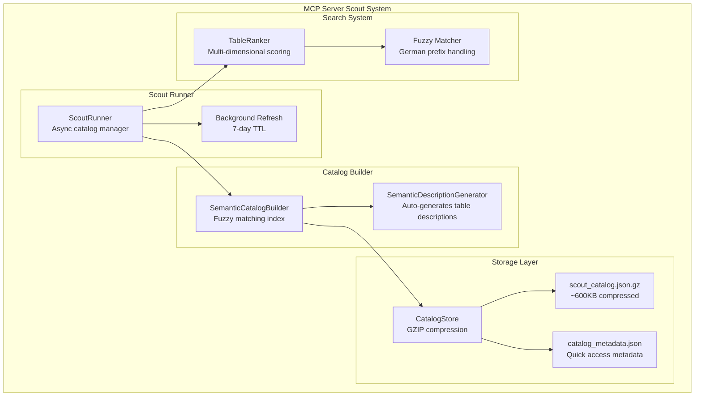
```mermaid
graph TB
    subgraph "MCP Server Scout System"
        subgraph "Scout Runner"
            RUNNER["ScoutRunner<br/>Async catalog manager"]
            SCHEDULE["Background Refresh<br/>7-day TTL"]
        end

        subgraph "Catalog Builder"
            BUILDER["SemanticCatalogBuilder<br/>Fuzzy matching index"]
            DESCGEN["SemanticDescriptionGenerator<br/>Auto-generates table descriptions"]
        end

        subgraph "Storage Layer"
            STORE["CatalogStore<br/>GZIP compression"]
            CACHE["scout_catalog.json.gz<br/>~600KB compressed"]
            META["catalog_metadata.json<br/>Quick access metadata"]
        end

        subgraph "Search System"
            RANKER["TableRanker<br/>Multi-dimensional scoring"]
            FUZZY["Fuzzy Matcher<br/>German prefix handling"]
        end
    end

    RUNNER --> BUILDER
    RUNNER --> SCHEDULE
    BUILDER --> DESCGEN
    BUILDER --> STORE
    STORE --> CACHE
    STORE --> META
    RUNNER --> RANKER
    RANKER --> FUZZY
```

### Scout Catalog Structure

The catalog is built at MCP server startup and cached to disk:

```json
{
    "metadata": {
        "database_type": "mssql",
        "build_timestamp": "2026-01-11T10:15:42.123456",
        "tables_count": 587,
        "views_count": 356,
        "relationships_count": 142
    },

    "tables": {
        "dbo.KHKArtikel": {
            "schema": "dbo",
            "name": "KHKArtikel",
            "full_name": "dbo.KHKArtikel",
            "type": "table",
            "estimated_rows": 45000,
            "column_count": 28,
            "fk_count": 5,
            "columns": [
                {
                    "name": "Artikelnummer",
                    "type": "varchar",
                    "nullable": false,
                    "is_primary_key": true,
                    "role_hints": ["id-like", "key"]
                }
            ],
            "semantic_description": "Product master data with article numbers and descriptions"
        }
    },

    "relationships": [
        {
            "from_table": "dbo.KHKLagerplatzbestaende",
            "from_column": "Artikelnummer",
            "to_table": "dbo.KHKArtikel",
            "to_column": "Artikelnummer",
            "type": "foreign_key"
        }
    ]
}
```

### Semantic Search and Ranking

When `search_tables` is called, the MCP server uses the Scout catalog with multi-signal ranking:

```mermaid
graph LR
    subgraph "Input"
        QUERY["search_tables<br/>Artikel Lager Bestand"]
    end

    subgraph "Scoring Signals"
        EXACT["Exact Match<br/>weight: 1.0"]
        FUZZY["Fuzzy Match<br/>Levenshtein distance<br/>threshold: 0.72"]
        GERMAN["German Prefix Strip<br/>dbo, vew, tbl, KHK, BS"]
        COLUMN["Column Name Match<br/>weight: 0.3"]
        INTENT["Intent Boost<br/>customer, product, sales"]
        PENALTY["Archive Penalty<br/>-0.3 for backup tables"]
    end

    subgraph "Output"
        RANKED["Ranked Tables<br/>with scores and reasons"]
    end

    QUERY --> EXACT
    QUERY --> FUZZY
    QUERY --> GERMAN
    QUERY --> COLUMN
    QUERY --> INTENT
    QUERY --> PENALTY

    EXACT --> RANKED
    FUZZY --> RANKED
    GERMAN --> RANKED
    COLUMN --> RANKED
    INTENT --> RANKED
    PENALTY --> RANKED
```

**Scoring Formula:**

| Signal | Weight | Description |
|--------|--------|-------------|
| Exact table name match | 1.0 | Direct substring match |
| Fuzzy match (≥0.72) | 0.6-1.0 | Levenshtein similarity |
| Column name match | 0.3 | Query terms in columns |
| Intent boost | +0.2 | Domain-specific (customer, sales) |
| Archive penalty | -0.3 | Tables with backup/archive names |
| Empty table penalty | -0.5 | Tables with 0 rows |
| FK connectivity bonus | +0.1 | High foreign key count |

### Scout Lifecycle

```mermaid
stateDiagram-v2
    [*] --> Initializing: Server startup

    Initializing --> CheckCache: Check catalog file

    CheckCache --> LoadCache: Valid cache exists
    CheckCache --> BuildCatalog: No cache or expired

    LoadCache --> Ready: Load from disk ~50ms

    BuildCatalog --> QuerySchema: Query information_schema
    QuerySchema --> ExtractMetadata: Extract tables and columns
    ExtractMetadata --> GenerateDescriptions: Generate semantic descriptions
    GenerateDescriptions --> WriteCatalog: Compress and write
    WriteCatalog --> Ready: Cache ready

    Ready --> Serving: Handle search requests
    Serving --> Ready: Return ranked results

    Ready --> Expired: After 7 days TTL
    Expired --> BuildCatalog: Refresh catalog
```

### Cache Performance Impact

| Operation | Without Scout | With Scout | Improvement |
|-----------|---------------|------------|-------------|
| Schema discovery | 10-50s | 50ms | 200-1000x |
| Table search | 2-5s | 10-50ms | 40-500x |
| Full query pipeline | 15-60s | 500ms-3s | 20-100x |

### Integration Points

The Simple SQL Agent's `discover_tables` tool benefits from Scout in these ways:

1. **search_tables** - Returns semantically ranked tables from Scout catalog instead of querying DB
2. **get_column_index** - Column metadata cached in catalog, no DB round-trip
3. **list_relations** - Foreign key relationships pre-indexed in catalog

```python
# In simple_sql_agent/tools/db_tools.py
@tool
def discover_tables(query: str) -> str:
    """Uses MCP search_tables which queries Scout catalog."""
    async def _discover():
        client = get_mcp_client()
        # This call goes to MCP server's DiscoveryTools.search_tables()
        # which uses the Scout catalog for ranking
        search_results = await client.search_tables(query, limit=5)
        # ...
```

### Scout Files Location

```
mcp_server/
├── scout/
│   ├── mode.py           # SemanticCatalogBuilder, fuzzy matching
│   ├── runner.py         # ScoutRunner, async catalog management
│   ├── diagnostics.py    # Health monitoring
│   └── __init__.py
├── catalog/
│   ├── store.py          # CatalogStore, GZIP compression
│   └── schema_catalog.py # SchemaCatalog, in-memory dict
├── tools/
│   └── discovery_tools.py # DiscoveryTools.search_tables()
└── data/catalog/
    ├── scout_catalog.json.gz  # Compressed catalog (~600KB)
    └── catalog_metadata.json  # Quick-access metadata
```

## API Endpoints

### Service Endpoints (Port 5001)

```mermaid
graph LR
    subgraph "Endpoints"
        HEALTH[GET /health]
        QUERY[POST /query]
        PROCESS[POST /process_query]
        CONV[POST /process_conversation]
        STREAM[POST /stream]
    end

    subgraph "Clients"
        BENCH[Benchmark Runner]
        WEBUI[Web UI]
        DEBUG[Debug Tools]
    end

    BENCH --> PROCESS
    WEBUI --> CONV
    WEBUI --> QUERY
    DEBUG --> STREAM
    DEBUG --> HEALTH
```

| Endpoint | Method | Purpose | Request Body |
|----------|--------|---------|--------------|
| `/health` | GET | Health check | - |
| `/query` | POST | Simple query | `{"question": "..."}` |
| `/process_query` | POST | Benchmark compatible | `{"user_input": "..."}` |
| `/process_conversation` | POST | UI compatible | `{"messages": [...], "api_key": "..."}` |
| `/stream` | POST | SSE streaming | `{"question": "..."}` |

## Error Handling Strategy

```mermaid
flowchart TD
    ERROR[SQL Error Received]

    ERROR --> PARSE{Parse Error Type}

    PARSE -->|Invalid Column| COL[get_column_index]
    PARSE -->|Invalid Object| TAB[list_tables]
    PARSE -->|Syntax Error| SYN[Check MSSQL Syntax]
    PARSE -->|Conversion| TYPE[get_schema for types]

    COL --> FIX[Fix SQL]
    TAB --> FIX
    SYN --> FIX
    TYPE --> FIX

    FIX --> RETRY{Retry Count < 2?}

    RETRY -->|Yes| EXECUTE[execute_query]
    RETRY -->|No| EXPLAIN[Explain Error to User]

    EXECUTE --> SUCCESS{Success?}
    SUCCESS -->|Yes| ANSWER[Generate Answer]
    SUCCESS -->|No| ERROR
```

## Performance Characteristics

### LLM Calls per Query Type

| Query Type | Iterations | Example |
|------------|------------|---------|
| Simple lookup | 3-4 | "Wie viele Artikel gibt es?" |
| Single table with filter | 4-5 | "Zeige Artikel mit Bestand > 100" |
| Multi-table join | 5-8 | "Umsatz pro Kunde letzter Monat" |
| Complex aggregation | 8-12 | "Top 5 Problemartikel nach Ausschuss" |
| With error recovery | +2-4 | Any query hitting wrong column name |

### Latency Breakdown

```mermaid
pie title Typical Query Latency (10-30s)
    "LLM Thinking" : 60
    "MCP Round-trips" : 25
    "SQL Execution" : 10
    "Response Formatting" : 5
```

## Deployment

### Start Script Flow

```mermaid
graph LR
    subgraph "start_all_services_mac.sh"
        CHECK[Check Prerequisites]
        MCP_CHECK{MCP Server<br/>Reachable?}
        START_AGENT[Start SQL Agent<br/>Port 5001]
        START_UI[Start Web UI<br/>Port 3000]
        HEALTH[Health Checks]
    end

    CHECK --> MCP_CHECK
    MCP_CHECK -->|Yes| START_AGENT
    MCP_CHECK -->|No| FAIL[Exit with Error]
    START_AGENT --> START_UI
    START_UI --> HEALTH
```

### Required Services

| Service | Port | Host | Required |
|---------|------|------|----------|
| MCP Server | 8000 | Windows VM | Yes |
| SQL Agent | 5001 | Mac/Local | Yes |
| Web UI | 3000 | Mac/Local | Optional |

## Debugging

### Using Debug Stream

```bash
# Terminal 1: Watch live logs
python -m simple_sql_agent.debug_stream

# Terminal 2: Send queries
curl -X POST http://localhost:5001/query \
  -H "Content-Type: application/json" \
  -d '{"question": "Wie viele Tabellen gibt es?"}'
```

### Log Output Example

```
════════════════════════════════════════════════════════════════════════════════
🚀 NEW QUERY [10:30:15.123]
────────────────────────────────────────────────────────────────────────────────
Wie viele Artikel haben wir im Lager?
════════════════════════════════════════════════════════════════════════════════

🤖 LLM START [10:30:15.456]
┄┄┄┄┄┄┄┄┄┄┄┄┄┄┄┄┄┄┄┄┄┄┄┄┄┄┄┄┄┄┄┄┄┄┄┄┄┄┄┄┄┄┄┄┄┄┄┄┄┄┄┄┄┄┄┄┄┄┄┄

🔧 TOOL CALL: discover_tables [10:30:16.789]
┄┄┄┄┄┄┄┄┄┄┄┄┄┄┄┄┄┄┄┄┄┄┄┄┄┄┄┄┄┄┄┄┄┄┄┄┄┄┄┄┄┄┄┄┄┄┄┄┄┄┄┄┄┄┄┄┄┄┄┄
📥 Input:
  {"query": "Artikel Lager Bestand"}

✓ TOOL RESULT: discover_tables [10:30:17.234]
📤 Output:
  ## Discovery Results for 'Artikel Lager Bestand'
  ### dbo.KHKLagerplatzbestaende (relevance: 0.89, ~125000 rows)
  Columns: BestandsID, Artikelnummer, Lagerplatz, Bestand, ...
```

## Consequences

### Positive
- **Simple architecture**: Single ReAct agent vs 8+ specialized agents
- **Observable**: Real-time debug logging with formatted output
- **Configurable**: Environment variables for iteration limits
- **Resilient**: Structured error recovery with retry logic
- **Efficient**: Composite discovery reduces tool calls by 60%
- **Fast discovery**: Scout Mode provides 200-1000x faster table search via cached semantic catalog

### Negative
- **Single model dependency**: All reasoning in one LLM
- **Prompt complexity**: System prompt approaching 4KB
- **Iteration ceiling**: Complex queries may hit limits
- **Scout dependency**: Relies on MCP server's Scout catalog being warm

### Trade-offs
- Simplicity over specialization
- Observability over performance (logging overhead)
- Safety over speed (iteration limits)
- Indirect Scout usage (via MCP) vs direct catalog access

## References

- ADR-0030: Initial Simple SQL Agent
- ADR-0014: Scout Mode - Semantic Caching for Table Discovery
- ADR-0016: Phase 7+ Complete Architecture with Scout Mode and Semantic Ranking
- LangGraph Documentation: https://langchain-ai.github.io/langgraph/
- MCP Protocol: Model Context Protocol Specification
