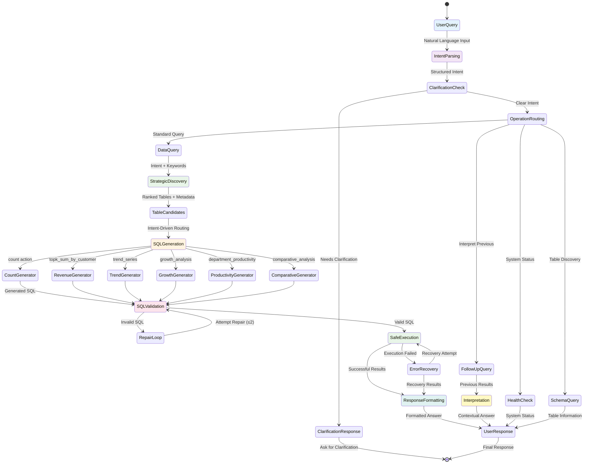
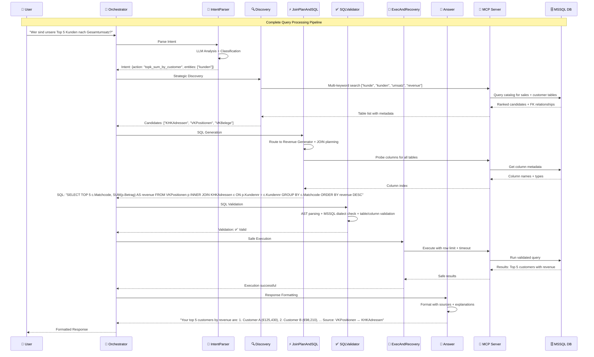

# ERP Assistant Architecture Diagrams

## Complete System Architecture

```mermaid
graph TB
    subgraph "User Layer"
        UI[👤 User Interface<br/>Natural Language Queries]
    end

    subgraph "Orchestration Layer"
        ORCH[🎯 QueryOrchestrator<br/>LangGraph Workflow<br/>Conditional Routing]

        subgraph "Agent Pipeline (7 Agents)"
            IP[🧠 IntentParserAgent<br/>Semantic Analysis<br/>Action Classification<br/>Clarification Detection]

            DA[🔍 DiscoveryAgent<br/>Strategic Table Discovery<br/>Multi-Keyword Search<br/>Business Domain Awareness]

            JS[⚡ JoinPlanAndSQLAgent<br/>Intent-Driven SQL Generation<br/>6 Specialized Generators<br/>Column Probing]

            SV[✅ SQLValidatorAgent<br/>AST Validation<br/>Dialect Checking<br/>Auto-Repair Loop]

            ER[🚀 ExecAndRecoveryAgent<br/>Safe Execution<br/>Error Recovery<br/>Row Limiting]

            AA[💬 AnswerAgent<br/>Contextual Formatting<br/>Source Attribution<br/>Row Previews]

            IA[🔄 InterpretationAgent<br/>Follow-up Processing<br/>Session Persistence<br/>No Re-query]
        end
    end

    subgraph "MCP Server Layer"
        MCP[🔧 MCP Server (Windows)<br/>JSON-RPC Protocol]

        subgraph "Database Tools"
            SM[📚 Scout Mode<br/>Semantic Catalog<br/>Accurate Row Counts<br/>View Dependencies]

            DT[🔎 Discovery Tools<br/>Table/View Search<br/>Column Indexing<br/>Semantic Ranking]

            QT[⚙️ Query Tools<br/>Bounded Execution<br/>MSSQL Dialect<br/>Timeout Management]
        end
    end

    subgraph "Database Layer"
        DB[(🗄️ MSSQL ERP Database<br/>Complex Schema<br/>German Table Names<br/>Business Logic)]
    end

    UI --> ORCH
    ORCH --> IP
    IP --> DA
    DA --> JS
    JS --> SV
    SV --> ER
    ER --> AA

    ORCH -.-> IA

    AA --> UI
    IA --> UI

    ORCH <--> MCP
    MCP --> SM
    MCP --> DT
    MCP --> QT

    DT --> DB
    QT --> DB
    SM --> DB

    style ORCH fill:#e1f5fe,stroke:#01579b,stroke-width:2px
    style IP fill:#f3e5f5,stroke:#4a148c
    style DA fill:#e8f5e8,stroke:#1b5e20
    style JS fill:#fff3e0,stroke:#e65100
    style SV fill:#fce4ec,stroke:#880e4f
    style ER fill:#f3e5f5,stroke:#4a148c
    style AA fill:#e8f5e8,stroke:#1b5e20
    style IA fill:#e0f2f1,stroke:#004d40
    style MCP fill:#fff8e1,stroke:#f57f17
    style DB fill:#fafafa,stroke:#424242
```

## Detailed Process Flow



## Agent Interaction Sequence



## Strategic Query Pattern Routing

```mermaid
flowchart TD
    A[🎯 User Query] --> B{🧠 Intent Classification}

    B --> C[📊 Simple Count<br/>Action: count<br/>"How many customers?"]

    B --> D[💰 Revenue Aggregation<br/>Action: topk_sum_by_customer<br/>"Top customers by revenue"]

    B --> E[📈 Time Series<br/>Action: trend_series<br/>"Growth over time"]

    B --> F[📊 Growth Analysis<br/>Action: growth_analysis<br/>"Customer growth over 3 years"]

    B --> G[⚡ Productivity Analysis<br/>Action: department_productivity<br/>"Department performance"]

    B --> H[🔄 Comparative Analysis<br/>Action: comparative_analysis<br/>"Q1 vs Q2 performance"]

    B --> I[📅 Month Filtering<br/>Action: month_count<br/>"Projects in October"]

    B --> J[🔍 Follow-up<br/>Action: interpret_previous<br/>"Sort those results"]

    C --> K[🔍 Standard Discovery]
    D --> L[🔍 Strategic Discovery<br/>Sales + Customer Tables]
    E --> L
    F --> L
    G --> M[🔍 Strategic Discovery<br/>Employee + Department Tables]
    H --> L
    I --> K
    J --> N[🔄 Direct Interpretation<br/>No Discovery Needed]

    K --> O[📝 Count SQL Generator]
    L --> P[📝 Revenue SQL Generator<br/>Complex JOINs]
    M --> Q[📝 Productivity SQL Generator<br/>Aggregation + Grouping]
    N --> R[📝 Interpretation Engine<br/>Previous Results Only]

    O --> S[✅ Validation & Repair]
    P --> S
    Q --> S
    R --> T[💬 Direct Response]

    S --> U[🚀 Safe Execution]
    U --> V[💬 Response Formatting]

    T --> W[👤 User Response]
    V --> W

    style B fill:#e3f2fd,stroke:#1976d2,stroke-width:2px
    style L fill:#fff3e0,stroke:#f57c00
    style M fill:#f3e5f5,stroke:#7b1fa2
    style P fill:#fce4ec,stroke:#c2185b
    style S fill:#e8f5e8,stroke:#388e3c
    style U fill:#e0f2f1,stroke:#00796b
    style V fill:#fff9c4,stroke:#f9a825
    style W fill:#e8eaf6,stroke:#3f51b5
```

## Query Pattern Examples

| Query Type | Example Query | Required Action | SQL Generator | Key Features |
|------------|---------------|-----------------|----------------|--------------|
| **Basic Count** | "How many customers?" | `count` | Count Generator | Simple COUNT(*) |
| **Revenue Aggregation** | "Top 5 customers by revenue" | `topk_sum_by_customer` | Revenue Generator | JOIN + SUM + GROUP BY + ORDER BY |
| **Time Series** | "Growth over last 3 years" | `trend_series` | Trend Generator | YEAR() + GROUP BY + window functions |
| **Growth Analysis** | "Customer growth over 3 years" | `growth_analysis` | Growth Generator | LAG() + percentage calculations |
| **Productivity** | "Department productivity" | `department_productivity` | Productivity Generator | AVG() + GROUP BY department |
| **Comparative** | "Q1 vs Q2 performance" | `comparative_analysis` | Comparative Generator | DATEPART(quarter) + window functions |
| **Month Filter** | "Projects in October" | "month_count" | Month Generator | MONTH() + YEAR() filters |
| **Follow-up** | "Sort those results" | `interpret_previous` | Interpretation Agent | No SQL generation |

## Data Flow Architecture

```mermaid
graph LR
    subgraph "Input Processing"
        IQ[Intent + Query] --> KW[Keywords Extraction]
        KW --> SE[Entity Recognition]
        SE --> AC[Action Classification]
    end

    subgraph "Discovery Phase"
        AC --> SD[Strategic Discovery]
        SD --> MK[Multi-Keyword Search]
        MK --> BR[Business Rules Filtering]
        BR --> TR[Table Ranking]
    end

    subgraph "SQL Generation Phase"
        TR --> IR[Intent Router]
        IR --> SG[Specialized Generators]
        SG --> CP[Column Probing]
        CP --> JV[Join Validation]
    end

    subgraph "Validation Phase"
        JV --> AP[AST Parsing]
        AP --> DC[Dialect Checking]
        DC --> TC[Table/Column Validation]
        TC --> AR[Auto Repair]
    end

    subgraph "Execution Phase"
        AR --> RL[Row Limiting]
        RL --> TO[Timeout Management]
        TO --> ER[Error Recovery]
        ER --> FR[Fallback Strategies]
    end

    subgraph "Response Phase"
        FR --> CF[Context Formatting]
        CF --> SA[Source Attribution]
        SA --> RP[Row Previews]
    end

    IQ --> Discovery Phase
    Discovery Phase --> SQL Generation Phase
    SQL Generation Phase --> Validation Phase
    Validation Phase --> Execution Phase
    Execution Phase --> Response Phase

    style Input Processing fill:#e3f2fd
    style Discovery Phase fill:#f3e5f5
    style SQL Generation Phase fill:#fff3e0
    style Validation Phase fill:#fce4ec
    style Execution Phase fill:#e8f5e8
    style Response Phase fill:#e0f2f1
```

---

## Key Architecture Principles

### 1. **Separation of Concerns**
Each agent has a single, well-defined responsibility with clear input/output contracts.

### 2. **Intent-Driven Design**
The entire pipeline routes based on the classified intent action, enabling specialized processing for different query types.

### 3. **Robust Error Handling**
Multiple recovery strategies at each level with meaningful error messages and automatic repair attempts.

### 4. **Business Intelligence Focus**
Specialized generators for complex BI queries like growth analysis, comparative reporting, and productivity metrics.

### 5. **Scalable Architecture**
New query patterns can be added by creating new SQL generators without modifying existing code.

### 6. **Contextual Responses**
All responses include source attribution, row previews, and explanations of the processing logic.

This architecture provides a comprehensive foundation for enterprise-grade ERP query assistance with room for continuous enhancement and expansion.

