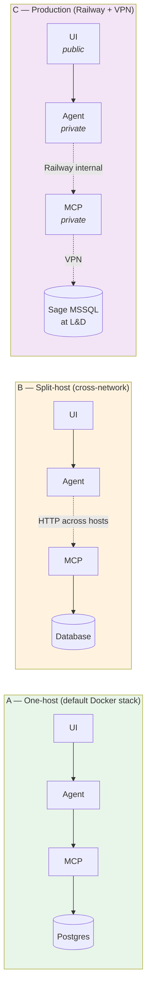

# Deployment topologies

The same image set supports three configurations. All three are tested in the thesis project. The system overview in the [main README](../README.md#system-overview) shows the *logical* architecture; this page shows where the three services can physically live.

## A — One-host (default)

`./run.sh` boots the whole stack on one machine. Bundled Postgres + Northwind, ~2 min cold start. This is the default for examiners and the configuration `thesis.julianuskath.com` runs.

## B — Split-host (cross-network)

Set `MCP_SERVER_URL=http://<other-host>:8000` on the Agent. The MCP server's `MCP_API_KEY` authenticates inbound traffic; nothing else needs to change. Use this when the database is on a separate machine, behind a firewall, or behind a VPN.

For local variations of B (custom Postgres, port overrides, remote MCP), see [`docker-compose.override.yml.example`](../docker-compose.override.yml.example).

## C — Production (Railway + VPN)

The four services run as separate Railway services with private internal DNS; only the Web UI is publicly exposed at `thesis.julianuskath.com`. The MCP service connects through a VPN to the Sage MSSQL ERP at Luisi & Diener AG. See [`deploy/railway/README.md`](../deploy/railway/README.md) for the runbook.

## Topology-agnostic configuration

Three URLs configure the topology end-to-end:

- `LANGGRAPH_URL` — UI → Agent
- `MCP_SERVER_URL` — Agent → MCP
- `POSTGRES_*` / `MSSQL_*` block — MCP → DB

No service knows about any other except via these env vars; collapse them all to localhost for a single-host deployment, or split them across hosts for a VPN-tunnelled production. The wire (JSON-RPC over HTTP) is the same in all three cases.
