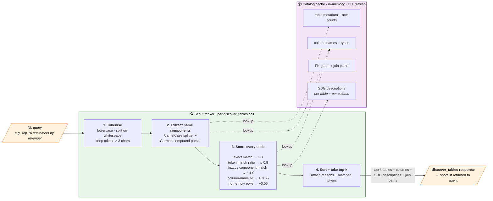

# Scout Mode — ranker pipeline

The [main README's system overview](../README.md#system-overview) shows the *static structure* of Scout (catalog cache + ranker + SDG layer). This page zooms into what `discover_tables` actually does on each call: it tokenises the natural-language query, walks every table in the cached catalog, and accumulates a score from a fixed set of signals.

Three of the five MCP tools (`list_tables`, `get_schema`, `get_column_index`) bypass the ranker entirely and read the cache directly; `execute_query` is the only tool that reaches the database at query time.

## Catalog lifecycle

The catalog is built at MCP startup and refreshed on a TTL — the agent never waits on a fresh build during a query. SDG descriptions are computed offline by a separate enrichment step (`mcp_server/scout/description_enricher.py`) and merged into the catalog. Flipping SDG on or off is the controlled axis of the H2a ablation reported in §5.2 of the thesis.

## Source code

- `mcp_server/scout/runner.py` — `search()` is the entry point used by `discover_tables`; `TableNameNormalizer` provides `normalize`, `extract_components`, `safe_fuzzy_match`, `get_component_match`.
- `mcp_server/scout/mode.py` — semantic-search wrappers and intent-aware ranking boost.
- `mcp_server/scout/description_generator.py` / `description_enricher.py` — the SDG layer.
- `mcp_server/tools/discovery_tools.py` — the MCP tool surface (`discover_tables`, `list_tables`, `get_schema`, `get_column_index`).

## Related ADRs

- [ADR-0014 — Scout Mode: Semantic Caching](../adrs/0014-scout-mode-semantic-caching.md)
- [ADR-0015 — Semantic Table Ranking](../adrs/0015-semantic-table-ranking.md)
- [ADR-0020 — MCP Discovery Tools & Catalog Enrichment](../adrs/0020-mcp-discovery-tools-semantic-catalog-enrichment.md)
- [ADR-0032 — Generic Table Search Ranking Fixes](../adrs/0032-generic-table-search-ranking-fixes.md)
- [ADR-0035 — SDG Semantic Description Generator](../adrs/0035-sdg-semantic-description-generator.md)
